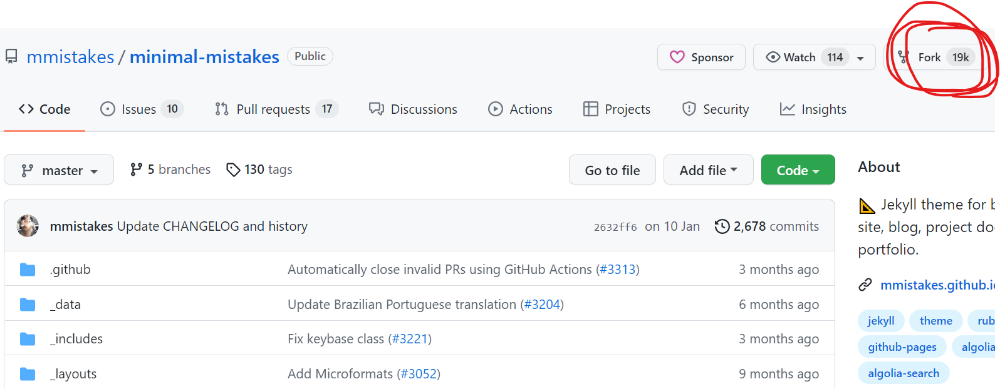
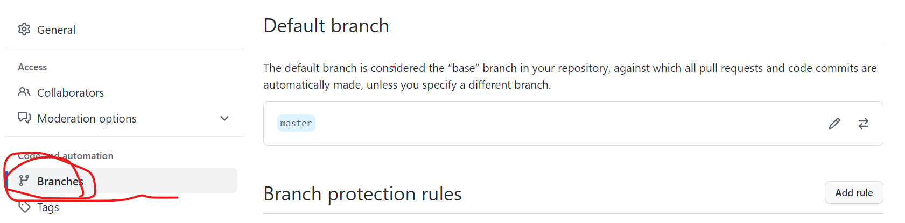

github에서 contribution에 초록불이 들어오지 않았을 때의 원인은 2가지 인데

- github profile과 git 의 name, email이 일치하지 않거나 

- 다른 github page에서 fork해온 repository를 commit할 때는 contribution에 초록 불이 들어오지 않는다.

  

두 번째 문제에서 많은 시행착오를 거쳐서 어떻게 해결했는지를 post하고자 한다.

예시는 minimal-miskakes jekyll theme이다.

[minimal-miskakes 깃허브 링크](https://github.com/mmistakes/minimal-mistakes)

먼저 fork를 하고 내 깃허브에 임의의 new 라는 repository를 하나 만들었다.

그 후 git에서 

`git clone --bare https://github.com/LeeJeaHyuk/minimal-mistakes.git`

`cd minimal-mistakes.git`

`git push --mirror https://github.com/LeeJeaHyuk/new.git`

`cd ..`  

`rm -rf  minimal-mistakes.git` 

fork해온 repostiory를 clone 해준 후에 새로 만든  repository로 mirror한 후에 지워준다.

그리고 새로 만든 new repository의 branch를 확인해보면 flexbox-sticky-footer가 default branch로 되어있는데 이는 setting-branch 에서 바꿔줄 수 있다.

그다음 repository 이름을 username.github.io로 바꾸어주면 된다. 
