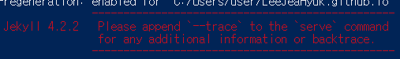

## 내가 다시 보려고 적는 실시간 localhost 다시 여는방법

1. 깃헙 블로그 폴더 leejeahyuk.github.io에서 powershell열기

2. `bundle exec jekyll serve`

3. 

4. 경고 뜨면 `bundle add webrick`

5. `bundle exec jekyll serve` 다시 입력

6. http://localhost:4000/ 로 실시간 확인

7. 작업하고 업데이트 확인하려면 powershell창에서 ctrl + c 후에 다시  `bundle exec jekyll serve`

8. 반복

   

