RDS :  Amazon Relational Database Service

- 아마존 웹 서비스(AWS)에서 제공하는 관리형 데이터베이스 서비스
-  RDS는 클라우드 환경에서 관계형 데이터베이스를 쉽게 구축, 운영 및 확장할 수 있도록 지원
- MySQL, PostgreSQL, Oracle, SQL Server 및 Amazon Aurora와 같은 다양한 데이터베이스 엔진을 지원합니다
- RDS를 사용하면 하드웨어 프로비저닝, 데이터베이스 설정, 패치 및 백업과 같은 데이터베이스 관리 작업을 AWS에 맡기고 응용 프로그램 개발에 집중할 수 있다
- RDS는 자동화된 백업, 소프트웨어 패치, 고가용성 및 확장성과 같은 기능을 제공하여 점점 증가하는 작업 부하를 처리할 수 있다


## RDS 생성

1. 서비스 - RDS - 대시보드 - 데이터베이스 생성

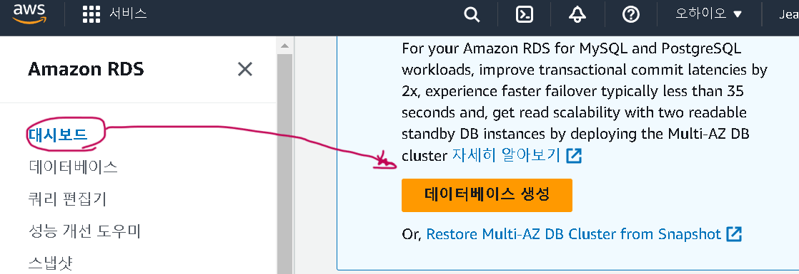


2. 데이터베이스 생성 방식/ 엔진 옵션 설정
   - 더 많은 상세옵션을 선택하기 위해서는 표준 생성을 선택해주는 것이 좋다
   - 이 포스트에서는 PostgreSQL 데이터베이스를 사용

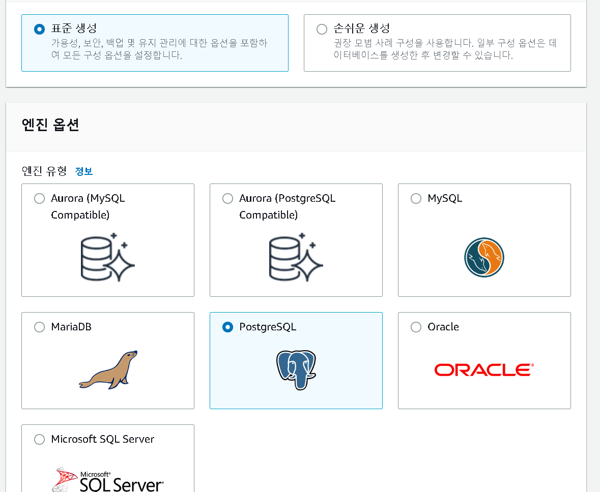

3. 템플릿
   1. 프로덕션 (Production):
      - 이 템플릿은 고가용성과 높은 성능을 위해 기본값을 사용하여 데이터베이스를 생성한다.
      - 프로덕션 환경에서 사용하기에 적합하며, 데이터베이스의 성능과 안정성을 중요시하는 경우에 추천
   2. 개발/테스트 (Development/Test):
      - 이 템플릿은 개발 및 테스트용으로 데이터베이스를 생성하는 데 사용
      - 프로덕션 환경이 아닌 외부에서 개발 작업을 수행하고자 할 때 유용
      - 일반적으로 비용이 저렴하고 기능이 충분한 환경을 제공하여 개발 및 테스트를 용이하게 한다
   3. 프리 티어 (Free Tier):
      - 이 템플릿은 RDS의 프리 티어를 사용하여 데이터베이스를 생성하는 데 사용
      - 프리 티어는 새로운 애플리케이션을 개발하거나 기존 애플리케이션을 테스트하거나 Amazon RDS에 대한 실습을 위해 무료로 사용할 수 있는 환경을 제공
      - 프리 티어는 일정한 제한 사항이 있으며, 실제 프로덕션 환경에서 사용하기에는 제한적일 수 있다

연습해보는 것이기 때문에 프리 티어를 사용

4. 설정
   1. 사용자 이름과 마스터 암호를 지정
      - postgres_test
      - mypassword

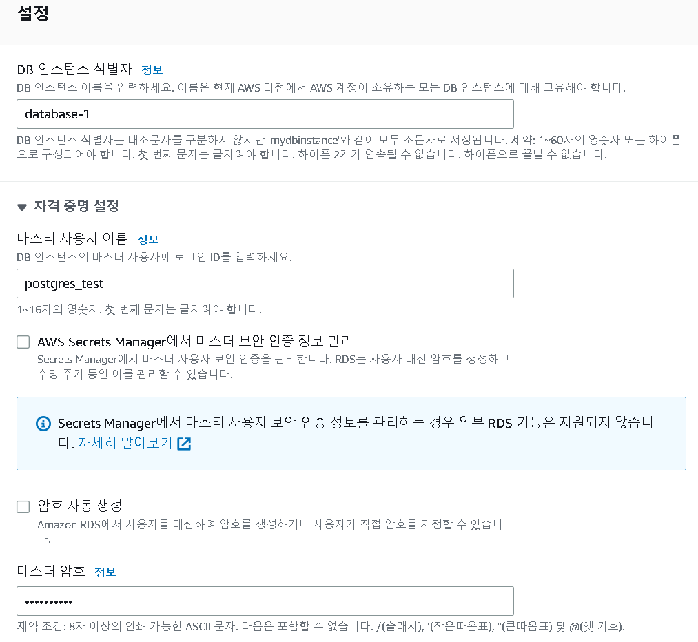

5. 인스턴스 크기 지정
   1. 디폴트로 지정되어 있는 db.t3.micro를 사용

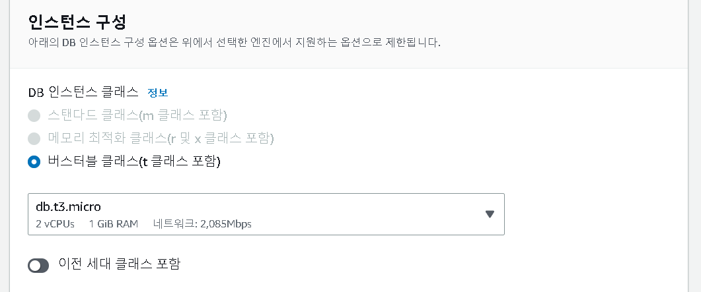

6. 퍼블릭 엑세스 설정
   1. 퍼블릭 액세스 설정 부분이다. 이번에는 개인 데탑에 R/Python연결 하려고 하기 때문에 퍼블릭 액세스에 예를 해주었다. 사실 이는 어느정도 보안 문제로 충분히 위험할 수 있으며, 이를 아니요로 했을경우에는 EC2에만 연결이 되게 된다. **현업에서 사용하게 된다면 특히 전문가와 상의를 하고 설정하는걸 추천.**

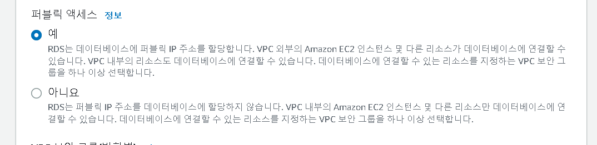

7. 데이터베이스 이름 지정
   1. R/Python 연결시 필요한 정보이다.
      - mydb

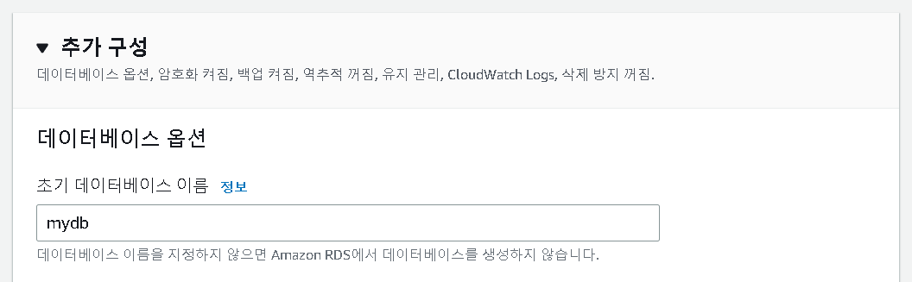

8. 월별 추정 요금 확인/ 데이터베이스 생성

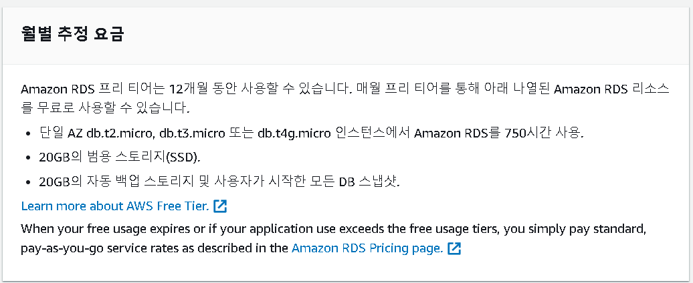

9. RDS 생성
   1. 생성 중인 데이터베이스 모습 10분 정도 걸린 것 같다

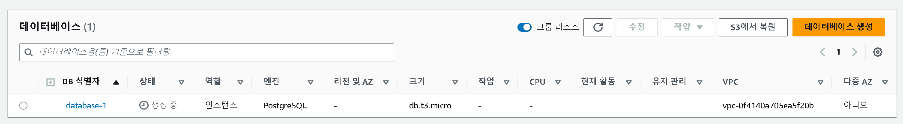

10. 데이터베이스 정보 확인 (연결 & 보안 Tab)
    1. DB를 클릭하여 정보 확인
       - R/Python에 연결할때 사용되기 때문에 엔드포인트와 포트 번호를 확인
         - database-1.cntx1a14qkyh.us-east-2.rds.amazonaws.com
         - 5432

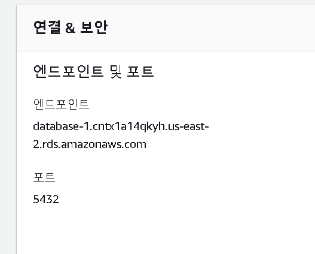

11. 데이터베이스 정보 확인 (구성 Tab)
    1. DB의 정보 확인 가능

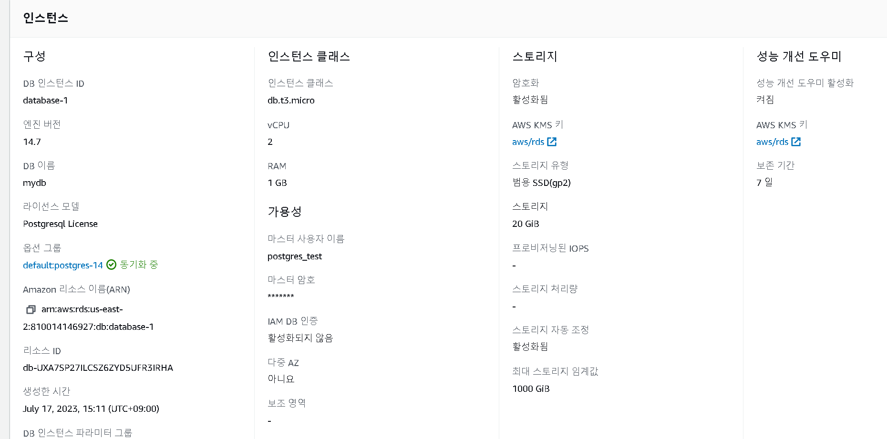

12. 사용 중지
    1. 작업 필터 - 중지
13. RDS - R/Python 연결
    - pg2.connct()를 사용해 conn을 만들었으면 cursor를 통해 sql문을 주고 받는다. 이후 이 커서 객체인 cur의 execute()명령을 실행하여 SQL쿼리를 실행한다.

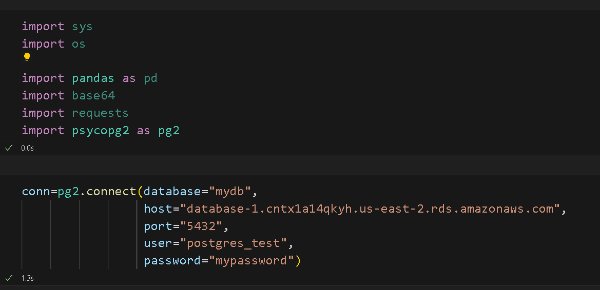

- Connection timed out 오류 해결
  - 인스턴스 - 보안 그룹 규칙 - 인바운드 규칙에서 새 인바운드 규칙을 생성 후 현재 ip를 추가하니 실행되었다

14. 데이터 업로드 및 확인

```python
import pandas as pd

# CSV 파일 경로
csv_file = 'rds_test_iris.csv'

# 컬럼 이름 리스트
columns = ['sepal_length', 'sepal_width', 'petal_length', 'petal_width', 'species']

# CSV 파일 읽어오기
data = pd.read_csv(csv_file, header=None, names=columns)

# 데이터 활용
print(data.head())

cur = conn.cursor()

# 트랜잭션 롤백
conn.rollback()

# 테이블 삭제
cur.execute("DROP TABLE IF EXISTS iris;")

# 테이블 생성
create_table_query = """
CREATE TABLE iris (
    sepal_length FLOAT,
    sepal_width FLOAT,
    petal_length FLOAT,
    petal_width FLOAT,
    species VARCHAR(20)
);
"""
cur.execute(create_table_query)

# 변경 사항 저장
conn.commit()

for index, row in data.iterrows():
    insert_query = "INSERT INTO iris (sepal_length, sepal_width, petal_length, petal_width, species) VALUES (%s, %s, %s, %s, %s);"
    cur.execute(insert_query, (row['sepal_length'], row['sepal_width'], row['petal_length'], row['petal_width'], row['species']))

# 변경 사항 저장
conn.commit()

cur = conn.cursor()
cur.execute("SELECT * FROM iris;")
result = cur.fetchall()
print(result)
```

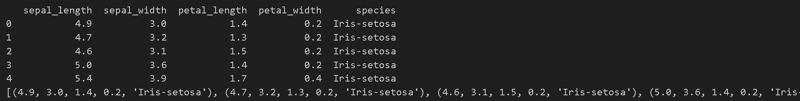

- [iris 데이터](https://archive.ics.uci.edu/dataset/53/iris)를 다운받아서 열을 지정해주었다
- iris 테이블을 만들어서 다운받은 iris 데이터를 넣어주었다
- 해당 데이터를 업로드하고 fetchall() 를 사용하여 실행된 쿼리의 모든 결과를 한 번에 가져와서 확인해보았다.


## 참고

https://unfinishedgod.netlify.app/2021/03/05/aws-rds-%EC%83%9D%EC%84%B1-%EB%B0%8F-r-python-%EC%97%B0%EB%8F%99/