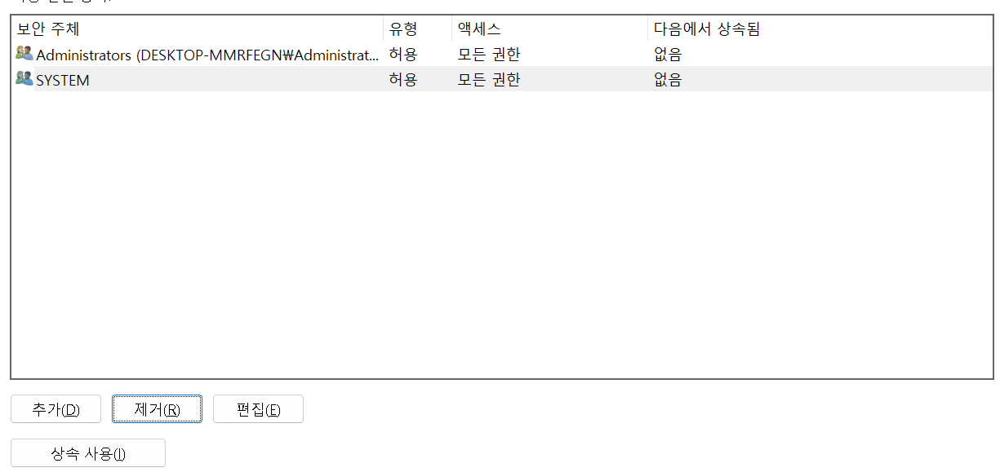

EC2 : Elastic Compute Cloud 

- 클라우드 컴퓨팅 서비스
- 가상 서버를 프로비저닝하고 관리할 수 있는 유연하고 확장 가능한 인프라를 제공하여 사용자가 원하는 만큼의 컴퓨팅 리소스를 생성하고 사용할 수 있도록 한다
- 가상 머신(VM)으로, 다양한 운영 체제와 애플리케이션을 호스팅할 수 있다
- EC2를 사용하여 필요에 따라 가상 서버를 프로비저닝하고, 인스턴스 유형, 운영 체제, 스토리지 유형 등을 선택할 수 있다 
- 웹 애플리케이션, 데이터베이스, 분석 워크로드, 기계 학습 모델 등을 호스팅하고 실행할 수 있다


## 1. EC2 인스턴스 만들기

- 검색에서 EC2를 검색한 후 인스턴스 생성


- 인스턴트 이름 지정 web server test


- 운영체제는 ubuntu를 설정하였고 이외의 값은 선택하지 않았다


## 2. 인스턴트 유형


- 인스턴트 유형은 프리 티어에서 사용 가능한 것으로 선택해준다


## 3. 키 페어 생성


- 키 페어를 생성하면 속성에 들어가서 고급을 누르면 아래와 같은 상태가 되는데


- "상속되지 않음" 옵션을 선택하면 키 페어를 생성한 사용자 외에는 해당 키 페어에 대한 액세스 권한을 갖지 않게 된다
- "사용 권한"에서 "user"가 포함된 항목들을 삭제하면 해당 키 페어에 대한 액세스 권한을 사용자에게 제한할 수 있게 된다



## 4. 보안 그룹 설정 

- 네트워크 설정 - 방화벽(보안 그룹)


- 인바운드 규칙은 3가지를 지정한다 
  - custum TCP - 특정 TCP 포트나 포트 범위로의 연결만을 허용
  - ssh - 원격으로 EC2 인스턴스에 접속 
  - HTTP - 웹 서버와 클라이언트 간의 통신을 위해 사용


이후 인스턴스 생성


## 5. EC2에 연결

인스턴스를 체크하고 연결을 누르면 SSH 클라이언트 창이 보인다

	


터미널을 열고 키페어를 저장한 폴더로 이동한 다음 

위 창에서 보이는SSH를 사용하여 EC2 인스턴스에 원격으로 연결하는 명령어를 사용한다


## 6. Jupyter Notebook 설정하기

저는 이미 jupyter notebook이 다운로드 되어 있으므로 Anaconda prompt에서 아래 코드를 실행시켜Jupyter configuration 파일을 생성했다

```shell
jupyter notebook --generate-config
```

```shell
ipython
```


```python
from notebook.auth import passwd
passwd()
```

으로 비밀번호를 지정하고 output을 잘 기억해 준다

```shell
exit
```

으로 IPython 셸에서 Anaconda Prompt로 돌아올 수 있다

```shell
cd .jupyter
vim jupyter_notebook_config.py_
```

```python
conf = get_config()

conf.NotebookApp.ip = '0.0.0.0'
conf.NotebookApp.password = u'YOUR PASSWORD HASH'
conf.NotebookApp.port = 8888
```

vim 편집기를 사용하여 해당 부분을 입력해주고 :wq로 저장해준다


## 참고

https://ynkim0.github.io/posts/EC2-%EC%84%9C%EB%B2%84%EC%97%90%EC%84%9C-Jupyter-Notebook-%EA%B5%AC%EB%8F%99%ED%95%98%EA%B8%B0/

