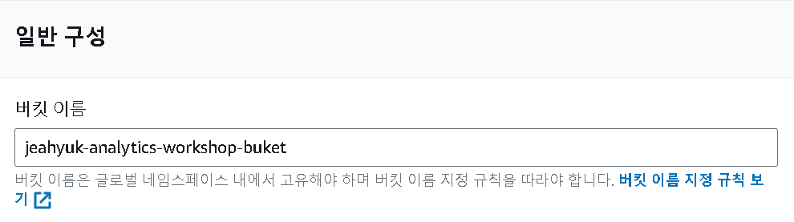
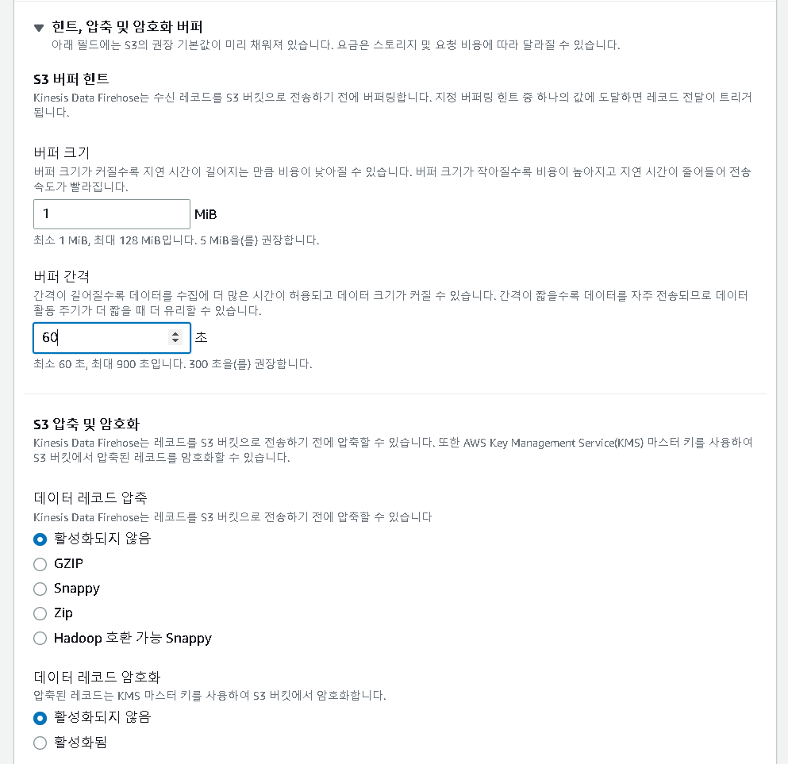
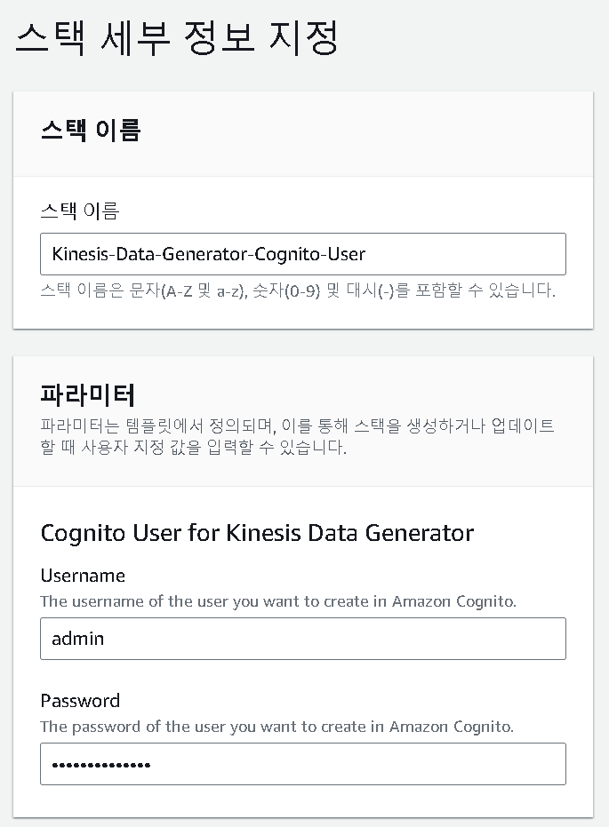

- 학습 목표
  - Kinesis 데이터 생성기 유틸리티를 사용하여 실시간으로 더미 데이터를 생성한다
  - Kinesis Firehose 전송 스트림을 사용하여 Amazon S3에 데이터를 전달한다
    - Kinesis Data Generator : 실시간 데이터 스트림을 생성하고 테스트할 수 있는 웹 기반 도구
    - Kinesis Firehose : 관리형 실시간 데이터 전송 서비스

---

## 1 S3 버킷 생성



이름만 지정해주고 버킷을 만들어 준다 yourname-analytics-workshop-buket

### 폴더 생성


- 생성된 버킷의 폴더를 만들어 준다

- 폴더 또한 이름만 지정 후 만들어 준다


- /data 폴더 안데 다시 reference_data 폴더를 만들어 준다

### 생성된 폴더에 tracks_list.json 데이터 업로드


- tracks_list.json 파일을 추가해준다

---

## 2 Kinesis Firehose 생성

- aws Kinesis Firehose 에서 스트림 생성을 해준 뒤 아래처럼 설정을 해준다




- 이외의 값들은 default로 지정해준다

---

## 3 Dummy 데이터 생성

- https://console.aws.amazon.com/cloudformation/home?region=us-east-1#/stacks/new?stackName=Kinesis-Data-Generator-Cognito-User&templateURL=https://aws-kdg-tools-us-east-1.s3.amazonaws.com/cognito-setup.json 페이지에서 다음 버튼을 누르면 스택이 생성된다



- username과 password를 지정해 준다


- 권한을 승인한 후 전송 버튼을 누른다


- 전송이 완료되면 출력 탭의 링크로 접속해준다


- 이전에 지정한 username과 pw를 입력해준다


templete은 [aws workshop Lab guide-ingest and store](https://catalog.workshops.aws/introduction-to-analytics-on-aws/en-US/lab-guide/ingest) 의 Generate Dummy Data - On Amazon Kinesis Data Generator homepage 의 json template부분을 복사해서 넣어준다


```
{
    "uuid": "{{random.uuid}}",
    "device_ts": "{{date.utc("YYYY-MM-DD HH:mm:ss.SSS")}}",
    "device_id": {{random.number(50)}},
    "device_temp": {{random.weightedArrayElement(
    {"weights":[0.30, 0.30, 0.20, 0.20],"data":[32, 34, 28, 40]}
    )}},
    "track_id": {{random.number(30)}},  
    "activity_type": {{random.weightedArrayElement(
        {
            "weights": [0.1, 0.2, 0.2, 0.3, 0.2],
            "data": ["\"Running\"", "\"Working\"", "\"Walking\"", "\"Traveling\"", "\"Sitting\""]
        }
    )}}
}
```


- send data를 누른 뒤 10000개가 전송되면 stop해준다


- s3의 buketㅇ firehose가 yyyy/mm/dd/hh 파티셔닝을 사용하여 데이터를 S3로 덤프 했다는 것을 알 수 있다 

---

## reference

https://ynkim0.github.io/posts/Analytics-on-AWS-Ingest-and-Store/

https://catalog.workshops.aws/introduction-to-analytics-on-aws/ko-KR/lab-guide/ingest