- 학습 목표

  - AWS Glue 데이터 카탈로그에 데이터셋을 등록

  - Glue 크롤러를 이용하여 메타데이터 수집을 자동화

  - 카탈로그 엔티티가 생성되면, Amazon Athena를 사용하여 데이터의 원시 형식을 쿼리할 수 있게 된다

    - AWS Glue는 AWS에서 제공하는 완전 관리형 ETL(Extract, Transform, Load) 서비스 : 데이터의 이동, 변환, 정제 등의 작업을 자동화

    - ETL은 데이터를 추출하여 변환한 뒤 원하는 형식으로 로드하는 작업
    
    - aws Crawlers 는 데이터 카탈로그를 자동으로 생성하고 데이터 스키마를 감지하기 위한 AWS Glue의 관리형 서비스
      - Crawlers는 다양한 데이터 소스를 검색하고 분석하여 해당 데이터에 대한 메타데이터를 데이터 카탈로그에 추가합니다. 이 메타데이터는 Glue Data Catalog에 저장되며, 이를 통해 데이터베이스, 테이블, 파티션, 스키마 등의 정보를 쉽게 찾을 수 있다
    

---

## IAM Role 생성

IAM 콘솔 https://us-east-1.console.aws.amazon.com/iamv2/home#/roles로 이동하여 새 AWS Glue service role을 생성합시다.

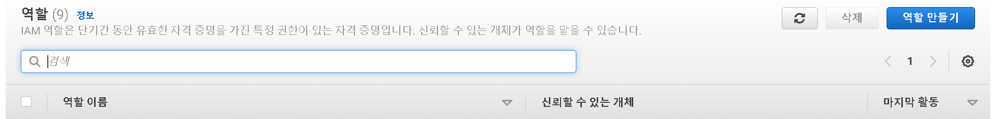

- 역할 만들기(create role) 선택


- 사용 사례를 조회할 서비스 선택에서 Glue를 선택 후 다음

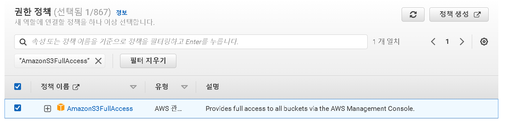

- AmazonS3FullAccess 를 필터 한 후 선택

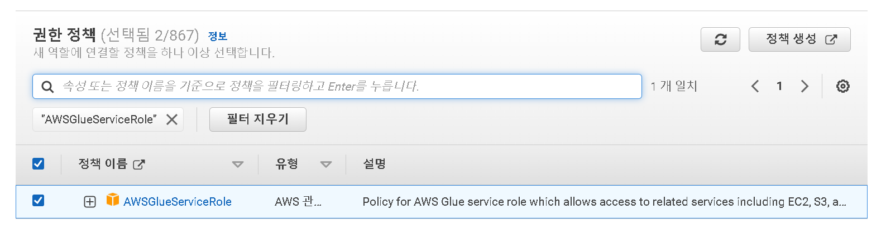

- AWSGlueServiceRole 를 필터 후 선택


- 다음을 누르면 이름을 지정해 주어야 하는데 AnalyticsworkshopGlueRole 로 지정하였음

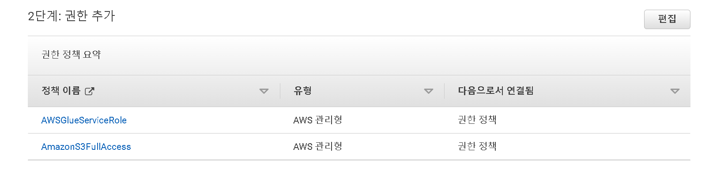

- 이전에 추가한 AWSGlueServiceRole 와 AnalyticsworkshopGlueRole 이 존재하는지 확인하고 역할 생성을 클릭


---

## AWS Glue Crawlers 생성

- [Glue 콘솔](https://us-east-1.console.aws.amazon.com/glue/home?region=us-east-1#/v2/getting-started) 로 이동

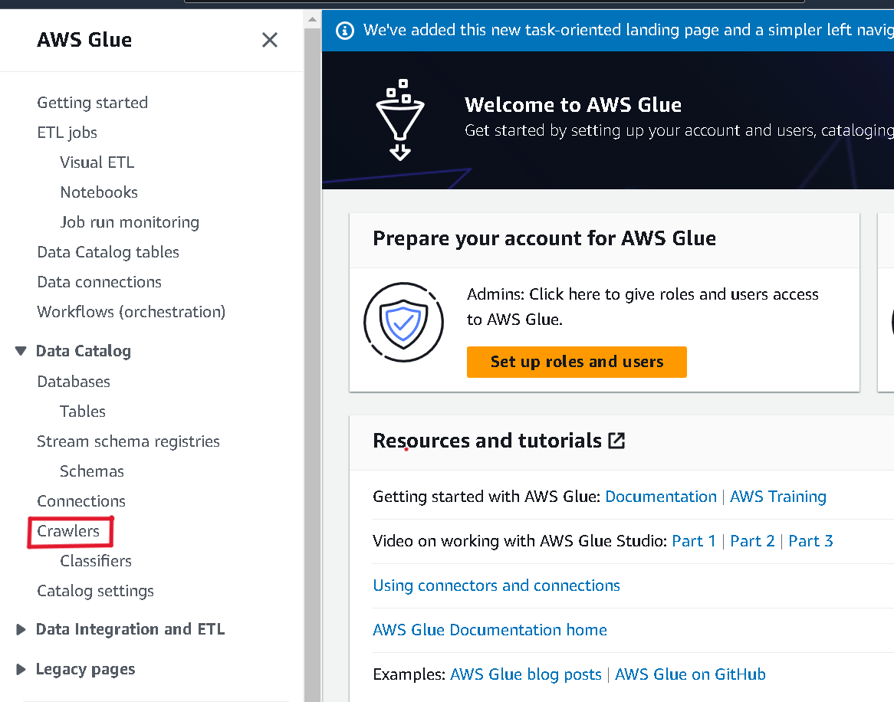

- Crawlers 선택

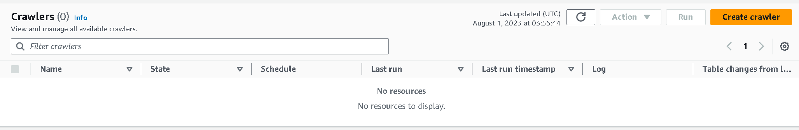

- create crawler 클릭

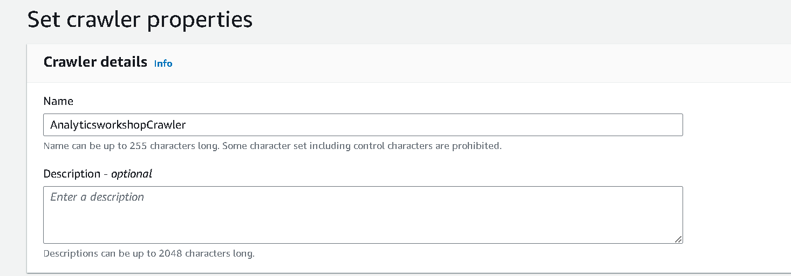

-  이름 지정 AnalyticsworkshopCrawler

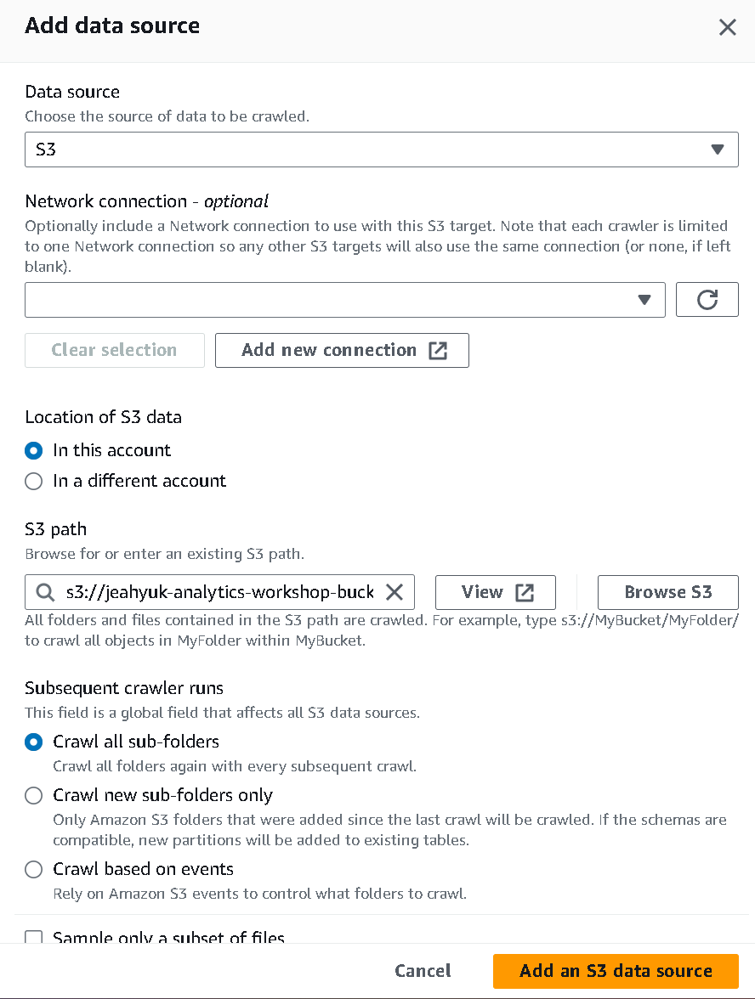

- s3 경로만 s3://yourname-analytics-workshop-bucket/data/ 로 지정해준 뒤 데이터 소스를 추가 후 다음

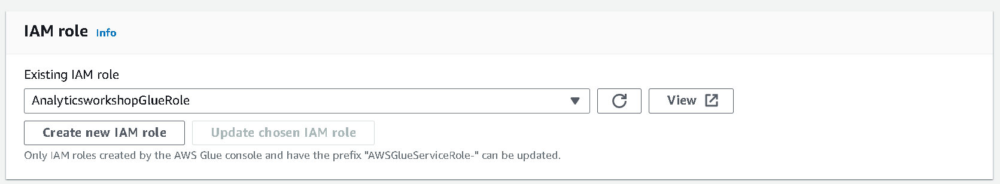

- IAM role은 AnalyticsworkshopGlueRole 로 설정 후 다음

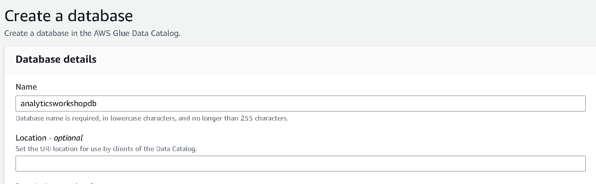

- 데이터베이스 이름을 analyticsworkshopdb로 설정 후 생성

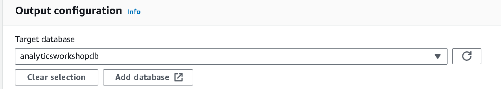

- Output configuration의 Target database를 새로고침 후 방금 생성한analyticsworkshopdb로 지정

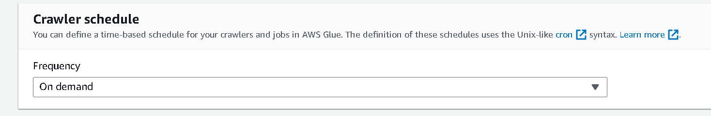

- **Crawler schedule** 은 default값인 on demend 로 지정

- 생성이 완료되면 run Crawler 클릭

---

## 카탈로그에서 새로 생성 된 테이블 확인

- [Glue 카탈로그](https://us-east-1.console.aws.amazon.com/glue/home?region=us-east-1#/v2/data-catalog/databases)로 이동
  - Crawler 를 실행한 창과 데이터베이스 표시 창의 region이 다른 경우가 있는데 동일하게 맞춰주어야 데이터베이스에 표시된다

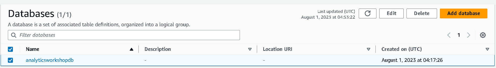

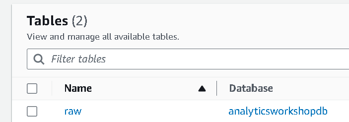

- table의 raw를 확인하여 데이터세트의 스키마를 둘러보고 탐색할 수 있다
  - `averageRecordSize`, `recordCount`, `compressionType` 등


---

## Amazon Athena를 사용하여 수집 된 데이터 쿼리

[Amazon Athena](https://us-east-1.console.aws.amazon.com/athena/home?region=us-east-1#query) 접속

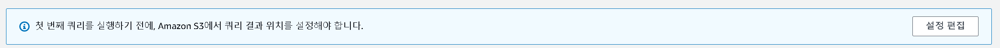

경고창이 보인다면 클릭하여


-  s3://yourname-analytics-workshop-bucket/query_results/ 를 입력 후 저장

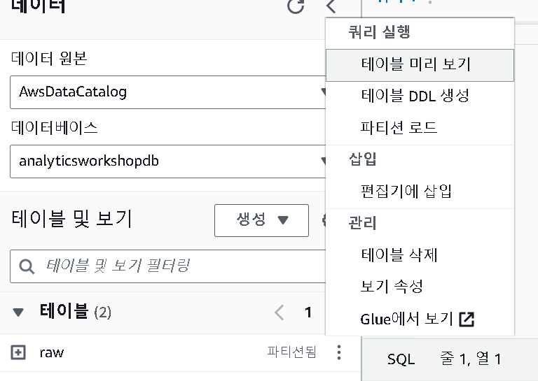

- raw - 테이블 미리 보기


```sql
SELECT activity_type,
         count(activity_type)
FROM raw
GROUP BY  activity_type
ORDER BY  activity_type
```


- 위 코드를 다른 쿼리 편집기에 코드를 복사하여 실행

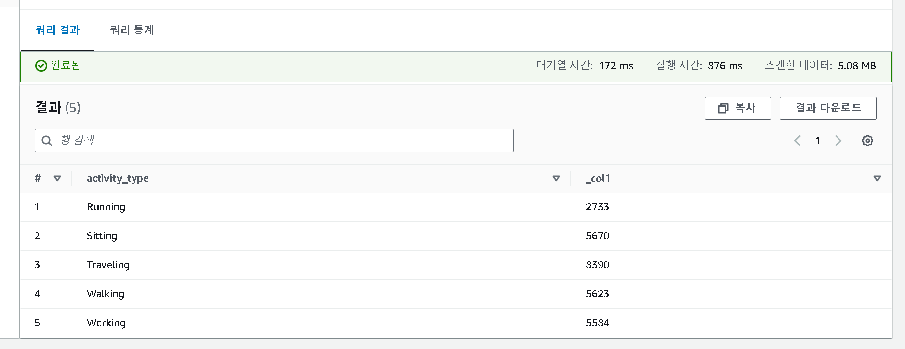

- 카탈로그화된 결과를 볼 수 있다
- 이후 AWS Glue ETL을 사용하여 데이터를 변환할 수 있다.

---

## reference

https://catalog.workshops.aws/introduction-to-analytics-on-aws/ko-KR/lab-guide/catalog

https://ynkim0.github.io/posts/Analytics-on-AWS-Catalog-Data/