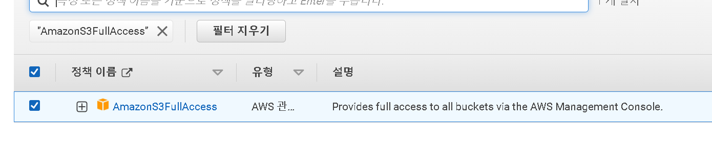

- 학습 목표
  - AWS Glue 대화형 세션(Interactive sessions)을 사용하여 데이터를 처리하고 그 결과를 다시 S3에 변환된 레이어로 저장하기
  - 데이터 변환을 진행하기 위해 AWS Glue 인터랙티브 세션으로 구동되는 Glue Studio와 Jupyter 노트북을 사용
  - 
- Pre-requisites
  - [Ingest and Store ](https://catalog.workshops.aws/introduction-to-analytics-on-aws/en-US/lab-guide/ingest)
  - [Catalog ](https://catalog.workshops.aws/introduction-to-analytics-on-aws/en-US/lab-guide/catalog)

## IAM Role과 Policy 준비


- [IAM Role](https://us-east-1.console.aws.amazon.com/iamv2/home?region=us-east-1#/policies)로 이동하여 정책 생성 클릭 후 json 클릭



```
{
  "Version": "2012-10-17",
  "Statement": [
    {
    "Effect": "Allow",
    "Action": "iam:PassRole",
    "Resource":"arn:aws:iam::<AWS account ID>:role/Analyticsworkshop-GlueISRole"
    }
  ]
}
```




- 위의 코드로 고쳐 주었다
  - 코드 중 AWS account ID 는 aws에서 보안 자격 증명을 클릭하면 나오는 12자리 숫자이다


- 정책 이름을 AWSGlueInteractiveSessionPassRolePolicy 로 지정한 후 정책 생성을 해 주었다
  - Description에 한글을 넣을시 생성되지 않음


- [IAM Role ](https://us-east-1.console.aws.amazon.com/iamv2/home#/roles)로 다시 이동하여 역할 생성 클릭 후 다른 aws서비스의 사용 사례에 glue을 선택 후 다음




- 아래 4종류를 선택하고 다음
  - `AwsGlueSessionUserRestrictedNotebookPolicy` 
  - `AWSGlueInteractiveSessionPassRolePolicy`
  - `AmazonS3FullAccess` 
  - `AWSGlueServiceRole`


- 역할 이름을 Analyticsworkshop-GlueISRole 로 지정한 후 권한에 4종류 확인 후 역할 생성


---


## 대화형 ETL 개발을 위해 AWS Glue에서 Jupyter Notebook 사용

- [aws workshop - Transform Data with AWS Glue (interactive sessions)](https://catalog.workshops.aws/introduction-to-analytics-on-aws/ko-KR/lab-guide/transform-glue-interactive-sessions#iam-role-policy) 에서 analytics-workshop-glueis-notebook.ipynb 를 로컬에 저장


- [Glue Studio jobs](https://us-east-1.console.aws.amazon.com/gluestudio/home?region=us-east-1#/jobs) 으로 이동하여 jupyter notebook을 선택하고 Upload and edit an existing notebook 선택


- Choose file에서 방금 로컬에 다운로드 받은 파일 업로드 후 create 클릭


- job name은 AnalyticsOnAWS-GlueIS 로 지정
- iam role은 Analyticsworkshop-GlueISRole 로 지정 
- start notebook



```python
try:
    datasink = glueContext.write_dynamic_frame.from_options(
        frame = joined_data_clean, connection_type="s3",
        connection_options = {"path": "s3://yourname-analytics-workshop-bucket/data/processed-data/"},
        format = "parquet")
    print('Transformed data written to S3')
except Exception as ex:
    print('Something went wrong')
    print(ex)
```



- jupyter notebook을 읽으면서 실행
- path 부분만 이전에 생성한 s3 경로로 바꾸기

---


## 확인 - 변환/처리된 데이터가 S3에 생성되었는지 확인

- [s3 콘솔](https://s3.console.aws.amazon.com/s3/home?region=us-east-1) 로 이동
- data/processed-data 클릭


- **.parquet** 파일들이 생성되었는지 확인


- 데이터를 변환했기에 Amazon Athena를 사용하여 데이터를 쿼리할 수 있다
- AWS Glue 또는 Amazon EMR을 사용하여 데이터를 추가로 변환/집계할 수도 있다

---


## reference

- https://catalog.workshops.aws/introduction-to-analytics-on-aws/ko-KR/lab-guide/transform-glue-interactive-sessions
- https://catalog.workshops.aws/introduction-to-analytics-on-aws/en-US/lab-guide/transform-glue-interactive-sessions
- https://ynkim0.github.io/posts/Analytics-on-AWS-Transform-Data-with-AWS-Glue/
