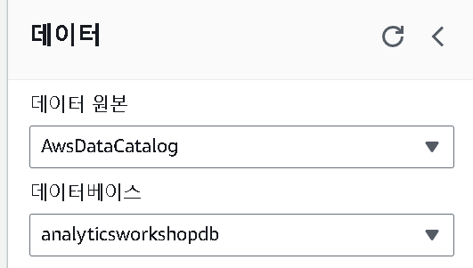

- 학습목표
  - Amazon Athena를 사용하면 표준 SQL 쿼리를 사용하여 데이터를 탐색 
- Pre-requisites
  - [Ingest and Store ](https://catalog.workshops.aws/introduction-to-analytics-on-aws/ko-KR/lab-guide/ingest)
  - [Catalog Data ](https://catalog.workshops.aws/introduction-to-analytics-on-aws/ko-KR/lab-guide/catalog)
  - [Transform Data with AWS Glue (interactive sessions) ](https://catalog.workshops.aws/introduction-to-analytics-on-aws/ko-KR/lab-guide/transform-glue-interactive-sessions)

---


## Athena를 사용하여 변환 된 데이터 탐색

[Athena 콘솔](https://catalog.workshops.aws/introduction-to-analytics-on-aws/ko-KR/lab-guide/analyze#athena) 로 이동



- 왼쪽 데이터베이스에서 **analyticsworkshopdb** 를 선택 




```sql
SELECT artist_name,
       count(artist_name) AS count
FROM processed_data
GROUP BY artist_name
ORDER BY count desc
```



- 위의 쿼리를 실행


---

##  reference

https://catalog.workshops.aws/introduction-to-analytics-on-aws/ko-KR/lab-guide/analyze#athena

