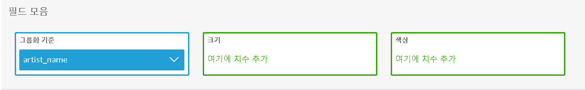

- 학습목표
  - Amazon Quicksight를 사용하여 S3에 수집, 저장된 데이터에 대해 몇 가지 시각화를 구축
  - Quicksight에서 사용할 수 있는 다양한 시각화 옵션을 탐색
- Pre-requisites
  - [Ingest and Store ](https://catalog.workshops.aws/introduction-to-analytics-on-aws/ko-KR/lab-guide/ingest)
  - [Catalog ](https://catalog.workshops.aws/introduction-to-analytics-on-aws/ko-KR/lab-guide/catalog)
  - [Transform Data with AWS Glue (interactive sessions) ](https://catalog.workshops.aws/introduction-to-analytics-on-aws/ko-KR/lab-guide/transform-glue-interactive-sessions)

---

## QuickSight 셋팅

- QuickSight를 사용하여 processsed data를 시각화
-  [Quicksight 콘솔](https://us-east-1.quicksight.aws.amazon.com/en/start) 로 이동

- **Sign up for QuickSight** 클릭

- 첫 번째인 Enterprise를 선택함

- 이름과 이메일을 입력

- S3와 athena만 체크 후 완료
  - s3에서는 이전에 생성한 bucket을 체크한다

---

## 새로운 데이터세트 추가

- [QuickSight](https://us-east-1.quicksight.aws.amazon.com/sn/start/data-sets)로 이동

- 데이터 세트 - 새 데이터 세트 - Athena 클릭

- 이름을 analyticsworkshop 으로 지정하고 
- 연결 확인 (Validate connection) 을 클릭한 후 데이터 원본을 생성

- 위와 같이 선택
  - Catalog - **AwsDataCatalog**
  - Database - **analyticsworkshopdb** 
  - Tables - **processed_data** 

- 데이터 직접 쿼리(Directly quert your data) 를 선택

---

## Amazon Quicksight를 사용하여 processsed data 시각화

### 1. 사용자들이 반복적으로 듣는 음악 트랙의 히트맵 생성해보기

- 왼쪽 하단에 Visual types에서 히트 맵을 클릭

- device_id을 행(rows)으로 지정하고 track_name을 열(columns)로 지정합니다 

- 히트맵 위로 마우스를 가져가면 특정 사용자의 id와 횟수를 표시해준다

### 2. 가장 많이 재생된 아티스트를  트리맵으로 보기

- 왼쪽 상단에서 추가(add) 시각적 객체 추가(visual add)를 선택한다

- 트리 맵을 선택한다

- 필드 리스트에서 artist_name을 선택하면 가장 많이 재생된 음악의 아티스트를 트리맵으로 확인할 수 있다

---

## reference

https://catalog.workshops.aws/introduction-to-analytics-on-aws/ko-KR/lab-guide/visualize#quicksight

https://catalog.workshops.aws/introduction-to-analytics-on-aws/en-US/lab-guide/visualize

https://ynkim0.github.io/posts/Analytics-on-AWS-Visualize-in-Quicksight/