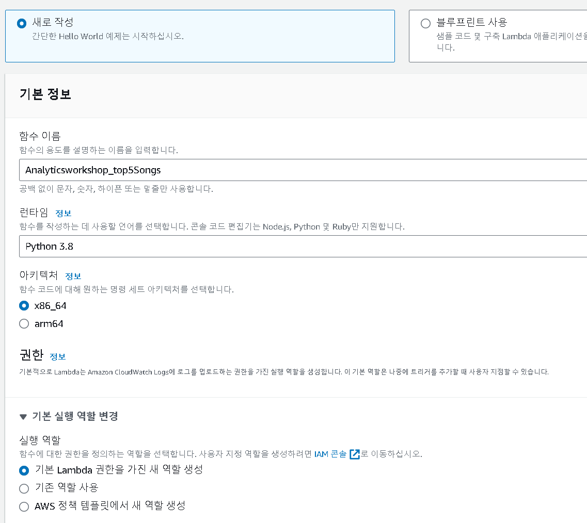

- 학습목표
  - Lambda 함수를 생성
  - Athena가 S3의 processsed data에서 Hits 별 Top 5 Popular Songs를 쿼리하고 가져 오는 코드를 호스팅
- Pre-requisites
  - [Ingest and Store ](https://catalog.workshops.aws/introduction-to-analytics-on-aws/ko-KR/lab-guide/ingest)
  - [Catalog ](https://catalog.workshops.aws/introduction-to-analytics-on-aws/ko-KR/lab-guide/catalog)
  - [Transform Data with AWS Glue (interactive sessions) ](https://catalog.workshops.aws/introduction-to-analytics-on-aws/ko-KR/lab-guide/transform-glue-interactive-sessions)


---

## Lambda 함수 생성

- [Lambda 콘솔](https://console.aws.amazon.com/lambda/home?region=us-east-1) 로 이동
- **Create function** 클릭




- 함수 이름으로 Analyticsworkshop_top5Songs 지정
- 런타임으로 **Python 3.8** 선택
- 기본 실행 역할 변경(**Chane default execution role**)을 확장하여 기본 Lambda 권한을 가진 새 역할 생성( **Create a new role with basic Lambda permissions**)이 체크되어있는지 확인

---


## Lambda 함수 작성

- `boto3`를 사용하여 Athena 클라이언트에 액세스합니다



```python
import boto3
import time
import os

# Environment Variables
DATABASE = os.environ['DATABASE']
TABLE = os.environ['TABLE']
# Top X Constant
TOPX = 5
# S3 Constant
S3_OUTPUT = f's3://{os.environ["BUCKET_NAME"]}/query_results/'
# Number of Retries
RETRY_COUNT = 10

def lambda_handler(event, context):
    client = boto3.client('athena')
    # query variable with two environment variables and a constant
    query = f"""
        SELECT track_name as \"Track Name\", 
                artist_name as \"Artist Name\",
                count(1) as \"Hits\" 
        FROM {DATABASE}.{TABLE} 
        GROUP BY 1,2 
        ORDER BY 3 DESC
        LIMIT {TOPX};
    """
    response = client.start_query_execution(
        QueryString=query,
        QueryExecutionContext={ 'Database': DATABASE },
        ResultConfiguration={'OutputLocation': S3_OUTPUT}
    )
    query_execution_id = response['QueryExecutionId']
    # Get Execution Status
    for i in range(0, RETRY_COUNT):
        # Get Query Execution
        query_status = client.get_query_execution(
            QueryExecutionId=query_execution_id
        )
        exec_status = query_status['QueryExecution']['Status']['State']
        if exec_status == 'SUCCEEDED':
            print(f'Status: {exec_status}')
            break
        elif exec_status == 'FAILED':
            raise Exception(f'STATUS: {exec_status}')
        else:
            print(f'STATUS: {exec_status}')
            time.sleep(i)
    else:
        client.stop_query_execution(QueryExecutionId=query_execution_id)
        raise Exception('TIME OVER')
    # Get Query Results
    result = client.get_query_results(QueryExecutionId=query_execution_id)
    print(result['ResultSet']['Rows'])
    # Function can return results to your application or service
    # return result['ResultSet']['Rows']
```




- 소스 코드란의 **lambda_function.py** 를 위의 코드로 교체합니다


- 환경 변수를 사용하여 소스코드의 역할을 수행할 수 있습니다


- 구성 - 환경변수 - 편집


- Key: `DATABASE`, Value: `analyticsworkshopdb`
- Key: `TABLE`, Value: `processed_data`
- Key: `BUCKET_NAME`, Value: `yourname-analytics-workshop-bucket`


- 일반구성 - 편집


- 메모리 128mb
- 제한시간(timeout) 을 10초로 변경 후 저장

---


## Execution Role


- 구성(**Configuration**) - 권한(**Permissions**) - 역할 이름(**Execution Role**) 아래의 역할을 클릭하여 IAM 콘솔창 열기


- 권한 - 권한 추가(**Add permissions**) - 정책 연결(**Attach policies**)
- 추가
  - `AmazonS3FullAccess`
  - `AmazonAthenaFullAccess`

---


## 테스트 이벤트 구성


-  Code 섹션에서 **Deploy**를 클릭하여 함수를 배포


-  새로 생성된 람다 함수의 실행 결과를 확인하기 위해 Dummy 테스트 이벤트를 구성
- 이벤트 이름만 test로 지정 해준 뒤 저장 후 테스트 버튼 클릭


- 세부 정보를 클릭하면 로그를 확인할 수 있다

---


## Athena를 통한 확인

- [Athena 콘솔](https://console.aws.amazon.com/athena/home?region=us-east-1#query)로 이동 
- Database 드롭 다운에서 **analyticsworkshopdb** 선택



```sql
SELECT track_name as "Track Name",
    artist_name as "Artist Name",
    count(1) as "Hits" 
FROM analyticsworkshopdb.processed_data 
GROUP BY 1,2 
ORDER BY 3 DESC 
LIMIT 5;
```



- 위의 쿼리의 실행 결과를 람다 함수의 실행 결과와 비교




```sql
[{'Data': [{'VarCharValue': 'Track Name'}, {'VarCharValue': 'Artist Name'}, {'VarCharValue': 'Hits'}]}, {'Data': [{'VarCharValue': 'Perfect'}, {'VarCharValue': 'Ed Sheeran'}, {'VarCharValue': '1916'}]}, {'Data': [{'VarCharValue': 'Never Be The Same'}, {'VarCharValue': 'Camila Cabello'}, {'VarCharValue': '1906'}]}, {'Data': [{'VarCharValue': 'Walk It Talk It'}, {'VarCharValue': 'Migos Featuring Drake'}, {'VarCharValue': '1880'}]}, {'Data': [{'VarCharValue': 'Him & I'}, {'VarCharValue': 'G-Eazy & Halsey'}, {'VarCharValue': '1874'}]}, {'Data': [{'VarCharValue': 'Friends'}, {'VarCharValue
```



- 람다 함수의 실행 결과를 가져와서 확인해 보아도 동일한 결과를 보여준다


---


## reference

https://catalog.workshops.aws/introduction-to-analytics-on-aws/ko-KR/lab-guide/lambda

https://ynkim0.github.io/posts/Analytics-on-AWS-Serve-with-Lambda/
