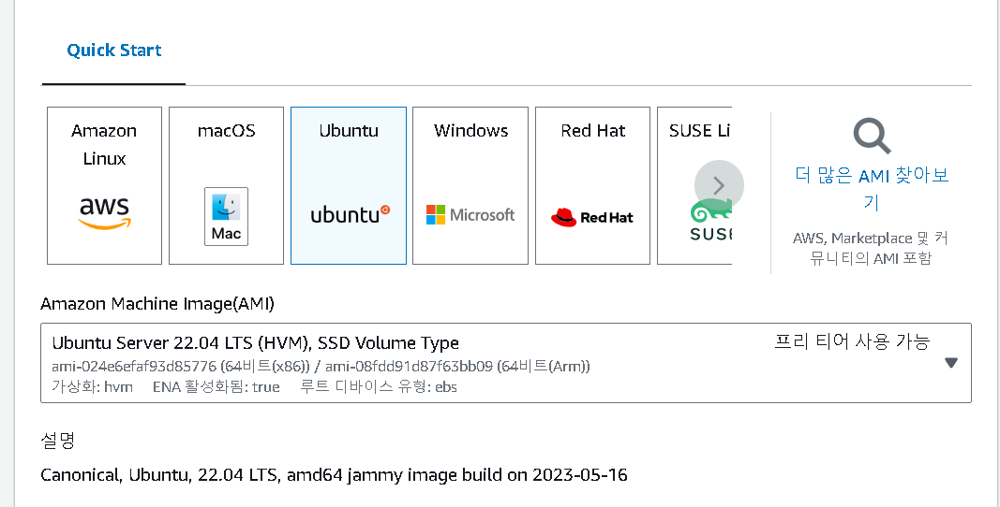
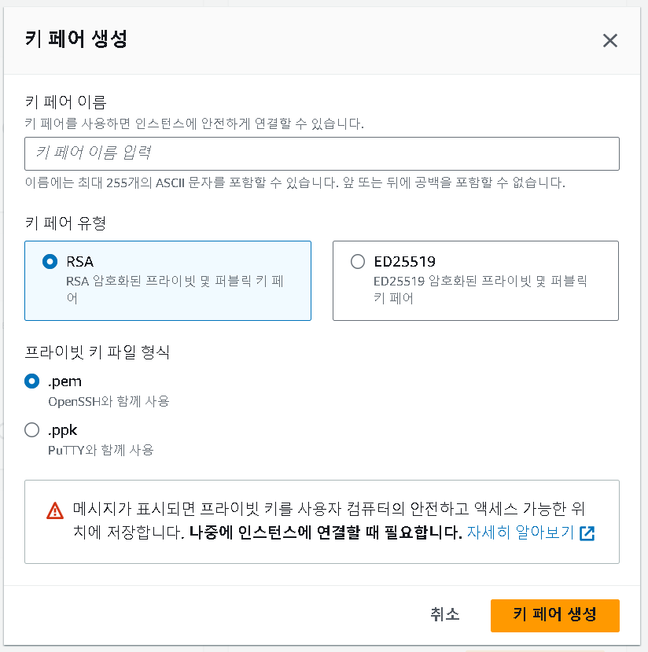
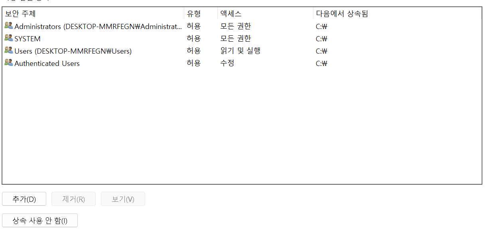

EC2 : Elastic Compute Cloud 

- 클라우드 컴퓨팅 서비스
- 가상 서버를 프로비저닝하고 관리할 수 있는 유연하고 확장 가능한 인프라를 제공하여 사용자가 원하는 만큼의 컴퓨팅 리소스를 생성하고 사용할 수 있도록 한다
- 가상 머신(VM)으로, 다양한 운영 체제와 애플리케이션을 호스팅할 수 있다
- EC2를 사용하여 필요에 따라 가상 서버를 프로비저닝하고, 인스턴스 유형, 운영 체제, 스토리지 유형 등을 선택할 수 있다 
- 웹 애플리케이션, 데이터베이스, 분석 워크로드, 기계 학습 모델 등을 호스팅하고 실행할 수 있다

## 1. EC2 인스턴스 만들기

- 검색에서 EC2를 검색한 후 인스턴스 생성

- 인스턴트 이름 지정

- 운영체제는 ubuntu를 설정하였고 이외의 값은 선택하지 않았다

## 2. 인스턴트 유형

- 인스턴트 유형은 프리 티어에서 사용 가능한 것으로 선택해준다

## 3. 키 페어 생성

- 키 페어를 생성하면 속성에 들어가서 고급을 누르면 아래와 같은 상태가 되는데

- "상속되지 않음" 옵션을 선택하면 키 페어를 생성한 사용자 외에는 해당 키 페어에 대한 액세스 권한을 갖지 않게 된다
- "사용 권한"에서 "user"가 포함된 항목들을 삭제하면 해당 키 페어에 대한 액세스 권한을 사용자에게 제한할 수 있게 된다

## 참고

https://ynkim0.github.io/posts/EC2-%EC%84%9C%EB%B2%84%EC%97%90%EC%84%9C-Jupyter-Notebook-%EA%B5%AC%EB%8F%99%ED%95%98%EA%B8%B0/

