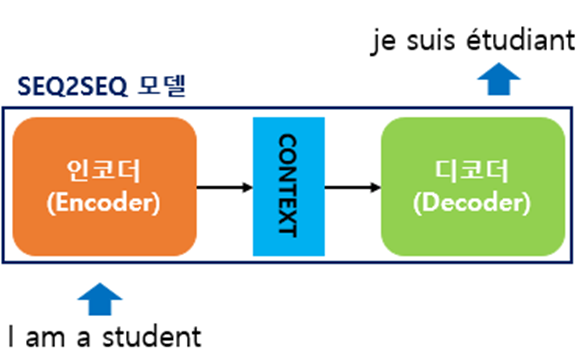
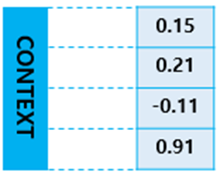
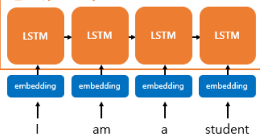
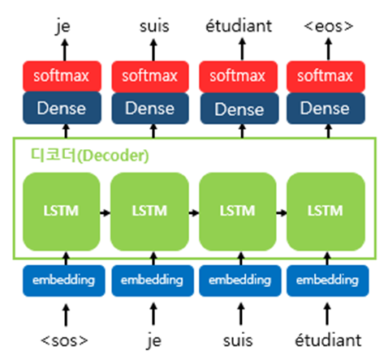
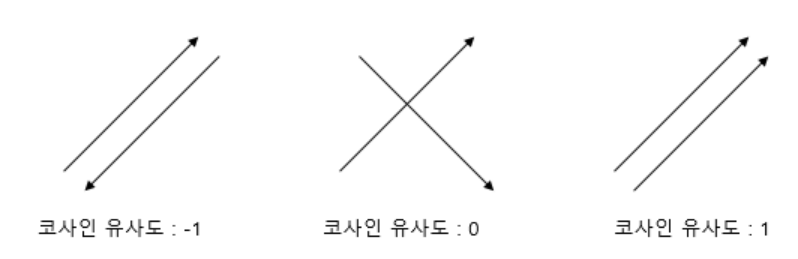
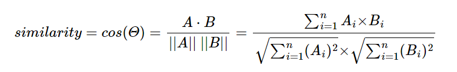

# sequence-to-sequence 

[seq2seq 설명 블로그](https://wikidocs.net/24996)

인코더와 디코더로 두 개의 모듈로 구성되어 있다.

1. 인코더는 입력 문장의 모든 단어들을 순차적으로 입력받은 뒤에 마지막에 이 모든 단어 정보들을 압축해서 하나의 벡터(context vector)로 만든다.
2. 입력 문장의 정보가 하나의 context vector로 모두 압축되면 context vector를 디코더로 전송한다.
3. 디코더는 context vector를 받아서 번역된 단어를 한 개씩 순차적으로 출력한다.

context vector 예시 사진 : 실제로는 수백개의 차원을 갖고 있는 경우가 많다.

인코더와 디코더의 Architecture 내부를 살펴보면 두 개의 RNN Architecture로 구성되어있음을 볼 수 있다.

1. 인코더 : 입력 문장을 받는 RNN셀
2. 디코더 : 출력 문장을 출력하는  RNN셀 
3. 바닐라 RNN이 아니라 LSTM 셀 또는 GRU **셀**들로 구성되어 있다.

## Incoder

1. 입력 문장은 단어 코큰화를 통해서 단어 단위로 쪼개지고 단어 토큰은 각각 RNN셀의 각 시점에 입력이 된다.
   1. 
2. 인코더 RNN셀은 모든 단어를 입력받은 뒤에 인코더 RNN 셀의 마지막 시점의 은틱 상태를 디코더 RNN셀로 넘겨준다.
3. 넘겨준 벡터를 context vector 라고 한다.
4. context vector는 디코더 RNN셀의 첫 번째 은닉 상태에 사용된다.

## Decoder RNNLM(RNN Language Model)

테스트 과정 동안에

1. 디코더는 초기 입력으로 문장의 시작을 의미하는 심볼 $<sos>$가 들어 있다.
   1. $<sos> == <s> == <Go> == <bos>$ 심볼은 여러 종류로 쓰이는 듯 하다.
2. 디코더는 $<sos>$가 입력되면, 다음에 등장할 확률이 높은 단어를 예측한다.
   1. 첫 번째 timestep의 디코더 RNN셀은 다음 단어를 $je$로 예측한 모습
3. 문장의 끝을 의미하는 심볼인 $<eos>$가 다음 단어로 예측될 때 까지 반복된다.
   1. $<eos> == </s> == <end> $

훈련 과정 동안에는

디코더에게 인코더가 보낸 context vector와 실제 정답인 $<sos> je suis étudiant $를 입력 받았을 때

 $je suis étudiant <eos> $가 나와야 한다고 정답을 알려주면서 훈련한다.

1. seq2seq에서 사용되는 모든 단어들은 임베딩 벡터로 변환 후 입력으로 사용한다.
   1. 
   2. 임베딩 층을 거쳐서 입력된다.

Word Embedding 예시 실제로 임베딩 벡터는 수백개의 차원을 가질 수 있다.

## RNN셀에서의 timestep

1. 현재 timestep을 t라고 할 때,  RNN셀은 t-1에서의 은닉 상태와 t에서의 입력 벡터를 입력으로 받는다.
2. t에서의 은닉 상태를 만든다.
3. t에서의 은닉 상태는 바로 위에 또 다른 은닉층이나 출력층이 존재할 경우에는 위의 층으로 보내거나 필요 없다면 값을 무시할 수 있다.
4. RNN셀은 다음 타임 스텝에 해당하는 t+1의 RNN셀의 입력으로 현재 t에서의 은닉 상태를 입력으로 보낸다.

### 컨텍스트 벡터 Context vector

인코더 RNN셀의 마지막 시점의 은닉 상태를 디코더로 넘겨준 벡터

1. t에서의 은닉 상태는 과저 타입 스텝의 동일한 RNN셀에서의 모든 은닉 상태의 값들의 영향을 누적되어 있는 값이다.
2. 컨텍스트 벡터는 인코더에서의 마지막 RNN셀의 은닉상태 값이다.
3. 입력 문장의 모든 단어 토큰들의 정보를 요약해서 닮고 있다.

## seq2seq 디코더 단어 예측

1. 디코더는 인코더의 마지막 RNN셀의 은닉 상태인 **컨텍스트 벡터를 첫 번째 은닉 상태**의 값으로 사용한다.
   1. context vector를 단어를 예측하는 매 타임스텝마다 하나의 입력으로 사용할 수 있다.
   2. attention
2. 디코더의 첫 번째 RNN셀은 이 첫 번째 은닉 상태의 값 + 현재 t에서 입력값인 $<sos>$로부터 다음에 등장할 단어를 예측한다.
3. 예측된 단어는 다음 시점인 t+1 RNN에서의 입력값이 되고 이것이 반복된다.
4. seq2seq모델은 선택될 수 있는 모든 단어로부터 하나의 단어를 골라서 예측해야 한다.
5. 디코더에서 각 타임스텝의 RNN셀에서 출력 벡터가 나오면 해당 벡터는 소프트맥스 함수를 통해 출력 시퀀스의 각 단어별 확률값을 반환한다.
6. 반환된 확률값으로부터  출력 단어를 선택한다.

## 한계

1. 하나의 고정된 크기의 벡터에 모든 정보를 압축하기 때문에 정보 손실이 일어난다.
2. RNN이므로 **vanishing gradient** 

### Word Embeding

[단어 임베딩](https://wikidocs.net/33520)

단어를 벡터로 표현하는 방법

1. 희소 표현**(Sparse Representation)**
   1. 원-핫 인코딩처럼 벡터 또는 행렬(matrix)의 값이 대부분이 0으로 표현되는 방법을 희소 표현(sparse representation)이라고 한다. 비슷하게 원-핫 벡터는 희소 벡터이다
2. 희소 표현의 한계
   1. 단어의 개수가 늘어나면 벡터의 차원이 너무 커진다. 단어 집합이 클수록 고차원의 벡터가 된다.
   2. 그러므로 벡터 표현은 공간적 낭비를 일으킨다.
      1. 희소 표현의 일종인 DTM과 같은 경우에도 특정 문서에 여러 단어가 다수 등장하였으나, 다른 많은 문서에서는 해당 특정 문서에 등장했던 단어들이 전부 등장하지 않는다면 역시나 행렬의 많은 값이 0이 되면서 공간적 낭비를 일으킨다.
   3. 원-핫 벡터와 같은 희소 벡터의 문제점은 단어의 의미를 표현하지 못한다

1. 밀집 표현 **(Dense Representation)**'
   1. 벡터의 차원을 단어 집합의 크기로 상정하지 않는다.
   2. 사용자가 설정한 값으로 모든 단어의 벡터 표현의 차원을 맞춘다.
      1. 차원이 줄어듦으로 0과 1이 아니라 실수값을 가지게 된다.
   3. 벡터의 차원이 조밀해졌다고 하여 밀집 벡터(dense vector)라고 한다.

1. **Word Embeding**
   1. 단어를 밀집 벡터(dense vector)의 형태로 표현하는 방법
   2. 이 밀집 벡터는 워드 임베딩 과정을 통해 나온 결과이므로 임베딩 벡터(embeding vector)라고 한다.
   3. 케라스 Embeding()
      1. 단어를 랜덤한 값을 가지게 하는 밀집 벡터로 변환한다.
      2. 인공 신경망의 가중치를 학습하는 방법으로 단어 벡터를 학습하는 방법을 사용한다.
   4.  LSA, Word2Vec, FastText, Glove 등의 방법이 있다.

### 코사인 유사도 (cosine similarity)

[코사인 유사도](https://wikidocs.net/24603)

1. **코사인 유사도는 두 벡터 간의 코사인 각도를 이용하여 구할 수 있는 두 벡터의 유사도이다.**

2. 단어가 추치화되어 있을 때 코사인 유사도를 구할 수 있다.

3. 1에 가까울수록 유사도가 높다고 판단한다.
   1. $-1<=x<=1$의 값을 갖는다.
4. 두 벡터가 가리키는 방향이 얼마나 유사한지를 의미한다

 

식

