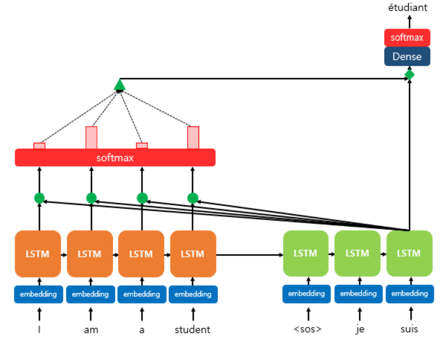

# Attention

트랜스포머의 기반이 되는 어탠션 매커니즘

[딥러닝을 통한 자연어 처리 입문 - Attention](https://wikidocs.net/22893)

### seq2seq 모델의 문제

1. 하나의 고정된 크기의 벡터에 모든 정보를 압축하기 때문에 정보 손실이 일어난다.
2. RNN이므로 **vanishing gradient** 존재

## Attention idea

1. 디코더에서 출력 단어를 예측하는 매 time step마다 인코더에서 전체 입력 문장을 다시 한 번 참고한다.
2. 전체 입력 문장을 전부 다 동일한 비율로 참고하는 것이 아니라 해당 시점에서 예측해야 할 단어와 연관이 있는 입력 단어 부분을 좀 더 집중(attention)한다.

## Attention Function

어텐션 함수는 딕셔너리처럼 Key-Value로 구성되는 자료형이다.

키를 통해서 맵핑된 값을 찾아낼 수 있다는 특징이 있다.

**Attention(Q, K, V) = Attention Value**

1. 주어진 '쿼리(Query)'에 대해서 모든 '키(Key)'와의 유사도를 각각 구한다.
2.  유사도를 키와 맵핑되어있는 각각의 '값(Value)'에 반영한다.
3. 유사도가 반영된 '값(Value)'을 모두 더해서 리턴한다.

​             i.     Q = Query : t 시점의 디코더 셀에서의 은닉 상태

​            ii.     K = Keys : 모든 시점의 인코더 셀의 은닉 상태들

​            iii.     V = Values : 모든 시점의 인코더 셀의 은닉 상태들

## dot porduct attention

seq2seq에서 사용되는 어텐션 

다른 어텐션과 매커니즘은 유사하다.

디코더의 세 번째 LSTM셀에서 출력 단어를 예측할 때 어텐션 매커니즘을 사용하는 것을 보여준다.

1. 디코더의 첫번째와 두 번쨰LSTM셀은 이미 어텐션 매커니즘을 통해 $je, suis$를 예측하는 과정을 거쳤다고 하자

2. 디코더의 세 번째LSTM셀은 출력 단어를 예측하기 위해서 인코더의 모든 입력 단어들의 정보를 다시 한번 참고한다.

   

3. 인코더의 소프트맥스 함수는 인코더의 단어가 각각 출력 단어를 예측할 때 얼마나 도움이 되는지를 수치화한 것이다.

4. 이를 하나의 정보로 담어서 디코더로 전송한다.

## Attention Score

1. 인코더의 타임 스텝을 각각 $1,2,...,N$
2. 인코더의 은닉 상태(hidden state)를 각각 $h_1, h_2, ... h_N$
3. 디코더의 현재 시점(time step) t에서의 디코더의 은닉 상태(hidden state)를 $s_t$
4.  인코더의 은닉 상태와 디코더의 은닉 상태의 차원이 같다고 가정 
5. 인코더의 은닉 상태와 디코더의 은닉 상태가 동일하게 차원이 4

### 디코더의 현재 타입스텝에서 필요한 입력값

1. 이전 시점인 $t-1$의 은닉 상태
2. 이전 시점 $t-1$의 출력 단어
3. 어텐션 매커니즘 에서는 어텐션 값(attention value)을 추가고 필요로 한다.
   1. attention value를 $a_t$라 하자

### Attention Score Value

1. $s_t$를 전치(transpose)하고 각 은닉 상태와 내적(dot product)을 수행

   1. $s_t$ : 디코더의 은닉 상태

2. 모든 어텐션 스코어 값은 스칼라값이다.

3. $s_t$과 인코더의 i번쨰 은닉상태의 어텐션 스코어 계산

   

   1. 어텐션 스코어 함수

      

4. 모든 어텐션 스코어 값을 $e^t$라고 하자

   

   

