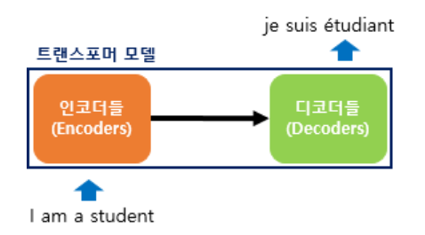
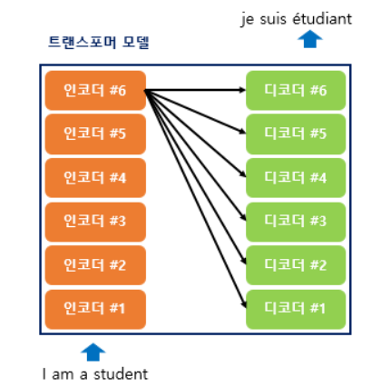
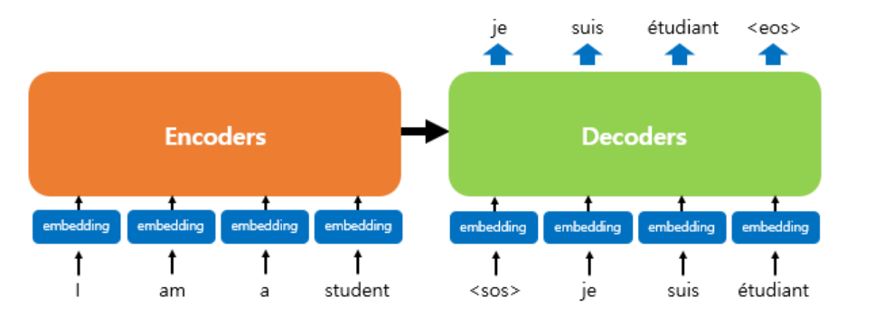

# Transformer

트랜스포머는 "attenetion is all you need " 논문에서 발표한 모델이다.

기존의 seq2seq 구조인 인코더-디코더를 따르면서도, attention만으로 구현한 모델이다.

RNN을 사용하지 않고 인코더-디코더 구조를 설계했음에도 번역 성능에서 RNN보다 우수한 성능을 보여준다.

## 기존 seq2seq 모델의 한계

기존 seq2seq모델은 인코더-디코더 구조로 구성되어 있다.

인코더는 입력 시퀀스 하나의 벡터 표현으로 압축하고, 디코더는 이 벡터 표현을 통해서 출력 시퀀스를 만들어냈다.

인코더가 입력 시퀀스를 하나의 벡터로 압축하는 과정에서 입력 시퀀스의 정보가 일부 손실된다는 단점이 있다.

이를 보정하기 위해 어텐션이 사용되었다.

## 트랜스포머의 주요 하이퍼파라미터

$d_model=512$

트랜스포메의 인코더와 디코더에서 정해진 입력과 출력의 크기를 의미한다.

임베딩 벡터의 차원 또한 $d_model$이며, 각 인코더와 디코더가 다음 층의 인코더와 디코더로 값을 보낼 때에도 이 차원을 유지한다.

$num_layers=6$

트랜스포머에서 하나의 인코더와 디코더를 층으로 생각하였을 때, 트랜스포머 모델에서 인코더와 디코더가 총 몇 층으로 구성되어있는지를 의미한다.

논문에서는 인코더와 디코더를 각각 6개를 쌓았다.

$num_heads$=8

트랜스포머에서는 어텐션을 사용할 때 한 번 하는 것보다 여러 개로 분할해서 병렬로 어텐션을 수행하고 결과값을 다시 하나로 합치는 방식을 선택한다.

이 때 이 병렬의 개수를 의미한다.

$d_ff=2048$

트랜스포머 내부에는 피드 포워드 신경망이 존재하며 해당 신경망의 은닉층의 크기를 의미한다.

피드 포워드 신경망의 입력층와 출력층의 크기는 $d_model$이다.

## 트랜스포머

트랜스포머는 RNN을 사용하지 않지만 기존의 seq2seq모델처럼 인코더에서 입력 시퀀스를 입력받고 디코더에서 출력 시퀀스를 출력하는 인코더-디코더 구로를 유지한다.

seq2seq의 인코더와 디코더에서는 각각의 RNN이 t개의 타임스텝을 가지는 구조였다

트랜스포머에서는 인코더와 디코더의 단위가 N개로 구성되는 구조이다.

인코더와 디코더가 각각 6개인 트랜스포머 구조를 나타낸 것이다.

인코더로부터 정보를 전달받아 디코더가 출력 결과를 만들어내는 트랜스포머 구조를 보여준다.

디코더는 마치 기존의 seq2seq구조처럼 시작 심볼 $<sos>$를 입력으로 받고 종료 심볼$<eos>$가 나올 때 까지 연산한다.

트랜스포머의 인코더와 디코더는 단순히 각 단어의 임베딩 벡터들을 입력받는 것이 아니라 임베딩 벡터에서느 조정된 값을 입력받는다.

## 포지셔널 인코딩

트랜스포머의 입력

