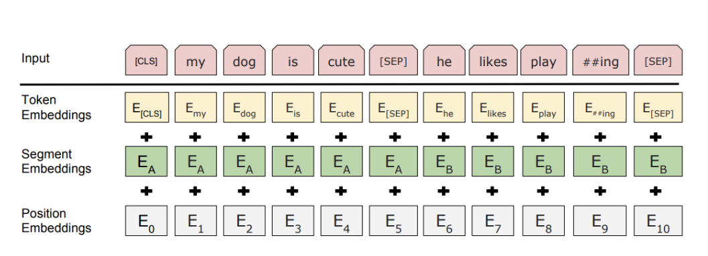
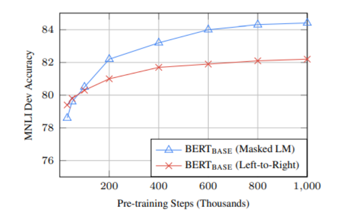
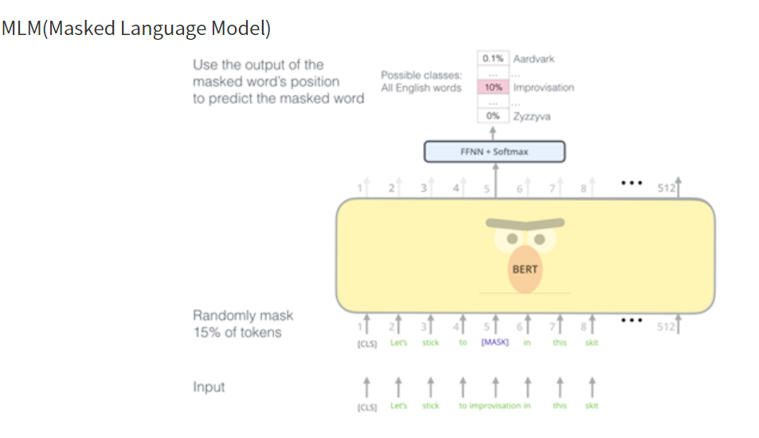
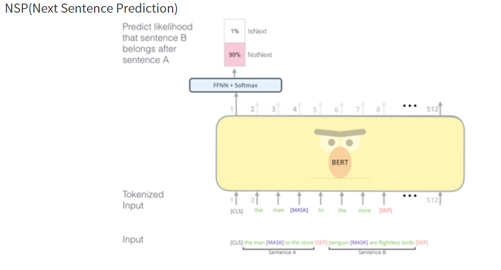

# BERT

Bidirectional Encoder Representations from Transformers

Bidirectional :양방향 

인코더는 입력값을 양방향으로 처리하고

디코더는 왼쪽으로 오른쪽으로 단방향으로 출력

gpt-1이라는 자연어 처리 모델

문장을 데이터로 사용하고 단어를 하나씩 읽어가면서 다음 단어를 예측한다.

위와 같은 방식을 별도의 레벨링 작업이 필요가 없으므로 비지도 학습이고

한 문장만 가지고도 여러 학습 데이터를 만들 수 있다.

다음 단어를 예측하는 것이기 때문에 사람이 직접 레이블링 할 필요가 없다.

학습을 위해서는 많은 양의 데이터가 필요하다

문맥이해의 약점

왼쪽에서 오른쪽으로 읽어나가는 디코더보다 양방향으로 문맥을 이해할 수 있는 모델

모든 자연어 처리에서 좋은 성능을 내는 범용 lanuguage model

특정 과제를 하기 전에 임베딩(자연어 -> 벡터)을 통해 성능을 좋게 하는 것

Word Piece 임베딩 방식 사용, 각 Char(문자) 단위로 임베딩을 하고, 자주 등장하면서 가장 긴 길이의 sub-word를 하나의 단위로 만듭니다. 자주 등장하지 않는 단어는 다시 sub-word로 만듭니다. 이는 이전에 자주 등장하지 않았던 단어를 모조리 'OOV'처리하여 모델링의 성능을 저하했던 'OOV'문제도 해결 할 수 있습니다.

모르는 단어로 인해 문제를 푸는 것이 까다로워지는 상황을 OOV(Out-Of-Vocabulary) 

Subword Segmentation

하나의 단어를 여러 subword로 분리해서 단어를 인코딩/임베딩 하겠다는 의도의 전처리 작업

Segment Embedding

: Sentence Embedding, 토큰 시킨 단어들을 다시 하나의 문장으로 만드는 작업입니다.

BERT에서는 두개의 문장을 구분자([SEP])를 넣어 구분하고 그 두 문장을 하나의 Segment로 지정하여 입력합니다. 

BERT에서는 이 한 세그먼트를 512 sub-word 길이로 제한하는데, 한국어는 보통 20 sub-word가 한 문장을 이룬다고 하며 대부분의 문장은 60 sub-word가 넘지 않는다고 하니 BERT를 사용할 때, 하나의 세그먼트에 128로 제한하여도 충분히 학습이 가능하다고 합니다.

Position Embedding

: BERT의 저자는 이전에 Transformer 모델을 발표하였는데, 

Transformer란 CNN, RNN 과 같은 모델 대신 Self-Attention 이라는 모델을 사용하는 모델입니다. 

BERT는 Transformer의 인코더, 디코더 중 인코더만 사용합니다. 

Self Attention은 입력의 위치를 고려하지 않고 입력 토큰의 위치 정보를 고려합니다. 

2. Pre-Training

: 데이터들을 임베딩하여 훈련시킬 데이터를 모두 인코딩 하였으면, 사전훈련을 시킬 단계입니다. 기존의 방법들은 보통 문장을 왼쪽에서 오른쪽으로 학습하여 다음 단어를 예측하는 방식이거나, 예측할 단어의 좌우 문맥을 고려하여 예측하는 방식을 사용합니다.
하지만 BERT는 언어의 특성을 잘 학습하도록,

MLM(Masked Language Model)
NSP(Next Sentence Prediction)

: 입력 문장에서 임의로 토큰을 버리고(Mask), 그 토큰을 맞추는 방식으로 학습을 진행합니다.

: 두 문장이 주어졌을 때, 두 문장의 순서를 예측하는 방식입니다. 두 문장 간 관련이 고려되야 하는 NLI와 QA의 파인 튜닝을 위해 두 문장의 연관을 맞추는 학습을 진행합니다.