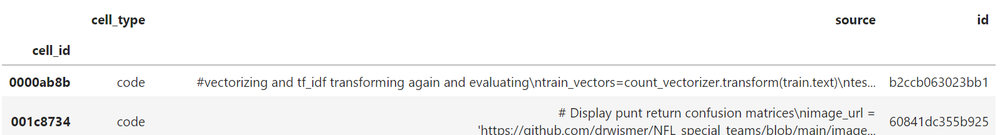
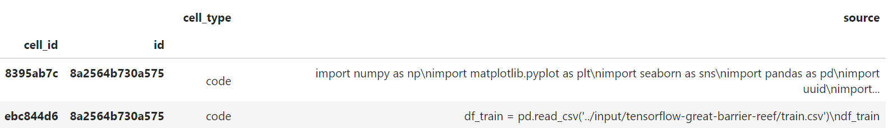
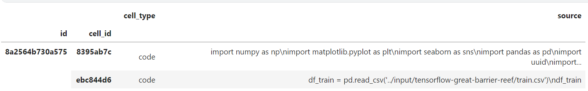
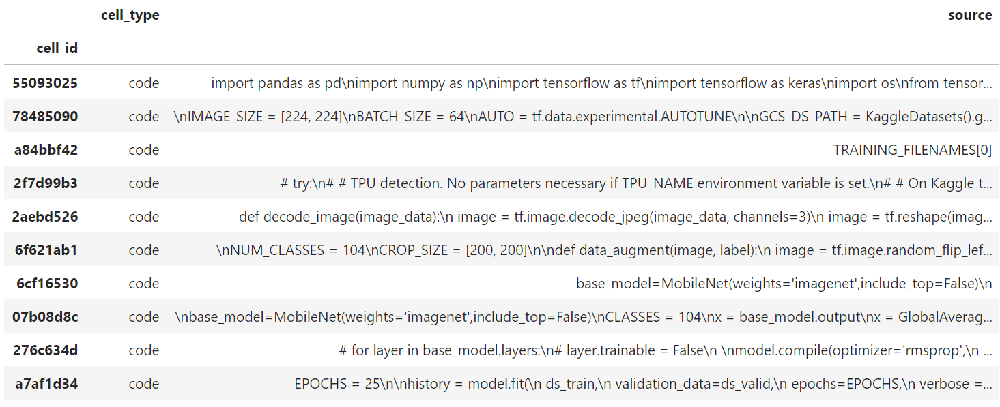
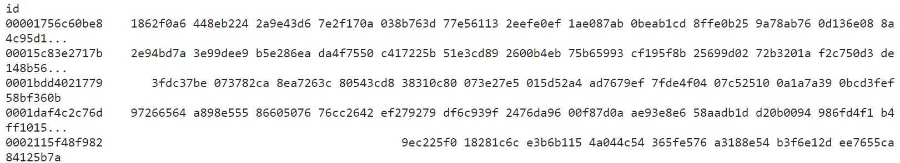
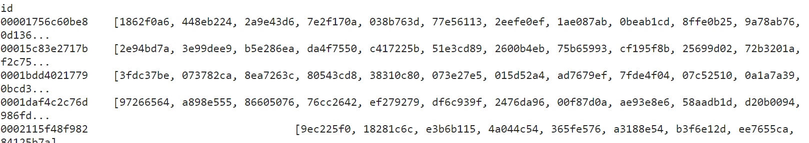

# Disitlbert


```
paths_train = list((data_dir / 'train').glob('*.json'))[:NUM_TRAIN]
```

NUM_TRAIN = 100 몇 개를 훈련시킬지 개수 정하기

리스트[:NUM_TRAIN] == 처음~NUM_TRAIN까지 의 개수

glob('*.json') == json 파일을 찾는다.

(data_dir / 'train'). == 위치

paths_train은 (data_dir / 'train')에서 json 파일을 [:NUM_TRAIN]만큼 리스트로 저장한다.


```
df = (
    pd.concat(notebooks_train)
    .set_index('id', append=True)
    .swaplevel() #인덱스 위치 바꾸는 것
    .sort_index(level='id', sort_remaining=False)
)
```




​    .set_index('id', append=True)사용해서 'id'를 인덱스로 만들어준다

append=True를 사용해서 기존 index인 'cell_id'index가 사라지지 않도록 해준다.



.swaplevel()로 'id'와 'cell_id'인덱스 위치를 바꾸어준다.



.sort_index(level='id', sort_remaining=False)

'id'를 sort한다.sort_remaining=False를 통해서 다른 인덱스는 sort하지 않도록 해준다.

```
nb_id = df.index.unique('id')[6]
print('Notebook:', nb_id)

print("The disordered notebook:")
nb = df.loc[nb_id, :]
```

nb_id = df.index.unique('id')[6]는 id가 중복인 경우는 제외하고 6번째 값을 nb_id에 저장

unique == id가 중복인 경우는 제외하고 


nb = df.loc[nb_id, :]는 df에서 nb_id와 같은 값을 모두 출력

nb_id에 id값이 저장되어있으므로 id가 같은 값을 전부 출력한다.

nb = df.loc[nb_id]로 생략해도 똑같이 출력하는 것으로 보인다.



```
df_orders = pd.read_csv(
    data_dir / 'train_orders.csv',
    index_col='id',
    squeeze=True, 
).str.split()

df_orders
```

df_orders는 train_orders.csv를 불러오는데 이 곳에는 순서가 맞는 train파일(정답파일)이 존재한다.

squeeze=True 는 열이 하나이면 serise 형태로 변환한다

.str.split()를 통해 마지막에 리스트로 바꾸어준다.



리스트

