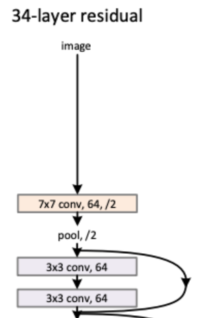
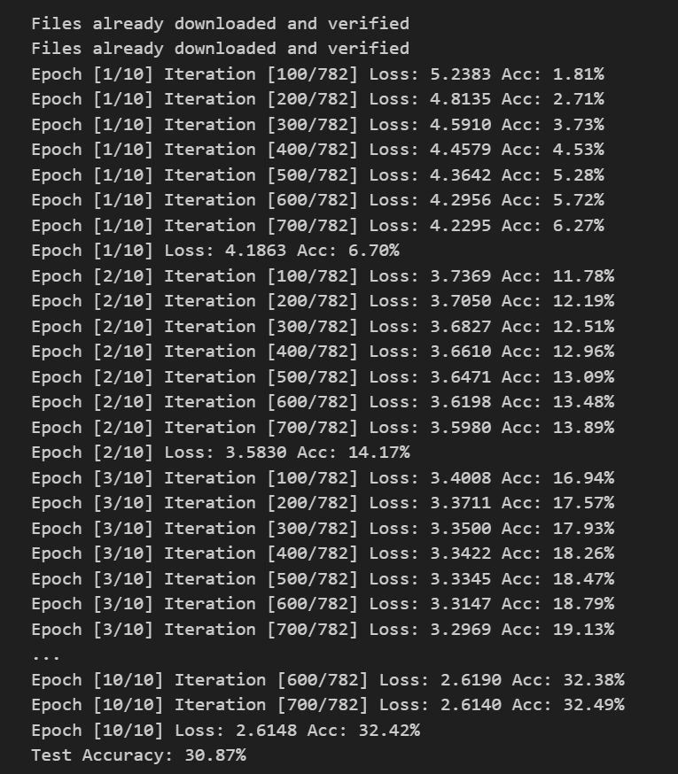

# ResNet

ResNet은 잔여학습을 통해 layer가 깊어질 때 발생하는 vanishing/exploding gradient를 방지한다.


## ResNet Architecture


## ResNet Architecture를 가지고 코드 완성해보기




- 7x7 conv layer와 체널이 64임을 알 수 있고 stride를 통해 특성을 뽑으면서 이미지를 절반으로 줄이는 것을 볼 수 있다.
- pooling을 사용해 특성을 추출하고 다시 절반으로 이미지 크기를 줄인다.
- 3x3 conv, 64 층이 2번 반복되고 





```python
def resnet_34(input_shape=(224, 224, 3), class_num=1000):
    # 체널(필터)지정
    base_channel_num = 64

    input_1 = Input(input_shape, name="input_1")
    
    # 첫번째 합성곱 블록 (224, 224, 3) 입력
    block1_conv_1 = Conv2D(
        filters=base_channel_num,
        kernel_size=7,
        strides=2,
        padding="same",
        activation="relu",
        name="block1_conv_1"
    )(input_1)
    # same padding : H = (입력 높이 / 스트라이드)
    # vaild padding : H = (입력 높이 - 커널 높이) / 스트라이드 + 1
    # 첫번째 합성곱 블록 (112, 112, 64) 출력

    # 두번째 풀링 블록 (112, 112, 64) 입력
    block2_pool_1 = MaxPool2D(
        pool_size=3,
        strides=2,
        padding="same",
        name="block2_pool_1"
    )(block1_conv_1)
    # 두번째 풀링 블록 (56, 56, 64) 출력 : stride = 2
    
    # 두번째 합성곱 블록 내 첫 번째 레이어 (56, 56, 64) 입력
    block2_residual_1 = block2_pool_1
    block2_conv_1 = Conv2D(
        filters=base_channel_num,
        kernel_size=3,
        padding="same",
        activation="relu",
        name="block2_conv_1"
    )(block2_residual_1)
    # 두번째 합성곱 블록 내 첫 번째 레이어 (56, 56, 64) 출력
    
    # 두번째 합성곱 블록 내 두 번째 레이어 (56, 56, 64) 입력
    block2_conv_2 = Conv2D(
        filters=base_channel_num,
        kernel_size=3,
        padding="same",
        activation="relu",
        name="block2_conv_2"
    )(block2_conv_1)
    # 두번째 합성곱 블록 내 두 번째 레이어 (56, 56, 64) 출력

    # Residual 연결을 위한 Add 레이어
    block2_add_1 = Add()(
        [block2_residual_1, block2_conv_2]
    )
```


```python

```



```python
from tensorflow.keras.layers import Input, Conv2D, MaxPool2D, GlobalAveragePooling2D, Dense, Add
from tensorflow.keras.models import Model

def resnet_34(input_shape=(224, 224, 3), class_num=1000):
    # 초기 체널(필터) 수
    base_channel_num = 64

    # 입력 레이어
    input_1 = Input(input_shape, name="input_1")

    # 첫 번째 합성곱 블록
    x = Conv2D(
        filters=base_channel_num,
        kernel_size=7,
        strides=2,
        padding="same",
        activation="relu",
        name="block1_conv_1"
    )(input_1)
    # same padding: H = 입력 높이 / 스트라이드

    # 두 번째 풀링 블록
    x = MaxPool2D(
        pool_size=3,
        strides=2,
        padding="same",
        name="block2_pool_1"
    )(x)
    # same padding이므로 크기 변화 없음

    # Residual 블록 1
    x = residual_block(x, base_channel_num, 3, "block2")

    # Residual 블록 2
    x = residual_block(x, base_channel_num * 2, 4, "block3")

    # Residual 블록 3
    x = residual_block(x, base_channel_num * 4, 6, "block4")

    # Residual 블록 4
    x = residual_block(x, base_channel_num * 8, 3, "block5")

    # Global Average Pooling
    x = GlobalAveragePooling2D(name="gap_1")(x)

    # 출력 레이어
    output = Dense(
        units=class_num,
        activation="softmax",
        name="last_dense_1"
    )(x)

    # 모델 생성
    model = Model(inputs=[input_1], outputs=[output])
    
    return model
```





```python
def residual_block(x, filters: int, num_blocks: int, name):
    # Residual 블록
    for i in range(num_blocks):
        block_name = f"{name}_block_{i + 1}"
        x = residual_unit(x, filters, block_name)
    return x
```



Residual 블록은 `for` 루프를 사용하여 주어진 개수의 Residual 유닛을 생성합니다. 각 Residual 유닛은 `residual_unit` 함수를 호출하여 생성되며, 이 함수는 입력 텐서 `x`를 받고 필터 수 `filters`와 Residual 유닛의 이름을 전달합니다. 그리고 각 Residual 유닛은 이전 유닛의 출력을 다음 유닛으로 전달하는 방식으로 구성되어 네트워크가 깊어질수록 그레디언트 소실 문제를 해결하게 됩니다.

- `x`: 입력 텐서
  -  이 입력 텐서는 Residual 블록 내의 첫 번째 Residual 유닛의 입력으로 사용됩니다. 
  - 이 텐서는 Residual 블록 내에서 변환되고, 그 다음 Residual 유닛에 전달됩니다.
- `filters`: Residual 블록 내에서 사용할 필터(채널)의 수를 나타내는 정수입니다. 
  - 이것은 Residual 유닛 내의 합성곱 레이어에서 필터 수를 결정하는 데 사용됩니다.
- `num_blocks`: Residual 블록 내에 생성할 Residual 유닛의 개수를 나타내는 정수입니다. 
  - Residual 블록은 여러 개의 Residual 유닛으로 구성되며, 이 값은 그 개수를 지정합니다.
- `name`: Residual 블록의 이름을 나타내는 문자열입니다. 
  - 이것은 블록 내에서 각 Residual 유닛의 이름을 구성할 때 사용됩니다.




```python
def residual_unit(x, filters: int, name):
    # Residual 유닛
    # 첫 번째 경로
    residual_1_maxpool_1 = MaxPool2D(
        pool_size=3,
        strides=2,
        padding="same",
        name=f"{name}__residual_1__pool_1"
    )(x)
    residual_1_conv_1 = Conv2D(
        filters=filters,
        kernel_size=1,
        padding="same",
        activation="relu",
        name=f"{name}__residual_1__conv_1"
    )(residual_1_maxpool_1)

    # 두 번째 경로
    residual_2_conv_1 = Conv2D(
        filters=filters,
        kernel_size=3,
        strides=2,
        padding="same",
        activation="relu",
        name=f"{name}__residual_2__conv_1"
    )(x)
    residual_2_conv_2 = Conv2D(
        filters=filters,
        kernel_size=3,
        padding="same",
        activation="relu",
        name=f"{name}__residual_2__conv_2"
    )(residual_2_conv_1)
```





```python
    # 합치기
    x = Add(
        name=f"{name}__residual__add_1"
    )([residual_1_conv_1, residual_2_conv_2])
    
    return x
```





```python

```





```python

```





```python

```





```python

```

