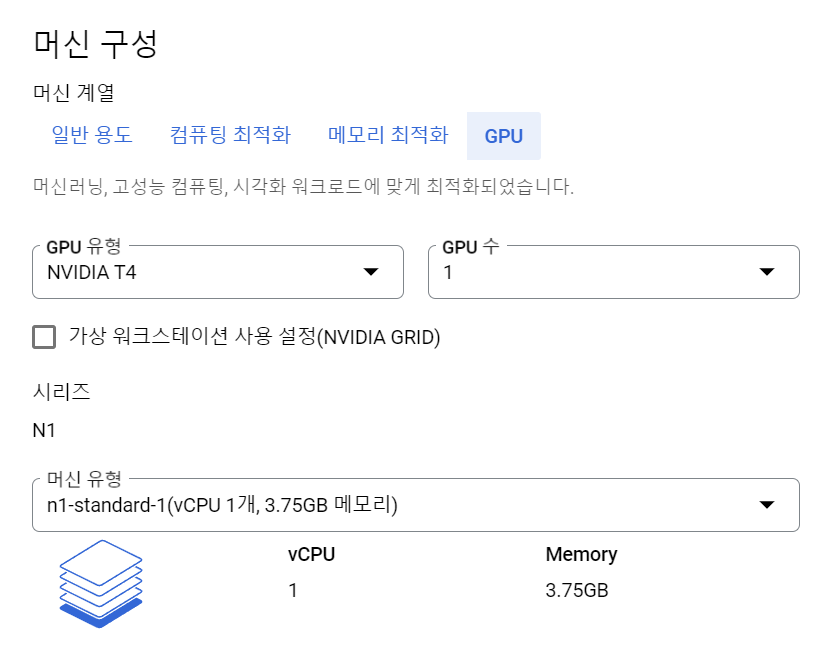
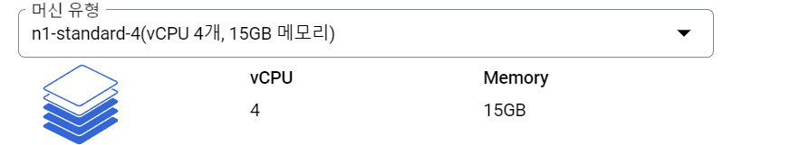
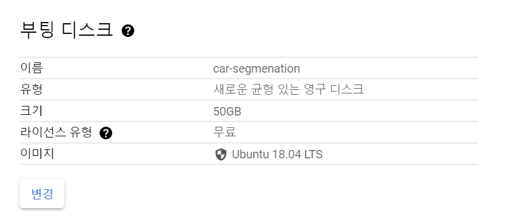
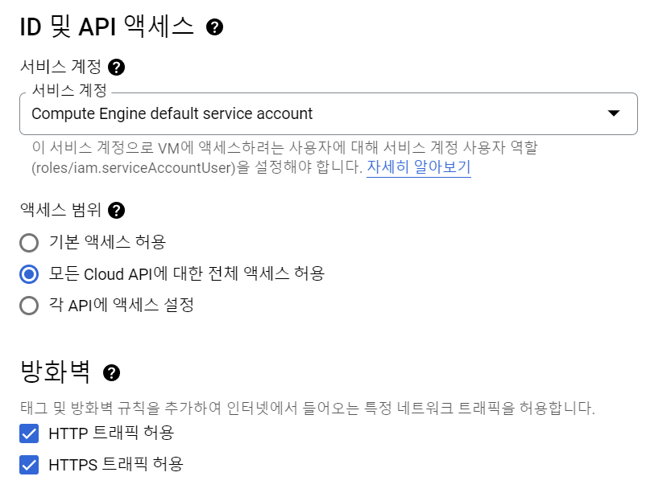
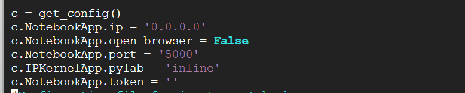

google gcp에서 segmentation 훈련 실행해보기

인스턴스 만들기 -> 새 VM 인스턴스를 선택합니다



머신 구성에서 가격을 확인해서 가장 저렴한 NVDIA T4를 선택합니다. 

위에 사진에서 메모리가 가장 낮은 거로 되어있는데 나중에 수정하였습니다.



[인스턴스 수정하는 방법](https://cloud.google.com/compute/docs/instances/changing-machine-type-of-stopped-instance?hl=ko)



운영체제를 ubuntu로 설정해주고 크기를 적당히 50기가로 설정해주었습니다.



모든 cloud API에 대한 전체 엑세스 허용과 HTTP,HTTPS 트래픽 허용 을 체크하고 만듭니다


파이썬과 주피터 설치

```
# python3 pip 설치
 
$ sudo apt-get update
 
$ sudo apt update
$ sudo apt install python3-pip
$ pip3 --version

# 쥬피터 노트북 설치
 
$ sudo apt-get install jupyter-notebook
$ jupyter --version
$ jupyter notebook

# ipython3 설치 및 외부접속 설정하기
 
$ sudo apt-get install ipython3
 
$ ipython3

# 쥬피터 노트북 외부접속 환경설정하기 
# a를 누르면 수정할 수 있게 됨
 
$ jupyter notebook --generate-config
 
$ vi ~/.jupyter/jupyter_notebook_config.py

# esc shift+: wq 로 설정창 나가기 및 설정 저장
```

설정



```
c = get_config()
c.NotebookApp.ip = '0.0.0.0'
c.NotebookApp.open_browser = False
c.NotebookApp.port = '5000'
c.IPKernelApp.pylab = 'inline'
c.NotebookApp.token = ''
# 커널이 죽지 않도록 버퍼 사이즈 늘리기
c.NotebookApp.max_buffer_size = 1000000000000000000000
```

ip와 port 는 방화벽에 설정한 것과 동일하게 입력하였다

외부 주소를 고정 주소로 만들어준다

네트워크 세부 정보 보기 -> ip주소 -> 외부 고정 주소 예약

```
# 노트북 열기
jupyter notebook --port=5000

# 외부 고정 주소:포트번호 로 주피터 열기
```


해당 환경에서 필요 패키지  다운 

```
# numpy
pip3 install tqdm
# pandas 
pip3 install tqdm
# tqdm
pip3 install tqdm

# PIL
sudo apt-get install libjpeg-dev zlib1g-dev
pip3 install pillow
pip3 install image

# cv2
python3 -m pip install --upgrade pip
pip3 install scikit-build
pip3 install cmake
pip3 install opencv-python


# 드라이버 설치 패키기 
sudo apt-get install ubuntu-drivers-common
# 설치 가능한 드라이버 확인
ubuntu-drivers devices
# 드라이버 선택하여 설치
sudo apt-get install nvidia-driver-515
# 리부트 후 설치 확인
sudo reboot
nvidia-smi

# cuda
wget https://developer.download.nvidia.com/compute/cuda/11.2.0/local_installers/cuda_11.2.0_460.27.04_linux.run
sudo apt install nvidia-cuda-toolkit
# 경로지정
## ls 해서 cuda 가 존재하는 경로에 지정하면 되는듯
$ vi ~/.bashrc

export PATH=/cuda-11.2/bin${PATH:+:${PATH}}
export LD_LIBRARY_PATH=/cuda-11.2/lib64:${LD_LIBRARY_PATH:+:${LD_LIBRARY_PATH}}
## 저장
source ~/.bashrc

# 버전확인
nvcc -V


# tensorflow
pip3 install tensorflow
pip3 install keras
# unet
pip3 install keras-unet
# sklearn
pip3 install -U scikit-learn

# cudnn 설치

```

