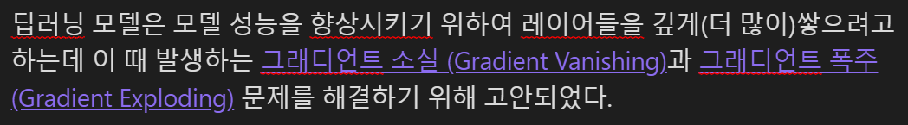
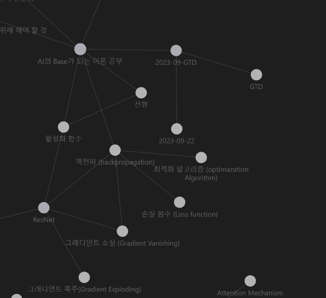

최근에 Obsidian이라는 노트 작성 앱을 발견하였는데 이전까지는 공부한 내용을 블로그에 올리고, 관련 코드는 GitHub에 저장하는 방식을 사용하였다. 하지만 이러한 방식은 링크와 카테고리를 일일이 관리해야 해서 까다로웠는데. 특히 링크를 통해 연관 내용을 연결해야 할 때나 카테고리를 변경할 때, 모든 링크를 수동으로 업데이트해야 하는 문제가 있었다. 이런 번거로움을 해결할 수 있는 효율적인 노트 작성 도구를 찾고 있던 중 Obsidian을 발견했고, 이를 통해 내용의 연결과 정리가 훨씬 수월해졌다.

Obsidian을 통해, 각 주제와 관련 내용을 손쉽게 연결하고 관리할 수 있어 이전의 불편함이 모두 해결되었고 이제 많은 링크와 카테고리를 일일이 관리할 필요가 없게 되어, 공부와 정리에 더 많은 가용시간을 가지게 되었다.

---

## 노트 간 연결과 재사용의 편리

예를 들어 특정 모델을 설명할 때 아래와 같이 설명을 적는데 그 것에 대한 설명을 추가하고 싶을 때 '[[]]' 안에 해당 내용을 적고 클릭하면 그 이름을 가진 마크다운 파일을 생성시키고 클릭 시에 연결하게 해 준다. 이 기능을 사용하면 아래와 같이 보인다.

위 내용은 ResNet 모델의 내용을 정리하면서 쓰게 되었는데 Gradient Vanishing과 Gradient Exploding에 대한 설명을 따로 마크다운 형태로 만들어서 설명하는 과정을 덜 하게 할 수 있으며 내용에 대해 잘 기억나지 않는다면 해당 설명으로 들어가서 확인하면 되므로 더 빠르게 내용을 확인할 수 있다. 

또한 위에서 설명하는 내용은 다른 딥러닝 모델에서도 사용되는 개념인데 그 때 기존에 만들어두었던 노트를 바로 재사용할 수 있으므로 자주 사용되는 내용들은 한 번 구축해놓는다면 구축된 내용이 많아지면 점점 더 노트를 완성하기 쉬워진다.

---

## Notion과의 차이점

하지만 위의 방법은 Notion에서도 사용할 수 있는데 Obsidian과의 차이점을 말하자면 Notion은 클라우드 기반이어서 무료 요금제일 경우 개별 파일의 업로드 용량 제한이 존재하지만 Obsidian은 로컬에 저장하는 방식이므로 제한이 없다.
하지만 반대로 노트를 다른 디바이스와 동기화하기 위해서는 매달 $8(23.09.28 기준)의 가격이 들지만 Github Repository와 동기화하여 사용하는 방법도 있다.

---

## Obsidian의 다른 기능

### Graph View
Obsidian에는 기본적으로 Graph View를 제공해주는데 이를 통해 연결한 모든 노드들을 확인할 수 있다. 한눈에 노트의 연결을 볼 수 있는 장점이 있다.

### canvas
canvas는 아직 만족할 만큼 사용해보지 못했는데 DashBoard를 만들거나 시각적으로 정보 정리를 하는데 좋다는 것 같다. 이후에 잘 사용하게 된다면 포스트를 추가해보려고 한다.

또한 Obsidain에는 Plugin을 사용하여 사용자가 필요로 할 시에 여러 추가 기능들을 커스터마이징 할 수 있는데 이 부분에 대해서는 다음 포스트에 정리하려고 한다.

Next Post : [[Obsidian Plugin(1) Dataview and Tasks]]