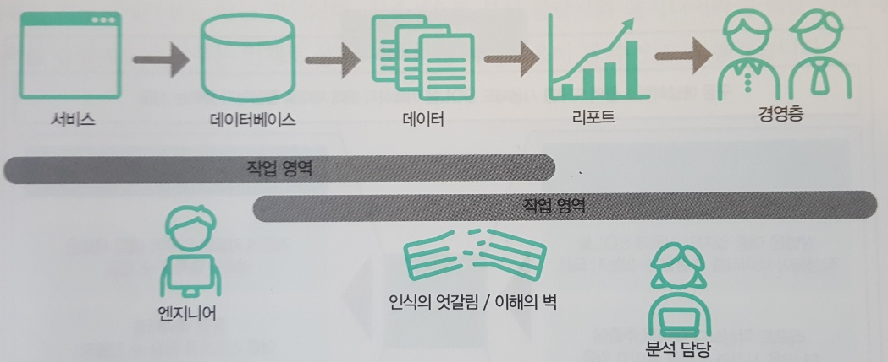

# 데이터 분석을 위한 SQL레시피

엔지니어와 분석 담당자 사이의 인식의 벽에 따라 생기는 여러 문제점

1. 분석 담장자가 요구한 데이터를 추출하더라도 이후에 비슷한 의뢰를 할 때마다 계속해서 비슷한 SQL을 만들어주어야 함
2. 분석 담당자도 무엇이 가능한지 몰라 애매모호한 의뢰를 하게 되므로 최종적인 결과물로 원하는 것이 나오지 않아 다시 의뢰를 받게 되는 경우

등등의 문제를 미연에 방지하기 위해

# PostgreSQL

오픈소스  RDB(Relational Database)이다.

RDB : 관계형 데이터베이스

다양한 플랫폼을 지원하며  GUI 인스톨러가 제공되므로 쉽게 컴퓨터에 설치할 수 있다.

# Apache Hive

RDB에서 대량의 데이터를 처리할 때 보틀넥이 발생하는 가장 큰 부분?
디스크에서 데이터를 읽어 들이 때의 전송 속도는 CPU에서 처리할 수 있는 속도에 비해 매우 느리다.

디스크 I/O가 보틀넥이 되는 경우에서 고속으로 데이터를 처리하기 위한 아키텍처로 분산 파일 시스템이 고안되었다.

분산 파일 시스템을 사용하면 거대한 데이터를 분할에서 여러 개의 디스크에 분산해서 저장하고 각 디스크에서 동시에 데이터를 읽어 들여 고속으로 대량의 데이터 처리를 할 수 있다.

5TB의 데이터를 100대의 디스크에 분산해서 저장하고 읽어 들어 들이면 시간 또한 1/100이된다.

Apache Hive는 HDFS이라고 부르는 분산 파일 시스템 위의 데이터를 SQL스러운 인터페이스로 간단하게 처리해 주는 시스템이다. 그런데 분산 파일 시스템 위의 데이터를 동시에 읽어 들여 디스크 I/O 보틀넥을 해결하더라도 그들의 순서를 제대로 맞출 수 없다면 의미가 없다.

그래서 분산 파일 시스템 위의 데이터의 순서를 맞추는 방법으로 MapReduce라는 알고리즘이 고안되었다.

이러한 HDFS와 MapReduce 아키텍처를 구현한 시스템이 초기의 Apache Hadoop이다.

Hive는 이러한 Hadoop 생태계의 일부분으로 HiveQL이라 부르는 SQL스러운 쿼리 언어로 작성한 쿼리를 자동적으로 MapReduce 잡으로 변환해서 간단하게 병렬 분산 처리를 할 수 있다. 

