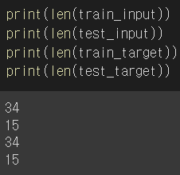
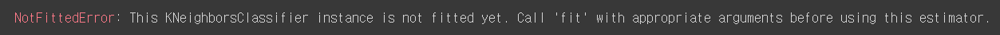
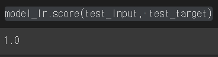
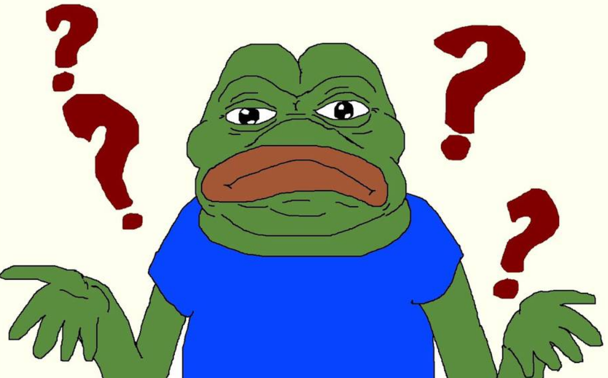

혼공머신 ch2의 책의 코드를 따라해보려다가 케글에 공개되어있는 데이터라고 되어 있어서 dataframe을 다루는 데 익숙해질 겸 케글에 있는 데이터를 colab으로 불러와서 변형시켜서 해보기로 했다

[fish_market kaggle 주소](https://www.kaggle.com/datasets/aungpyaeap/fish-market)

여러가지 방법으로 했는데 계속해서 fit 부근에서 오류가 나서 최대한 책과 동일하게 맞춰보려고 시도했다

`df = pd.read_csv('Fish.csv')`

이 데이터를 

```python
df['Species_value'] = df['Species'].map(dict(Bream=0, Roach=6, Whitefish=2, Parkki=3, Perch=4 , Pike=5, Smelt=1))

condition1 =  (df.Species =='Smelt')|(df.Species =='Bream')
df.test1=df.loc[condition1]
```

Species_value column을 추가해줘서  도미와 빙어에 0과 1을 만들어주고

도미와 빙어 데이터만 추출했다

```python
X = df.test1[['Weight','Length1']]
y = df.test1['Species_value']

train_input, test_input, train_target, test_target  = train_test_split(X, y, test_size=0.3, random_state=42)
```

X에는 훈련 데이터 Y에는 타겟 데이터를 넣어 주고 스케일링(위의 코드에서는 생략) 해준 다음

 훈련 / 테스트 데이터로 나누어주었다.



훈련 / 테스트 데이터가

 34 / 15로 나뉘어진 모습

```python
from sklearn.neighbors import KNeighborsClassifier
knn = KNeighborsClassifier(n_neighbors = 3)
knn.fit =(train_input,train_target)
```

이후 훈련을 해주고 score를 확인하려 하니 오류가 나온다

```
knn.score(test_input, test_target)
```



```
This KNeighborsClassifier instance is not fitted yet. Call 'fit' with appropriate arguments before using this estimator.
```


그래서 LogisticRegression 으로 돌려보니

```python
from sklearn.linear_model import LogisticRegression
model_lr = LogisticRegression(max_iter=1000)
model_lr.fit(train_input, train_target)
model_lr.score(test_input, test_target)
```



100%를 맞춰버렸다. 정확해서 뭔가 미심쩍지만 일단 돌아는 간다

어떻게 된 걸까?


