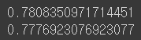
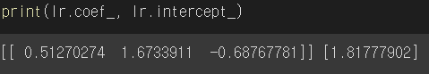
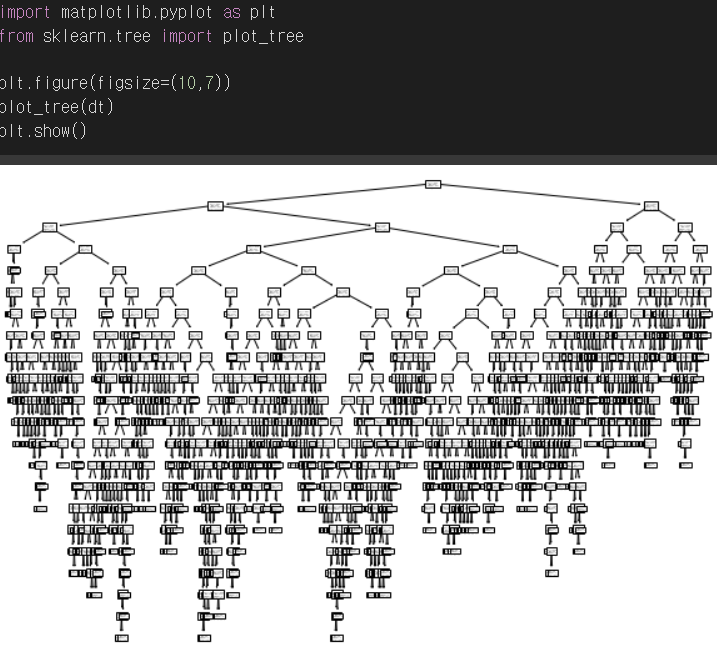

# 결정 트리

결정 트리는 분류와 회귀 다중출력 작업도 가능한 다재다능한 머신러닝 알고리즘이다.

랜덤 포래스트의 기본 구성 요소이다.

## 로지스틱 회귀로 와인 분류

데이터는 kaggle의 [Red Wine Quality](https://www.kaggle.com/datasets/uciml/red-wine-quality-cortez-et-al-2009)를 사용하려고 하였지만

kaggle의 winequality-red.csv에서는 개인정보 보호 때문에 어떤 와인인지 제공하지 않아서

Due to privacy and logistic issues, only physicochemical (inputs) and sensory (the output) variables are available (e.g. there is no data about grape types, wine brand, wine selling price, etc.).

그래서 [혼공머신 에서 제공하는 Red Wine Quality data](https://bit.ly/wine_csv_data) 를 사용하면

총 3개의 특성(**alcohol**,**sugar**,**pH**)과 분류하기위한 타겟 데이터(**class**:레드 와인과 화이트 와인)를 제공하는데

이것으로 로지스틱 회귀를 하면

```python
# 특성으로 사용할 수치형 데이터와 타깃 데이터 구분
data = wine[['alcohol', 'sugar', 'pH']].to_numpy()
target = wine['class'].to_numpy()

from sklearn.model_selection import train_test_split

#훈련, 테스트 데이터 나누기
train_input, test_input, train_target, test_target = train_test_split(
    data, target, test_size=0.2, random_state=42)

#정규화
from sklearn.preprocessing import StandardScaler

ss = StandardScaler()
ss.fit(train_input)

train_scaled = ss.transform(train_input)
test_scaled = ss.transform(test_input)

#로지스틱 회귀를 사용한 분류
from sklearn.linear_model import LogisticRegression

lr = LogisticRegression()
lr.fit(train_scaled, train_target)

print(lr.score(train_scaled, train_target))
print(lr.score(test_scaled, test_target))
```

score를 살펴 보면 



훈련 데이터는 0.78, 테스트 데이터는 0.77의 확률로 화이트 와인으로 구분한다. (0:레드 와인 1:화이트 와인으로 레이블되어 있음)

가중치와 절편값을 확인해보면



각 특성의 가중치를 확인 할 수 있다. (도수 당도 ph순서)

화이트와인은 도수, 당도는 레드와인보다 높은 편이고 ph는 좀 낮은 편이라고 추측할 수 있다.


로지스틱 회귀를 통해서 각 특성에 대한 가중치를 구했지만 가중치값에 대한 의미를 설명하는 것은 힘들다.

또한 특성끼리 곱해지는 다항 특성의 경우에는 그 값의 의미를 설명하는 것은 더욱 더 어려워진다.

## 결정 트리

Scikit - learn 에서는 이진 트리만 만드는 CART 알고리즘을 사용한다.

## CART 알고리즘

CART는 Classification And Regression Trees로써 지니 계수 혹은 분산의 감소량을 이용하여 이진 분리를 수행한다. 그러므로 plot을 그려보면 모두 자식 노드를 두 개만 갖는 것을 볼 수 있다.



또한 두 개의 자식 노드로 나누어질 때 가장 낮은 지니 불순도가 되도록 분할한다.

## 지니 불순도

지니 불순도가 높다는 것의 의미 : 데이터가 더 분산되어있다.

CART 알고리즘은 데이터가 덜 분산되도록(낮은 지니 불순도를 갖도록)노드를 분할한다.


# 참고

[의사결정 트리](https://itwiki.kr/w/%EC%9D%98%EC%82%AC%EA%B2%B0%EC%A0%95_%EB%82%98%EB%AC%B4)