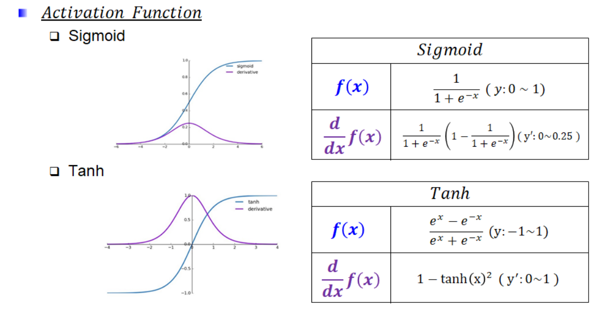
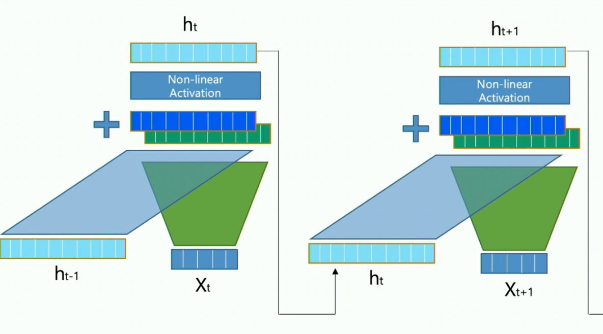
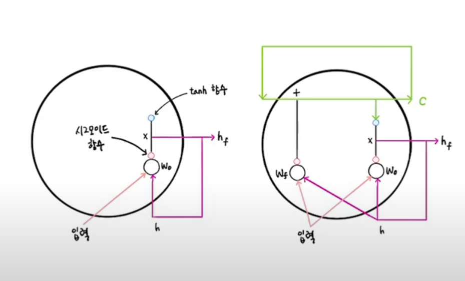
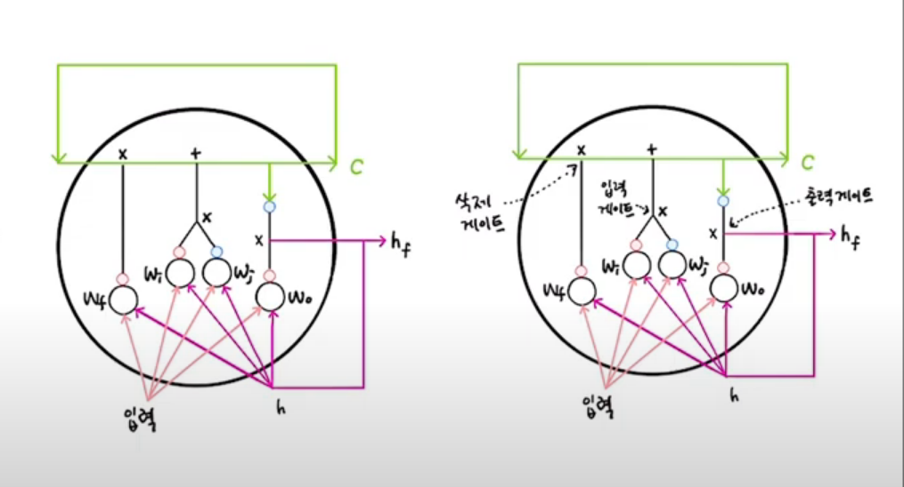

RNN

하이퍼볼릭 탄젠트를 활성화함수로 사용하는 이유

hidden state가 만들어지는 과정

은닉 상태 이외에도 셀 상태도 순환된다.

하지만 출력으로 사용되는 것은 은닉 상태이다.

셀 상태는 셀 안에서만 순환되는 값이다.

셀 상태는 입력과 은닉상태h가 어떤 가중치$w_h$와 곱해진 다음에 시그모이드함수를 통과해서 이전 셀 상태와 곱해져서 셀 상태를 업데이트한다.

