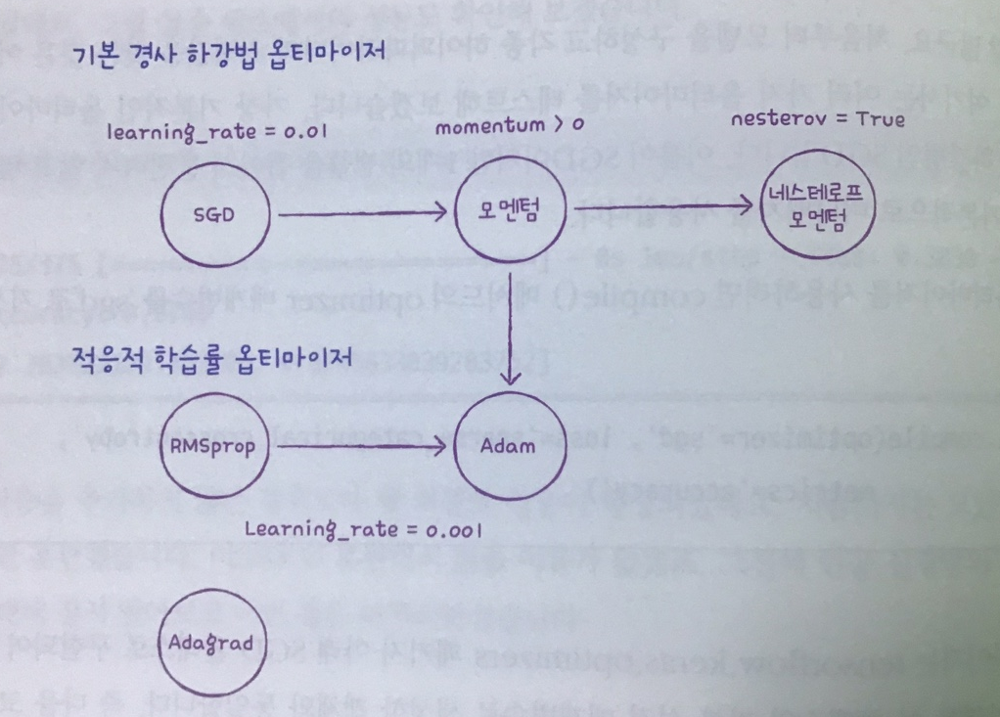
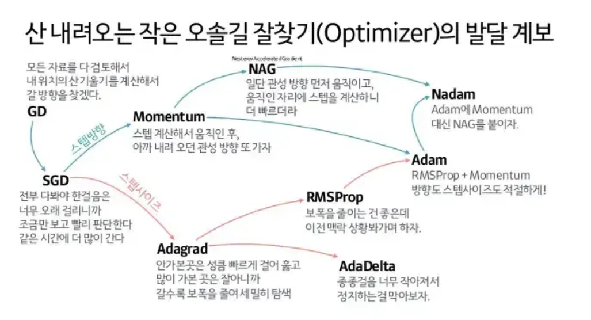
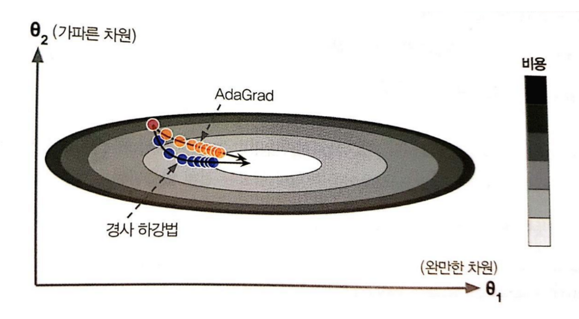

## 모멘텀

GD에 관성을 추가한 것

$$
1. \ m \larr \beta m-\eta\nabla_\theta J(\theta)
\\
2. \ \theta \larr \theta + m
$$

1 : 모멘텀 구하기(관성)

2 : 가중치 갱신

## 네스테로프 모멘텀

모멘텀보다 $ \theta_\beta m $만큼 앞서있는 비용함수의 그레이디언트를 계산한다.
$$
m←βm−η▽θJ(θ+βm)
\\
θ←θ+m
$$

## adagrad

Adaotive Gradient

학습율을 변화시켜서 처음에는 보폭이 크다가 점점 줄어들도록

기울기에 따라서 기울기가 높은 경우에는 학습율을 낮추고 낮은 경우에는 올린다.
$$
s←s+▽θJ(θ)⊗▽θJ(θ)\\
θ←θ−η▽θJ(θ)⊘√s+ε
$$

## RMSProp

$$
s←βs+(1−β)▽θJ(θ)⊗▽θJ(θ)\\
θ←θ−η▽θJ(θ)⊘√s+ε
$$

Adaotive Gradient에서 하이퍼파라미터가 한개 더 생긴 모델이다.

기본값은 $ \beta = 0.9$로 지정하는데 이전 데이터의 90%와 현재 데이터의 10% 비율로 계산하는 것이다.

그러므로 계속해서 기울기가 낮거나 높을 때 너무 학습율이 낮아지거나 높아지는 문제를 보완한다.

## Adam

adaptive moment estimation

Nadam
