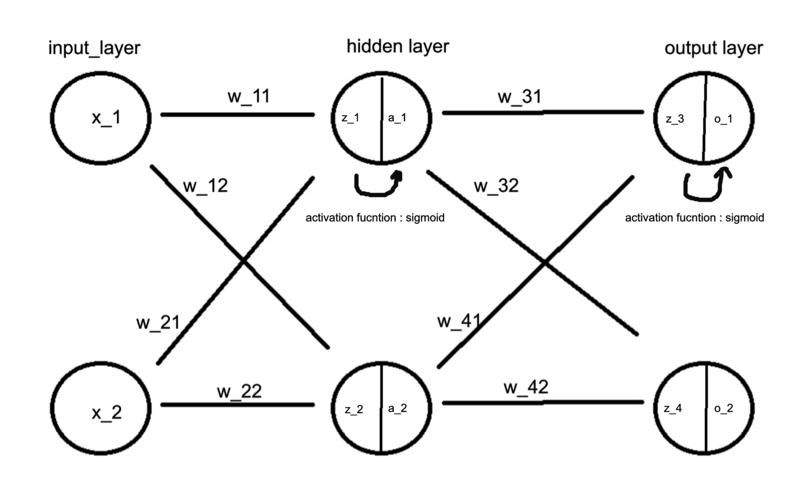

### 연쇄 법칙 (Chain Rule)

연쇄 법칙은 함수의 합성에 대한 미분을 계산하는 규칙이다


$$
만약 \  함수 h(x)가 \ 함수 \ g(u)와 \ 함수f(x)로 \ 이루어져 \ 있다면, \ f(x)의 \ 미분은 \ 다음과 \ 같이 \ 계산된다. \\
\frac{d}{dx}h(x)=\frac{d}{du}g(x)⋅ \frac{d}{dx}f(x) \\
\\
f(x) = (x+1)^2, \ g(u) = u^3+2u−5 \ 이라면 \\
h(x) = g(f(x)) \ 이고 \\
\frac{d}{dx}f(x) = 2(x+1), \
\frac{d}{du}g(x) = 3u^2+2 \ 이므로 \\
\frac{d}{dx}h(x) = (3u^2+2)⋅(2x+2), \ u = (x^2+1) \ 을 \ 대입하면 \\
\frac{d}{dx}h(x) = (3(x+1)^2+2)⋅(2x+2) = 6x(x+1)^2 + 10(x+1)^2 = (6x+10)(x+1)^2 \ 가 된다
$$


간단하게 겉미분을 적용한 수 속미분을 적용한 것과 같은 결과가 나온다


---

### 역전파 (Backpropagation)

위의 연쇄 법칙은 역전파에서 순서대로 미분을 적용하는 데 사용된다

예를 들어 아래와 같은 신경망이 존재한다고 가정하자




```
input(x)

Linear Layer(W1)

Linear Layer(W2)

Linear Layer(W3)

output(y)
```




- output이 어떻게 나오는지 그 과정을 살펴보면



```
input(x)

Linear Layer(W1)
- z1 = W1 * x + b1
- a1 = activation(z1)

Linear Layer(W2)
- z2 = W2 * a1 + b2
- a2 = activation(z2)

Linear Layer(W3)
- z3 = W3 * a2 + b3
- y = activation(z3)

output(y)
```



- 이렇게 계산된다고 볼 수 있다


- 예측값과 target의 차이를 구하여 손실함수를 계산한다 
  - L = 손실함수값


- 역전파의 첫 번째 단계로 손실 함수 L의 기울기(dL/dy)를 구하는 과정
- Linear Layer 3 (Output Layer) 의 역전파의 과정을 살펴보자

```
z3 = W3 * a2 + b3
y = activation(z3)
```

$$
손실 \ 함수 \ L을 \ 네트워크 \ 출력값 \ z3로 \ 미분한 \ 값  \ = \ \frac{dL}{dz3}  \\
손실 \ 함수 \ L을 \ 출력값 \ y로 \ 미분한 \ 값  \ = \ \frac{dL}{dy}  \\
출력값 \ y를 \ 네트워크 \ 출력값 \ z3로 \ 미분한 \ 값  \ = \ \frac{dy}{dz3}  \\
\\
연쇄 \ 법칙을 \ 사용하여 \ 값을 \ 구할 \ 수 \ 있다 \\
\frac{dL}{dz3}=\frac{dL}{dy}*\frac{dy}{dz3} \\
\\
b는 \ 편향을 \ 의미 \\
\frac{dL}{db3}=\frac{dL}{dz3}*\frac{dz3}{db3} \\
\\
W는 \ 가중치를 \ 의미 \\
\frac{dL}{dW3}=\frac{dL}{dz3}*\frac{dz3}{dW3} \\
$$


### 예시




- forward propagation

$$
은닉층 \\
z_1 = w_{11} ⋅x_1+w_{21}⋅x_2+b_1 \\
z_2 = w_{12} ⋅x_1+w_{22}⋅x_2+b_1 \\ 
\\

a_1 = \sigma(z_1) \\
a_1 = \sigma(z_2) \\

\\
\sigma(z) = \frac{1}{1+e^{-z}}\\
\\
출력층 \\
z_3 = w_{31} ⋅x_1+w_{41}⋅a_2+b_2 \\
z_4 = w_{32} ⋅x_1+w_{42}⋅a_2+b_2 \\
\\

o_1 = \sigma(z_3) \\
o_2 = \sigma(z_4) \\
$$


- Loss function(MSE)

$$
E_{o1} = \frac {1}{2}(target_{o1} - output_{o1})^2 \\
E_{o2} = \frac {1}{2}(target_{o2} - output_{o2})^2 \\
E_{total} = E_{o1} + E_{o2} \\
$$


- backpropagation

$$
가중치 \ 업데이트 \\
\frac{\partial E_{tortal}}{\partial W_{31}} = \frac{\partial E_{tortal}}{\partial o_{1}} ⋅\frac{\partial o_{1}}{\partial z_{3}}⋅\frac{\partial z_{3}}{\partial 2_{31}} \\

E_{tortal} = \frac {1}{2}(target_{o1} - output_{o1})^2 + \frac {1}{2}(target_{o2} - output_{o2})^2 \\
\\

\frac{\partial E_{tortal}}{\partial {o_1}} = \frac{\partial}{\partial o_1}(E_{01}+E_{o2}) = \frac{\partial E_{01}}{\partial o_1}\\
\\
※ \ o_1 \ 로 \ 미분하기 \ 때문에 \ E_{o2}는 \ 사라진다 \\
\\
\frac{\partial E_{tortal}}{\partial {o_1}} = -(target_{o1} - output_{o1})
\\
\frac{\partial o_{1}}{\partial z_{3}} = o_1 ⋅ (1-o_1) \\
\frac{\partial z_{3}}{\partial 2_{31}} = 1 \\
\\
\\ ※ \  z_3 = w_{31}⋅x_1 +b는 \ 선형적으로 \ 의존하므로 \ 미분시 \ 1이 \ 된다 
\\
\frac{\partial E_{tortal}}{\partial W_{31}} = -(target_{o1} - output_{o1})⋅o_1 ⋅ (1-o_1)⋅1
\\
W^+_{31} = w_{31} - \alpha\frac{\partial E_{tortal}}{\partial W_{31}} \\
\\
\alpha = learning \ rate
$$

이와 같은 방식으로 가중치 업데이트를 계속 해 간다


## reference

https://wikidocs.net/37406

