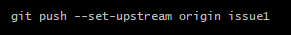
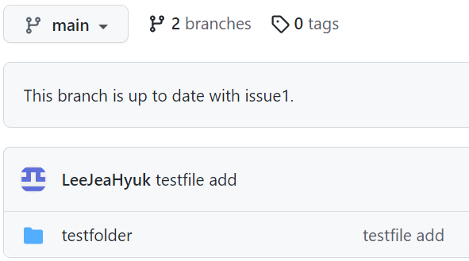

## 나의 첫 merge

처음 clone을 해 보라는 말을 들었을 때 나는 지팡이를 딛어가는 장님처럼 구글링을 시작했다. 

처음으로 clone을 따라 했을 때 clone이 된 것 같지만 어디 있는지도 모르겠고 그래서 제대로 된 건지 확인 할 수 없었다.

어떻게 branch로 들어가서 파일을 만들고 merge까지 해 봤지만 익숙해지기 위해서 repository를 하나 만들어서 한번 더 해보기로 했다.

```py
git clone https://github.com/LeeJeaHyuk/test.git_test

cd git_test

git checkout -b issue1

mkdir testfolder

cd testfolder

git add testfile.txt

git commit -m "testfile add"

git push
```


나는 git 테스트 라는 repostiory를 만들고 바로 branch를 생성하고  testfolder폴더를 만든 후에 폴더 안으로 들어가서 텍스트 파일을 하나 만들어준 후 commit해주고 branch까지 만들어주었다.

그 후에 push를 해주면



라고 하면서 github 에도 반영이 되지 않는다.

원인은 원격 저장소에 대한 기본 브랜치 설정이 되어 있지 않기 때문이다. 

git bash에서 하라는 대로 

`git push --set-upstream origin issue1`

로 브랜치 설정을 해주고 push하면 해결된다.


issue1 branch에 testfolder가 정상적으로 들어있는 것을 확인할 수 있다. 

`git branch`로 branch를 확인해보았는데 issue1만 존재해서 main  branch를 하나 만들어서 merge해보기로 했다.

```py
git branch main

git checkout main

git merge issue1

git push
```

push까지 해주고 github를 확인하면



main branch에 merge가 된 것을 확인할 수 있었다.


