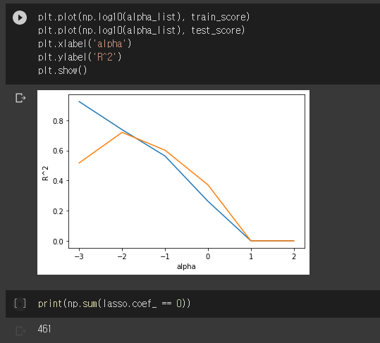
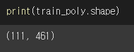
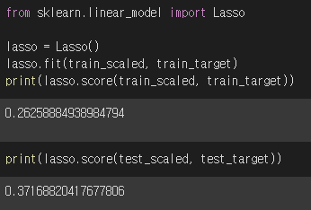
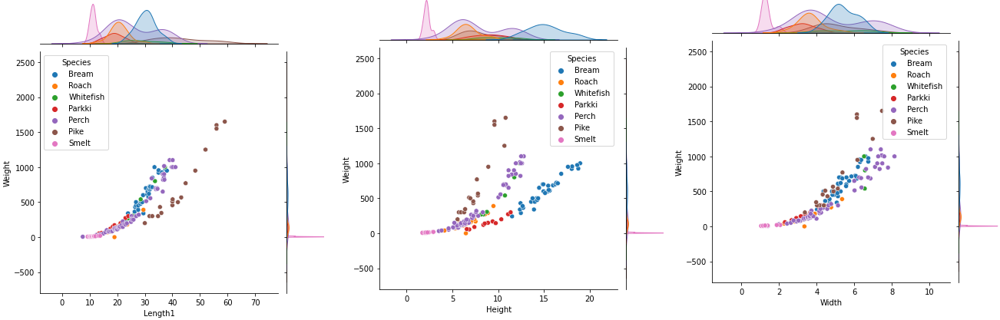
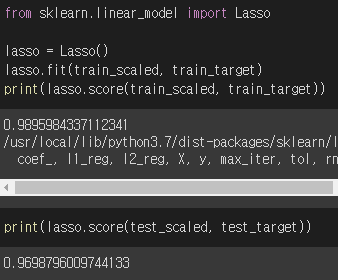
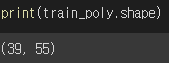
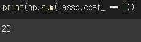

# Fish Market data를 분석하며

작년에 혼공머신을 공부할 때에는 dataframe과 numpy 등등 사용하는 sklearn의 대한 이해도 부족했었다

혼공머신 책에서는 해당 부분에 공부에서 필요한 데이터만 선별해서 주기 때문에 따로 데이터를 가공 혹은 전처리 하는 과정이 더 수월했었다 또한 그 당시에는 모델에 대한 수학적인 이해를 위한 공부를 했기 때문에 sklearn의 코드가 잘 이해가지 않더라도 넘기면서 진행했었다.

그래서 이번년도에는 다른 어떤 데이터셋을 받았을 때 내가 이 데이터를 알맞게 분석해낼 수 있어야 할 것 같았기에 가공되지 않은 데이터를 분석해보기로 했다.

하지만 그래서 많은 오류들과 납득하지 못할 결과물들을 만났기에 그것에 대해서 적어보려고 한다.

오류들의 대한 주된 원인은 거의 Regression과 Classification 에 맞게 잘 가공하지 못했기 때문에 발생했다.

아래의 결과는 3-3 에서의 다중 회귀의 라쏘규제의 결과이다.

461개의 특성을 제제한 것으로 보인다.

하지만 특성의 총 개수 또한 461개로 모든 특성을 제제해버렸다.

이는 target이 'Species' 으로 되어 있기 때문이었다.

무게 길이 너비 등등으로 종의 선형성을 구할 수는 없기 때문이다.

이 데이터를 사용해서 어떤 목적을구하려는 생각 없이 그냥 코드를 이것저것 따라해보기 위해서 데이터를 사용하려고 했기 때문에 이런 결과가 발생했다.

그래서 다중 회귀를 사용하기 위한 데이터는 어떻게 나누어야 될 지 생각했다.

그래서 target을 **Weight**로 train을 **Length1**,**Height**,**Width**로 해서 다시 훈련해보았다. 

이번에는 모든 특성을 제한하지는 않았지만 과소적합이 너무 심하게 나타난 것으로 보였다.

그래서 다시 train과 target 사이의 그래프를 그려 보았다

모든 **Species** 가 데이터 안에 들어 있기 때문에 이 종을 모두 합친 선형성을 그 의미가 없을 것이므로 일단 **Species**중 **Perch**에 대해서만 결과를 뽑아보았다.

높은 score값을 유지하는 것을 볼 수 있었다.

또한 55개의 특성 중 23개를 제외하고 32개의 특성을 사용한 것으로 보인다.