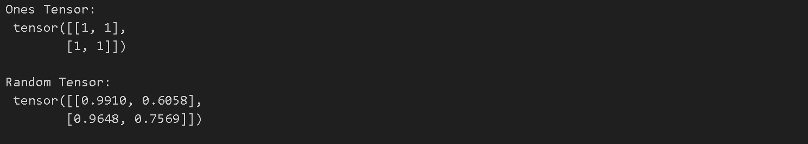
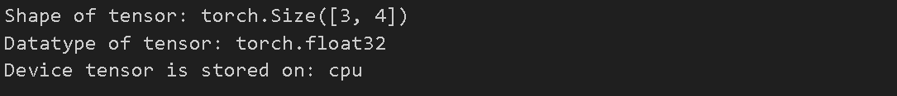
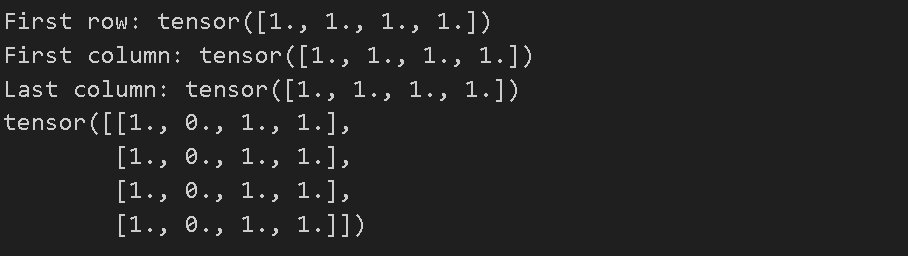
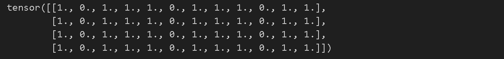
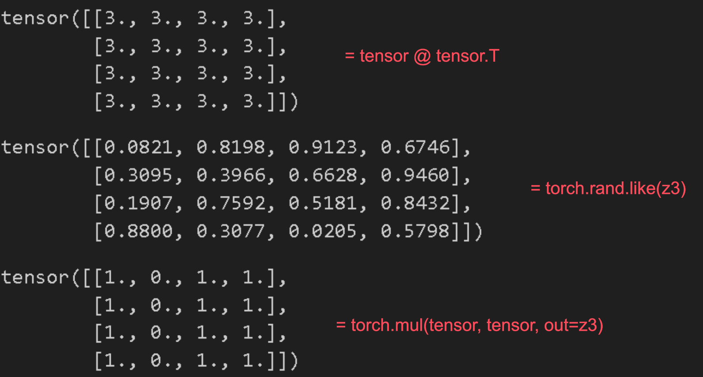
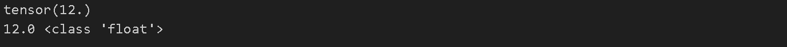
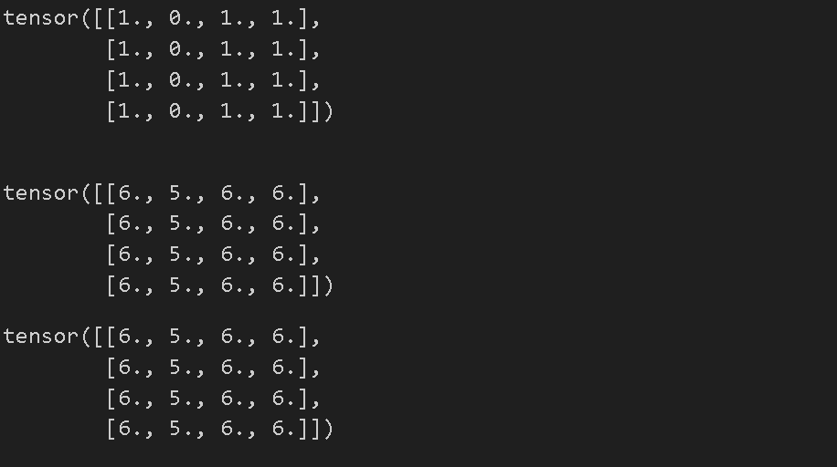
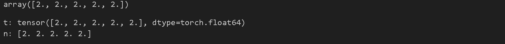

최근 딥러닝 분야에서는 PyTorch가 더 많은 기업에서 요구되고 있는 추세라고 생각한다

이에 따라 TensorFlow 이외에도 PyTorch를 배워보고자 [PyTorch 공식 튜토리얼](https://tutorials.pytorch.kr/beginner/basics/intro.html)을 따라해보고 이후 간단한 딥러닝 모델까지 학습해보는 과정을 공유하려고 한다

---


## 튜토리얼 학습 내용

1. 텐서
2. Dataset과 DataLoader
3. Transform
4. 신경망 모델 구성하기
5. torch.autograd를 사용한 자동 미분
6. 모델 매개변수 최적화하기
7. 모델 저장하고 불러오기

---


## 텐서(Tensor)

- 텐서는 배열 및 행렬과 유사한 특수 데이터 구조
- PyTorch에서는 텐서를 사용하여 모델의 매개변수뿐만 아니라 모델의 입력과 출력을 인코딩한다
- 텐서는 GPU 또는 기타 하드웨어 가속기에서 실행할 수 있다는 점을 제외하면 NumPy의 ndarray와 유사하다(ndarray는 GPU에서 실행되지 않음)
- Pytorch는 Bridge with NumPy 라는 NumPy와의 상호 운용성을 강화하는 기능이 존재하는데 이는 PyTorch와 NumPy 간에 데이터를 효율적으로 이동하고 공유할 수 있는 기능을 제공한다
    - 텐서와 ndarray가 동일한 메모리 주소를 참조하여 같은 데이터를 공유할 수 있다
    - 데이터를 복사하지 않고 데이터를 공유함으로써, 메모리 사용을 최소화하고 데이터 변환과 연산의 오버헤드를 줄일 수 있다
    - 텐서를 NumPy 배열로 변환: torch.Tensor.numpy()
    - NumPy 배열을 텐서로 변환: torch.from_numpy() 등
- 텐서는 자동 미분(Autograd)을 위해 최적화되어 있다
    - 딥 러닝 모델에서 편리하게 역전파를 수행하여 모델의 가중치를 최적화한다 

---


## Initializing a Tensor



```python
import torch
import numpy as np

# Directly from data
data = [[1, 2],[3, 4]]
x_data = torch.tensor(data)

# From a NumPy array
np_array = np.array(data)
x_np = torch.from_numpy(np_array)

# From another tensor:새 텐서는 명시적으로 재정의하지 않는 한 인수 텐서의 속성(모양, 데이터 유형)을 유지한다
x_ones = torch.ones_like(x_data) # retains the properties of x_data
print(f"Ones Tensor: \n {x_ones} \n")

x_rand = torch.rand_like(x_data, dtype=torch.float) # overrides the datatype of x_data
print(f"Random Tensor: \n {x_rand} \n")
```





- torch.ones_like는 1로 된 tensor를 생성
- torch.rand_like 0과 1사이의 랜덤 값의 tensor를 생성

---


## Attributes of a Tensor



```python
tensor = torch.rand(3,4)

print(f"Shape of tensor: {tensor.shape}")
print(f"Datatype of tensor: {tensor.dtype}")
print(f"Device tensor is stored on: {tensor.device}")
```





- tensor의 속성을 확인

---


## Operations on Tensors



```python
# We move our tensor to the GPU if available
if torch.cuda.is_available():
    tensor = tensor.to("cuda")
    
tensor = torch.ones(4, 4) # 1로 채워진 4x4 크기의 텐서를 생성
print(f"First row: {tensor[0]}") # 첫번째 열을 출력
print(f"First column: {tensor[:, 0]}") # 첫번째 행을 출력 
print(f"Last column: {tensor[..., -1]}") # 마지막 행을 출력
tensor[:,1] = 0 # 두번쨰 열의 요소를 전부 0으로 
print(tensor)
```







```python
t1 = torch.cat([tensor, tensor, tensor], dim=1) # concatenate와 비슷한 역할을 하는 듯
print(t1)
```



- .cat 텐서를 붙이는 역할(concatnate)





```python
# 두 텐서 간 행렬곱. y1, y2, y3 will have the same value
# ``tensor.T`` returns the transpose of a tensor
y1 = tensor @ tensor.T
y2 = tensor.matmul(tensor.T) # tensor transpose

y3 = torch.rand_like(y1)
torch.matmul(tensor, tensor.T, out=y3) # tensor와 tensor.T의 행렬 곱을 계산하여 결과를 y3에 저장


# 요소별 곱셈. z1, z2, z3 will have the same value
z1 = tensor * tensor
z2 = tensor.mul(tensor) # 자기 자신과의 요소별 곱샘을 한다

z3 = torch.rand_like(tensor) # 입력 텐서(input)와 동일한 크기(shape)를 가지며, 0과 1 사이의 랜덤한 값을 갖는 새로운 텐서를 생성
print(z3)
torch.mul(tensor, tensor, out=z3) # tensor와 tensor의 요소별 곱셈을 구하여 z3에 저장
```



- tensor.T : transpose(전치행렬)
- torch.rand.like(z3) z3텐서와같은 크기를 가지고 모든 요소를 0과 1사이의 랜덤 값으로 배치한다
- 행렬곱
  - tensor @ tensor 행렬곱
  - torch.matmul(tensor, tensor.T, out=y3) tensor와 tensor.T의 행렬곱을 하고 y3에 저장
- 요소간 곱셈
  - tensor * tensor 요소간 곱
  - torch.mul(y1) y1과 y1사이의 요소간 곱셈



- torch.mul(tensor, tensor. out=z3)의 결과를 보면 알 수 있듯이 요소간 곱셈이기때문에 1과 1이 곱해져서 tensor값이 그대로 나온 것을 볼 수 있다.



```python
agg = tensor.sum() # tensor의 모든 요소를 더한 1차원 텐서를 만든다
print(agg)
agg_item = agg.item() # 텐서의 모든 요소를 더하여 float형으로 반환
#.item() 메서드는 텐서가 스칼라 값(단일 값을 가지는)인 경우에만 사용할 수 있다 (.sum으로 1차원 텐서로 바꾸어줄 필요가 있음)
print(agg_item, type(agg_item))
```



- tensor.sum()은 tensor의 모든 요소를 1차원으로 만들어준다
- agg.item은 텐서의 모든 요소를 더해서 float형태로 바꾸어주는데 텐서가 단일 스칼라 값을 가질 때에만 사용할 수 있으므로 .sum 이후에 사용해주어야 한다







```python
# 모든 요소에 더하기
print(f"{tensor} \n")
tensor.add_(5)
print(tensor)
```





- 모든 요소에 더하기를 해 줄 수 있다

---


## Bridge with NumPy



```python
n = np.ones(5)
t = torch.from_numpy(n) # n NumPy 배열을 PyTorch 텐서로 변환하여 t에 저장

np.add(n, 1, out=n) # numpy에 전부 1을 더했지만 tensor까지 모두 1이 더해진 상황
print(f"t: {t}")
print(f"n: {n}")
```



- 텐서와 Numpy배열은 CPU상에서 메모리를 공유할 수 있으며, 하나를 변경하면 다른 하나도 변경된다.



- Numpy 배열을 PyTorch 텐서로 변환하고 t에 저장하고 Numpy배열에 1을 더한다
- tensor를 확인할 시 tensor값도 반영된 것을 확인할 수 있다


---


## reference

튜토리얼 링크 - https://pytorch.org/tutorials/beginner/basics/tensorqs_tutorial.html

실습한 파일 링크 - https://github.com/LeeJeaHyuk/dacon/blob/master/torch_tutorial/1_Tensors.ipynb