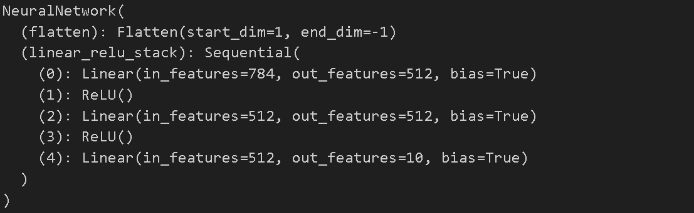
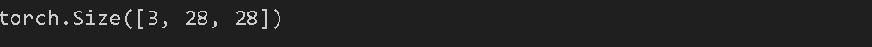
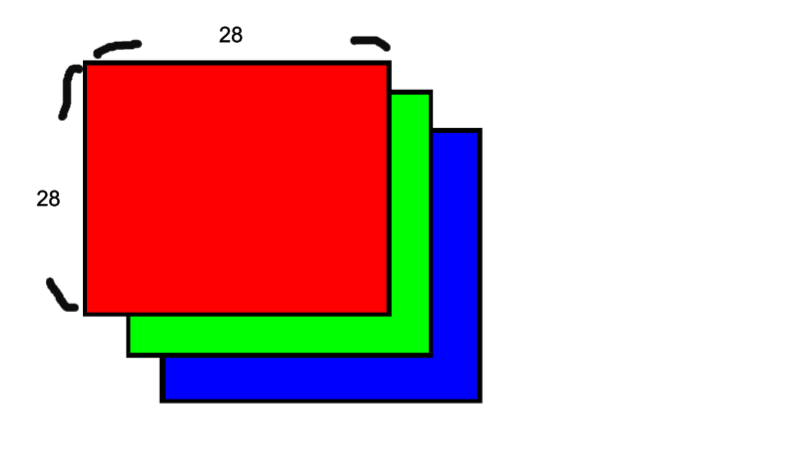
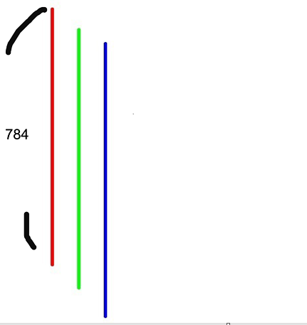
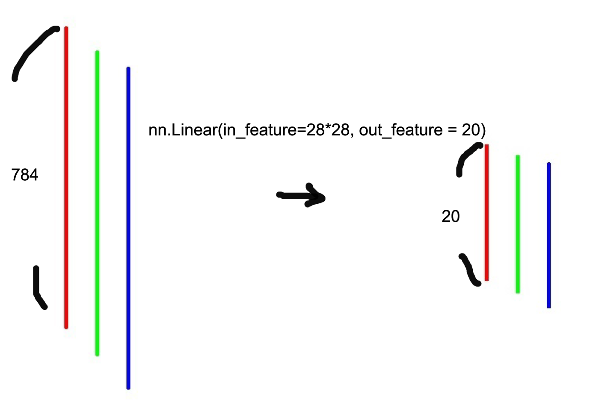
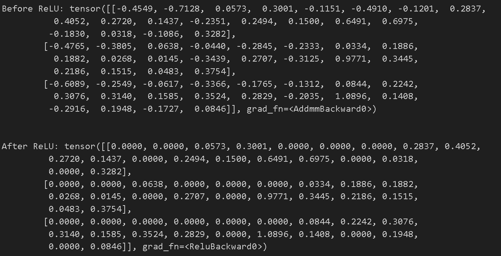
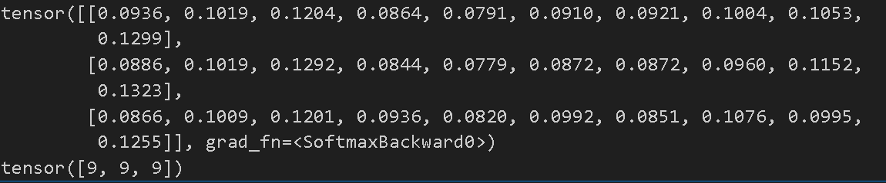
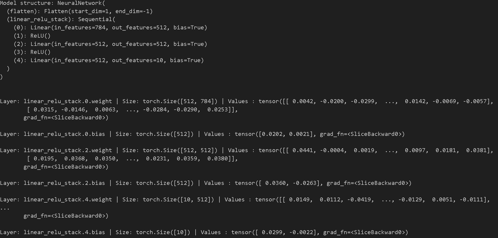
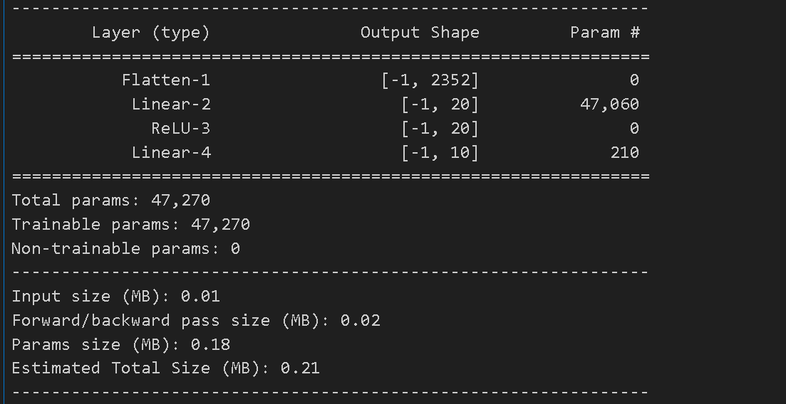

신경망은 데이터 처리를 위한 층과 모듈로 이루어져 있으며, `torch.nn`은 PyTorch에서 신경망을 구성하는 다양한 레이어, 손실 함수, 활성화 함수 등 신경망과 관련된 모든 구성 요소를 포함하는 모듈을 제공한다

이번 튜토리얼에서는 FashionMNIST 데이터셋을 활용하여 신경망을 구축하는 과정을 직접 실습한다

---

## Define the Class

- 신경망을 정의하기 위해 PyTorch에서는 nn.Module을 서브클래싱(subclassing)하는 방식을 사용한다

- 새로운 신경망 클래스를 정의할 때 nn.Module을 상속받기
- __init__ 메서드에서 신경망의 레이어들을 초기화
- forward 메서드 구현: forward 메서드는 입력 데이터에 대해 신경망의 연산을 수행하는 함수
    - 신경망은 입력 데이터를 forward 메서드에 전달하면 이 메서드에서 정의된 레이어들과 연산들을 통해 출력을 계산한다



```python
device = (
    "cuda"
    if torch.cuda.is_available()
    else "mps"
    if torch.backends.mps.is_available()
    else "cpu"
)

class NeuralNetwork(nn.Module):

    def __init__(self):
        super().__init__()
        self.flatten = nn.Flatten()
        self.linear_relu_stack = nn.Sequential(
            nn.Linear(28*28, 512),
            nn.ReLU(),
            nn.Linear(512, 512),
            nn.ReLU(),
            nn.Linear(512, 10),
        )
        
    def forward(self, x):
        x = self.flatten(x)
        logits = self.linear_relu_stack(x)
        return logits
    
model = NeuralNetwork().to(device)
print(model)    

```





- nn.Modlue을 상속받는 클래스 NeuralNetwork 를 선언한다
- __init__ 메서드에서 모델을 구성한다
  - super().__init__() 로 nn.Modlue를 상속받은 후 초기화한다
  - nn.Flatten을 사용하여 데이터를 1차원으로 만들어준 뒤 nn.Sequential을 사용하여 신경망 레이어를 구성한다 
- forward 메서드에서는 모델의 순전파를 정의한다 
  - nn.Sequental로 생성한 self.linear_relu_stack 을 사용한다




```python
X = torch.rand(1, 28, 28, device=device)
logits = model(X)
pred_probab = nn.Softmax(dim=1)(logits)
y_pred = pred_probab.argmax(1)
print(f"Predicted class: {y_pred}")
```




- 28*28의 무작위 값으로 이루어진 텐서 생성
- 위에서 생성한 model을 사용하여 입력 결과를 얻는다
- softmax함수를 사용하여 클래스별 확률 계산
  - pred_probab은 클래스별 예측 확률 값을 가지는 텐서
- pred_probab.argmax(1) 텐서마다 가장 큰 값의 인덱스를 찾아서 해당 클래스를 예측 값으로 선택
- 예측된 클래스는 tensor[2]

---

## Model Layers



```python
input_image = torch.rand(3,28,28)
print(input_image.size())
```








---

## nn.Flatten



```python
flatten = nn.Flatten()
flat_image = flatten(input_image)
print(flat_image.size())
```




- flatten으로 평탄화시킨다 



---

## nn.Linear



```python
layer1 = nn.Linear(in_features=28*28, out_features=20)
hidden1 = layer1(flat_image)
print(hidden1.size())
```



- 입력 특성을 선형 변환하면서, 입력 특성의 수를 줄여 출력 특성의 수를 784개에서 20개로 줄인다



---

## nn.ReLU



```python
print(f"Before ReLU: {hidden1}\n\n")
hidden1 = nn.ReLU()(hidden1)
print(f"After ReLU: {hidden1}")
```





- ReLU를 적용하기 전에는 음수와 양수 모두 포함되어있지만
- ReLU를 적용 이후에는 음수 값들이 0으로 변환되어 음수 값은 모두 제거되고, 양수 값들은 그대로 유지한다

- ReLU
    - ReLU 활성화 함수는 신경망의 비선형성을 증가시키는 역할
    - 음수 값을 0으로 제거함으로써 데이터의 특징을 강조


---

## nn.Sequential



```python
seq_modules = nn.Sequential(
    flatten,
    layer1,
    nn.ReLU(),
    nn.Linear(20, 10)
)
input_image = torch.rand(3,28,28)
logits = seq_modules(input_image)
```



- nn.Sequential은 여러 개의 모듈을 순차적으로 쌓아서 하나의 모듈로 만드는 데 사용


---

## nn.Softmax



```python
softmax = nn.Softmax(dim=1)
pred_probab = softmax(logits)
print(pred_probab)
print(pred_probab.argmax(1))
```





- logits값들은 -무한대와 무한대 사이의 값으로 소프트맥스 함수를 사용하여 [0,1]범위의 에측 확률을 나타내는 값들로 표시할 수 있다
- logits값은 2차원 형태의 텐서이기 때문에 softmax를 적용할 때 dim=1로 지정해준다
- .argmax(1)을 사용하여 어느 클래스가 가장 높은 확률을 나타내는지 확인할 수 있다

---

## Model Parameters



```python
print(f"Model structure: {model}\n\n")

for name, param in model.named_parameters():
    print(f"Layer: {name} | Size: {param.size()} | Values : {param[:2]} \n")
```



- `nn.Module`을 하위 클래스로 만들면 모델 객체 내에 정의된 모든 필드가 자동으로 추적된다
  -  이는 모델 내의 모든 **레이어, 가중치 편향** 등의 정보를 포함한다
- `parameters()` 또는 `named_parameters()` 메서드를 사용하면 모델 내의 모든 매개변수에 손쉽게 접근할 수 있다
- `parameters()` 메서드를 호출하면 모든 매개변수들이 단순한 리스트 형태로 반환되며, `named_parameters()` 메서드를 호출하면 매개변수들과 각 매개변수의 이름이 쌍으로 반환된다.



- 먼저 모델의 구조를 출력하고 각 매개변수의 이름, 크기, 처음 두 개의 값들을 출력한다


### Summary



```python
from torchsummary import summary
import torch.nn as nn

class NeuralNetwork(nn.Module):

    def __init__(self):
        super().__init__()
        self.linear_relu_stack = nn.Sequential(
            nn.Flatten(),
            nn.Linear(3*28*28, 20),
            nn.ReLU(),
            nn.Linear(20, 10),
        )
        
    def forward(self, x):
        logits = self.linear_relu_stack(x)
        return logits

model = NeuralNetwork().to(device)
summary(model, input_size=(3, 28, 28))
```





- 위의 3 * 28 * 28 의 예제를 사용한 신경망을 Sequential로 묶은 뒤 summary를 확인해보았다
- 3 * 28 * 28 = 2352를 선형 변환으로 20으로 바꾸어 주고 활성화 함수를 지난 뒤 softmax를 통과하기 전 10개로 줄여준 모습을 잘 보여준다

---

## reference

[해당 튜토리얼 링크](https://pytorch.org/tutorials/beginner/basics/buildmodel_tutorial.html)

[실습한 코드 링크](https://github.com/LeeJeaHyuk/dacon/blob/master/torch_tutorial/4_Build%20The%20Neural%20Network.ipynb)
