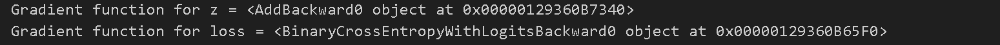
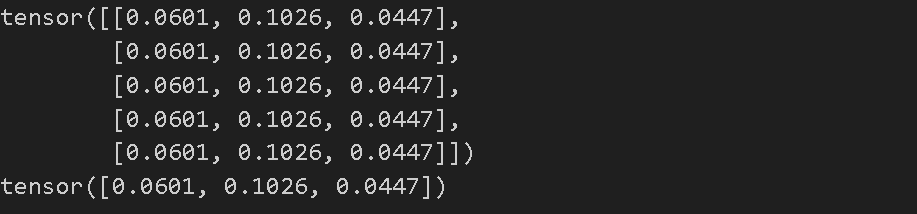
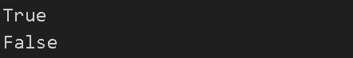

신경망을 훈련시킬 때 가장 자주 사용되는 알고리즘은 역전파(backpropagation)라고 할 수 있는데, 이 알고리즘에서 모델 가중치는 손실함수에 대한 파라미터의 기울기에 따라 조정된다

PyTorch에서는 이 기울기를 계산할 때 torch.autograd 라는 내장된 미분 엔진을 제공한다


---

## torch.autograd를 사용한 자동 미분



```python
import torch

x = torch.ones(5)  # input tensor
y = torch.zeros(3)  # expected output
w = torch.randn(5, 3, requires_grad=True)
b = torch.randn(3, requires_grad=True)
z = torch.matmul(x, w)+b
loss = torch.nn.functional.binary_cross_entropy_with_logits(z, y)
```



- requires_grad=True는 PyTorch에서 텐서에 대한 자동 미분을 활성화하는 데 사용되는 매개변수이다 
  - 해당 텐서에 대한 연산의 그래디언트 계산 여부를 지정한다


---

## Tensors, Functions and Computational Graph


- 이 네트워크에서 w와 b는 최적화되어야하는 매개변수이고, 이러한 변수들에 대한 손실함수의 기울기를 계산할 수 있어야 한다 
- requires_grad 속성을 설정하면 PyTorch에게 해당 텐서가 자동 미분을 통해 역전파될 때 그래디언트(기울기)를 계산해야 함을 알려주는 것이 된다




```python
print(f"Gradient function for z = {z.grad_fn}")
print(f"Gradient function for loss = {loss.grad_fn}")
```





- 텐서에 적용하는 함수는 클래스 Function의 객체이다
- 텐서의 grad_fn 속성에 역전파 함수에 대한 참조가 저장된다
- grad_fn을 통해 해당 텐서가 어떤 계산 그래프의 결과인지 그에 따른 역전파 함수가 어떤 것인지 알 수 있다
- 사용되는 함수들
  - AddBackward0: 덧셈 연산의 역전파를 나타내는 객체이다 두 텐서를 더한 결과에 대한 그래디언트를 계산하는 역할을 한다
  - MulBackward0: 곱셈 연산의 역전파를 나타내는 객체이다 두 텐서를 곱한 결과에 대한 그래디언트를 계산하는 역할을 한다
  - MatMulBackward: 행렬 곱셈 연산의 역전파를 나타내는 객체이다 두 행렬을 곱한 결과에 대한 그래디언트를 계산하는 역할을 한다
  - SigmoidBackward: 시그모이드 함수의 역전파를 나타내는 객체이다 시그모이드 함수를 통과한 결과에 대한 그래디언트를 계산하는 역할을 한다
  - ReLUBackward0: ReLU 함수의 역전파를 나타내는 객체이다 ReLU 함수를 통과한 결과에 대한 그래디언트를 계산하는 역할을 한다
  - BinaryCrossEntropyWithLogitsBackward: 이진 교차 엔트로피 손실 함수의 역전파를 나타내는 객체이다 손실 함수의 입력과 타겟 간의 그래디언트를 계산하는 역할을 한다


---

## Computing Gradients

- 신경망에 매개변수 가중치를 최적화하기 위해 손실 함수의 매개변수에 대한 도함수를 계산해야 한다
- 이 도함수를 계산하기 위해 loss.backward()를 호출하고, 그 결과로 w.grad와 b.grad의 값을 얻어온다
- 계산된 gradient는 주로 확률적 경사 하강법(SGD)과 같은 최적화 알고리즘을 사용하여 매개변수를 업데이트하는 데 사용된다



```python
loss.backward()
print(w.grad)
print(b.grad)
```





- loss.backward() 로 손실함수의 역전파 단계를 진행하고 그 과정에서 가중치와 편향에 대한 그래디언트 값을 출력


---

## Disabling Gradient Tracking 

- 모델을 훈련시키고 그것을 입력 데이터에 적용하기만 하려는 경우와 같이 일부 경우에는 gradient계산이 필요하지 않을 수 있으므로 torch.no_grad()블록으로 감싸서 중지할 수 있다
- 해당 코드 블록 내의 연산은 계산 그래프에 포함되지 않아 gradient를 계산하지 않고 순전파만 수행하게 된다



```python
z = torch.matmul(x, w)+b
print(z.requires_grad)

with torch.no_grad():
    z = torch.matmul(x, w)+b
print(z.requires_grad)
```





- 기본적으로는 그래디언트값을 추적하도록 설정되어있기 때문에 **requires_grad**이 **True**로 지정된것을 볼 수 있지만 no_grad로 설정하면 **requires_grad**값이 **False**로 지정된 것을 볼 수 있다




```python
z = torch.matmul(x, w)+b
z_det = z.detach()
print(z_det.requires_grad)
```




- detach() method 또한 비슷한 역할을 한다


- 위의 방법은 여러 가지 효과를 가져온다

  1. **동결된 매개변수로 표시**: 특정 매개변수를 "동결된 매개변수"로 설정할 수 있다. 이는 그래디언트 계산 시 해당 매개변수의 업데이트를 막아주며, 모델의 특정 부분을 학습에서 제외할 때 유용하다.
  2. **Gradient가 계산되지 않는 동결된 매개변수**: 동결된 매개변수는 역전파 과정에서의 그래디언트 계산을 무시하므로, 가중치 업데이트에 영향을 미치지 않는다. 이는 모델 학습 시 특정 매개변수를 고정하고 싶을 때 활용된다.
  3. **효율적인 순전파 계산**: 그래디언트를 추적하지 않는 텐서를 사용하면 순전파 계산이 더 효율적으로 이루어진다. 이는 학습 단계가 아닌 순전파만 수행할 때 유용하며, 추론(inference) 단계에서 모델을 사용하는 경우에 적합하다.

  이런 방식은 모델 학습 및 추론 과정에서 효율성과 유연성을 높이고 특히, 모델의 특정 부분을 동결시켜 변화하지 않게 하거나, 순전파 계산을 최적화하여 추론 속도를 향상시킬 때 유용하게 사용된다.


---

## More on Computational Graphs

- PyTorch의 autograd 메커니즘은 데이터(텐서)와 수행된 모든 연산(결과 텐서와 함께)을 함수 객체로 이루어진 방향 비순환 그래프(DAG:Directed Acyclic Graph)에 기록하는 방식으로 작동한다
- 이 그래프에서 입력 텐서는 잎(leaf)이며 출력 텐서는 뿌리(root)이다
- 이 그래프를 뿌리에서부터 잎까지 추적하면 연쇄 법칙(chain rule)에 따라 변화도를 자동으로 계산할 수 있게 된다
- 순전파 단계
  - autograd는 텐서에 요청된 연산을 실행하여 결과 텐서를 생성한다
  - 그래디언트 연산을 수행할 때 생성되는 미분 함수를 DAG에 저장한다
    - 아마도 순전파를 진행하면서 gradient function을 같이 생성하고 이후 역전파에서 사용하는데 계산 효율을 높이기 위함으로 생각된다
- 역전파 단계
  - 역전파 과정은 `.backward()` 메서드가 계산 그래프(DAG)의 루트 노드에 호출될 때 시작된다
  - 각 연산의 미분 함수를 사용하여 그래디언트 값을 계산한다
  - 각 텐서의 `.grad` 속성에 그래디언트 값을 누적한다
  - 연쇄 법칙을 활용하여 그래디언트를 루트 노드로부터 시작해 모든 연산을 거슬러 올라간다

---

## reference

[해당 튜토리얼 링크](https://pytorch.org/tutorials/beginner/basics/autogradqs_tutorial.html)

[실습한 코드 링크](https://github.com/LeeJeaHyuk/dacon/blob/master/torch_tutorial/5_Automatic%20Differenctiation%20With%20Torch%20AutoGrad.ipynb)
