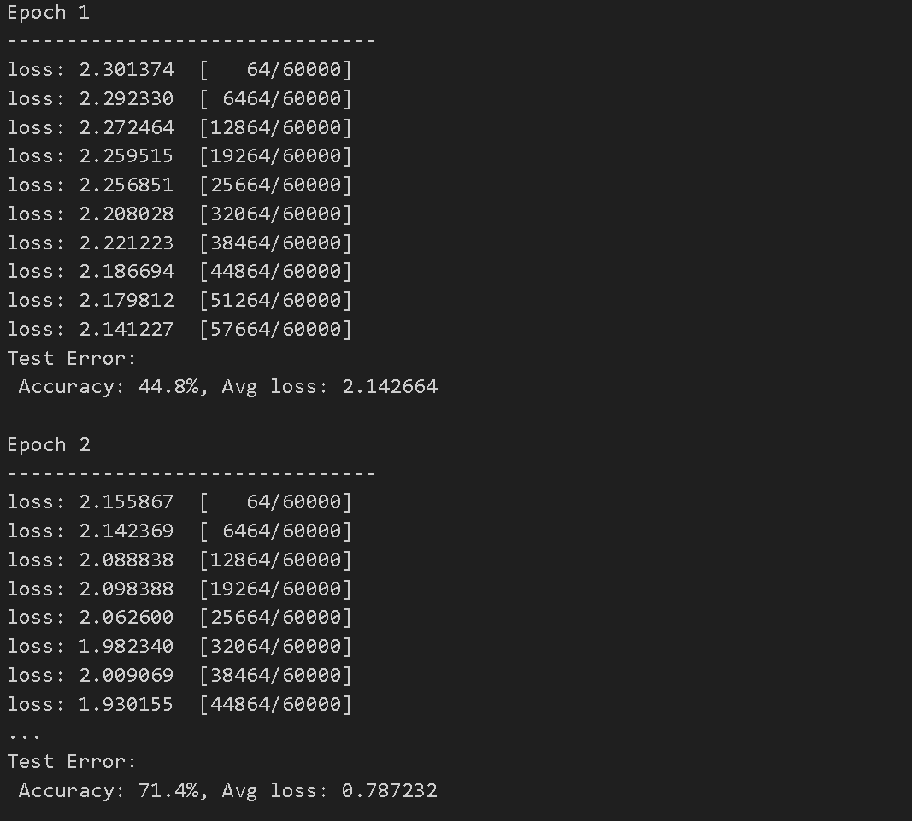
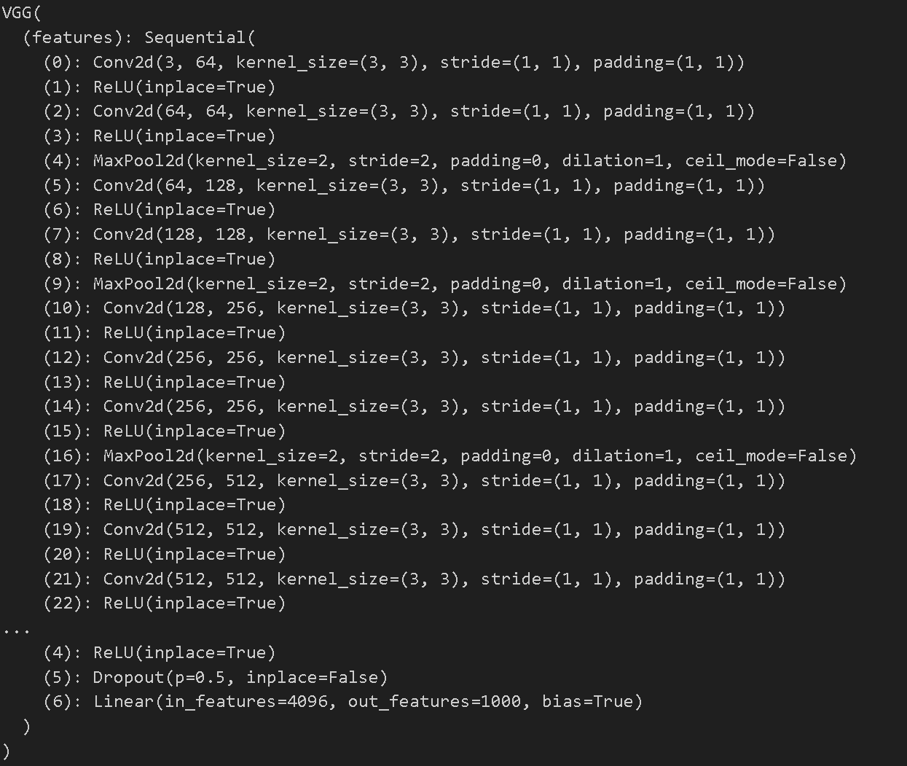

모델과 데이터가 준비되면, 모델을 훈련하고 검증하며 데이터에 대한 파라미터를 최적화하여 모델을 테스트한다. 훈련은 반복적인 과정으로, 각 반복마다 모델은 출력을 예측하고 예측의 오차를 계산하며, 오차에 대한 파라미터의 미분 값을 수집하고 경사 하강법을 사용하여 파라미터를 최적화한다

---

## Prerequisite Code



```python
import torch
from torch import nn
from torch.utils.data import DataLoader
from torchvision import datasets
from torchvision.transforms import ToTensor

training_data = datasets.FashionMNIST(
    root="data",
    train=True,
    download=True,
    transform=ToTensor()
)

test_data = datasets.FashionMNIST(
    root="data",
    train=False,
    download=True,
    transform=ToTensor()
)

train_dataloader = DataLoader(training_data, batch_size=64)
test_dataloader = DataLoader(test_data, batch_size=64)

class NeuralNetwork(nn.Module):
    def __init__(self):
        super().__init__()
        self.flatten = nn.Flatten()
        self.linear_relu_stack = nn.Sequential(
            nn.Linear(28*28, 512),
            nn.ReLU(),
            nn.Linear(512, 512),
            nn.ReLU(),
            nn.Linear(512, 10),
        )

    def forward(self, x):
        x = self.flatten(x)
        logits = self.linear_relu_stack(x)
        return logits

model = NeuralNetwork()
```



- Bulid the Neural Netwok에서 사용한 신경망을 가져온다


---

## Hyperparameters

하이퍼파라미터는 조절 가능한 매개변수로, 모델의 최적화 과정을 제어하는 역할을 한다 다양한 하이퍼파라미터 값은 모델의 훈련과 수렴 속도에 영향을 미칠 수 있다



```python
learning_rate = 1e-3
batch_size = 64
epochs = 5
```



- Learning Rate - 학습률은 모델의 매개변수를 업데이트하는 속도를 조절하는 값으로, 작으면 안정적이지만 느리게 학습하고, 크면 빠르게 학습하지만 불안정할 수 있다
- Batch Size - 한 번의 모델 업데이트를 수행하기 위해 네트워크를 통과하는 데이터 샘플의 수. 훈련 데이터셋이 매우 큰 경우, 전체 데이터셋을 한 번에 모델에 통과시키는 것은 계산적으로 부담일 수 있는데 이런 경우에 데이터를 작은 배치로 나누어 모델을 효율적으로 훈련할 수 있다
- Number of Epochs - 데이터셋을 여러 번 반복해서 모델을 훈련할 횟수


---

## Optimization Loop

하이퍼파라미터를 설정한 후, 최적화 루프를 사용하여 모델을 훈련하고 최적화할 수 있다 
- The Train Loop : 훈련 데이터셋을 반복하면서 최적의 파라미터로 수렴하는것이 목표이다
  - 이 과정에서 모델은 예측을 생성하고 손실을 계산한 후, 역전파를 통해 그래디언트를 계산하고 매개변수를 조정한다

- The Validation/Test Loop : 테스트 데이터셋을 반복하여 모델의 성능이 개선되고 있는지 확인(성능 평가)
  - 테스트 데이터를 사용하여 모델의 정확도, 손실 등을 측정하고 모델의 성능 개선 여부를 확인한다
  - 모델이 과적합되어있는지 확인하거나 모델의 일반화 능력을 평가한다


---

## Loss Function

손실 함수(Loss Function)는 훈련 데이터를 사용하여 예측한 결과와 실제 목표 값 사이의 차이의 정도를 측정한다. 초기에 훈련되지 않은 네트워크는 훈련 데이터를 제대로 처리하지 못한다. 손실 함수는 이러한 예측 오차를 측정하며, 훈련 중에 최소화하려는 값이다.



```python
loss_fn = nn.CrossEntropyLoss()
```



- 분류 작업에서 nn.CrossEntropyLoss는 신경망의 출력을 정규화하여 확률 분포로 변환한 다음, 실제 클래스 레이블과 비교하여 예측 오차를 계산한다
- 회귀 작업에서는 nn.MSELoss와 같은 손실 함수가 실제 값과 예측 값 간의 차이를 제곱하여 평균한 값을 계산하여 예측 오차를 측정한다\


---

## Optimizer

옵티마이저(Optimizer)는 모델의 파라미터를 조정하여 각 훈련 단계에서 모델의 오차를 줄이는 과정이다. 모든 최적화 절차(logic)는 optimizer 객체에 캡슐화(encapsulate)되어 있기 때문에 개발자는 최적화 알고리즘의 복잡한 부분을 직접 구현할 필요 없이 옵티마이저 객체를 사용하여 간단하게 최적화 과정을 수행할 수 있다. 



```python
optimizer = torch.optim.SGD(model.parameters(), lr=learning_rate)
```



- 위 예시에서는 확률적 경사 하강법인 SGD(Stochastic Gradient Descent)옵티마이저를 사용하고 추가로 PyTorch에는 ADAM과 RMSProp과 같은 다양한 옵티마이저가존재한다 
- 옵티마이저를 초기화하는 과정에서 모델의 학습이 필요한 파라미터를 등록하고 학습률 하이퍼파라미터를 전달한다


학습 단계(loop)에서 최적화는 세 개의 단계로 이루어진다
- **optimizer.zero_grad()를 호출하여 델 매개변수의 그래디언트 초기화**
    - 그래디언트는 역전파 과정에서 계산되기 때문에 기본적으로 누적된다. 이전 반복에서 계산된 그라디언트와 중복 계산을 방지하기 위해 각 반복에서 그래디언트를 명시적으로 0으로 초기화한다

- **loss.backwards()를 호출하여 예측 손실(prediction loss)을 역전파**
    - PyTorch는 손실에 대한 각 매개변수의 그래디언트를 계산하여 저장한다
    - 이 역전파 단계를 통해 각 매개변수가 손실에 얼마나 기여하는지 알 수 있다

- **optimizer.step()을 통한 파라미터 업데이트**
    -  optimizer.step() 함수를 호출하여 역전파 단계에서 계산한 그래디언트를 사용하여 파라미터를 업데이트
    - 옵티마이저는 이 그라디언트를 사용하여 각 파라미터를 얼마나 업데이트할지 결정하고, 모델을 최적화한다 이후 다음 반복에서는 더 나은 예측을 하기 위해 조정된 모델이 사용된다


---

## Full Implementation



```python
def train_loop(dataloader, model, loss_fn, optimizer):
    size = len(dataloader.dataset)
    # Set the model to training mode - important for batch normalization and dropout layers
    # Unnecessary in this situation but added for best practices
    model.train()
    for batch, (X, y) in enumerate(dataloader):
        # Compute prediction and loss
        pred = model(X)
        loss = loss_fn(pred, y)

        # Backpropagation
        loss.backward()
        optimizer.step()
        optimizer.zero_grad()

        if batch % 100 == 0:
            loss, current = loss.item(), (batch + 1) * len(X)
            print(f"loss: {loss:>7f}  [{current:>5d}/{size:>5d}]")


def test_loop(dataloader, model, loss_fn):
    # Set the model to evaluation mode - important for batch normalization and dropout layers
    # Unnecessary in this situation but added for best practices
    model.eval()
    size = len(dataloader.dataset)
    num_batches = len(dataloader)
    test_loss, correct = 0, 0

    # Evaluating the model with torch.no_grad() ensures that no gradients are computed during test mode
    # also serves to reduce unnecessary gradient computations and memory usage for tensors with requires_grad=True
    with torch.no_grad():
        for X, y in dataloader:
            pred = model(X)
            test_loss += loss_fn(pred, y).item()
            correct += (pred.argmax(1) == y).type(torch.float).sum().item()

    test_loss /= num_batches
    correct /= size
    print(f"Test Error: \n Accuracy: {(100*correct):>0.1f}%, Avg loss: {test_loss:>8f} \n")
```



- train_loop
    - 이 함수는 주어진 데이터로더(dataloader), 모델(model), 손실 함수(loss_fn), 최적화기(optimizer)를 사용하여 모델을 훈련하는 역할을 한다
    - 데이터셋의 크기를 가져온 후, 모델을 훈련 모드로 설정
    - 데이터로더에서 미니배치(batch)와 해당 미니배치의 입력(X)과 타겟(y)을 반복하여 가져온다
    - 모델을 사용해 입력 데이터를 예측(pred)하고, 예측과 실제 타겟 간의 손실(loss)을 계산한다
    - 손실에 대한 역전파를 수행하여 그래디언트를 계산하고, optimizer.step()으로 매개변수를 업데이트하고 optimizer.zero_grad()로 그래디언트를 초기화한다
    - 매 100번째 미니배치마다 현재 손실과 진행 상황을 출력

- test_loop
    - 이 함수는 주어진 데이터로더(dataloader), 모델(model), 손실 함수(loss_fn)를 사용하여 모델의 성능을 평가하는 역할을 합니다.
    - 모델을 평가 모드로 설정
    - 데이터셋의 크기와 미니배치의 수를 가져온 후, test_loss와 correct 변수를 초기화
    - torch.no_grad() 블록 안에서, 데이터로더에서 미니배치를 가져오며 모델을 사용해 입력 데이터를 예측
    - 예측과 실제 타겟 간의 손실을 누적하여 test_loss에 추가하고, 정확하게 예측한 개수를 세어 correct에 추가
    - 마지막으로 test_loss와 정확도를 계산하여 출력




```python
loss_fn = nn.CrossEntropyLoss()
optimizer = torch.optim.SGD(model.parameters(), lr=learning_rate)

epochs = 10
for t in range(epochs):
    print(f"Epoch {t+1}\n-------------------------------")
    train_loop(train_dataloader, model, loss_fn, optimizer)
    test_loop(test_dataloader, model, loss_fn)
print("Done!")
```





- 


## SAVE AND LOAD THE MODEL



```python
import torch
import torchvision.models as models
```




## Saving and Loading Model Weights

PyTorch 모델은 state_dict라는 내부 상태 사전에 학습된 매개변수를 저장한다. 이는 torch.save 메소드를 통해 유지될 수 있다	



```python
model = models.vgg16(weights='IMAGENET1K_V1')
torch.save(model.state_dict(), 'model_weights.pth')
```



모델 가중치를 불러오려면 먼저 동일한 모델의 인스턴스를 생성한 다음 load_state_dict() 메서드를 사용하여 매개변수를 불러와야 한다



```python
model = models.vgg16() # we do not specify ``weights``, i.e. create untrained model
model.load_state_dict(torch.load('model_weights.pth'))
model.eval()
```





## Saving and Loading Models with Shapes

- 모델 클래스는 신경망의 구조를 정의하며, 모델 가중치는 이 구조에 맞게 저장된다
- 모델의 구조를 가중치와 함께 저장하는 것이 유용할 수도 있다. 이때 model 객체를 저장 함수에 전달하여 모델의 구조와 가중치를 함께 저장할 수 있다. 
- model.state_dict()는 모델의 가중치 정보만을 나타내며, 이보다는 모델 자체를 저장하면 모델의 구조와 가중치를 모두 포함할 수 있다



```python
torch.save(model, 'model.pth')
model = torch.load('model.pth')
```



- Bulid 

---

## reference

[해당 튜토리얼 링크_OPTIMIZING MODEL PARAMETERS](https://pytorch.org/tutorials/beginner/basics/optimization_tutorial.html)
[해당 튜토리얼 링크_SAVE AND LOAD THE MODE](https://pytorch.org/tutorials/beginner/basics/saveloadrun_tutorial.html)

[실습한 코드 링크_OPTIMIZING MODEL PARAMETERS](https://github.com/LeeJeaHyuk/dacon/blob/master/torch_tutorial/6_Optimizing%20Model%20Parameters.ipynb)
[실습한 코드 링크_SAVE AND LOAD THE MODE](https://github.com/LeeJeaHyuk/dacon/blob/master/torch_tutorial/7_Save%20and%20Load%20the%20Model.ipynb)