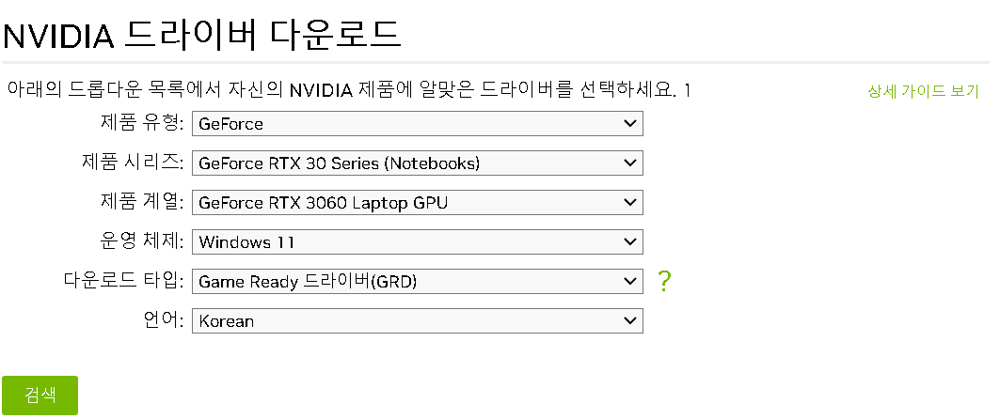
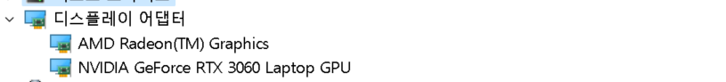
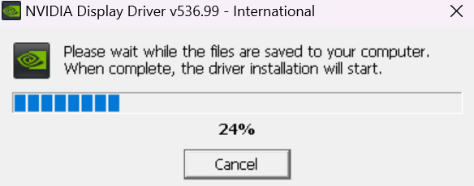



```python
device = (
    "cuda"
    if torch.cuda.is_available()
    else "mps"
    if torch.backends.mps.is_available()
    else "cpu"
)
```




PyTorch 실습 중 CPU만을 사용하여 신경망을 훈련하던 중, GPU를 활용하기 위해서는 추가적인 설치 및 설정이 필요한 것을 확인하게 되었다. 그래서 이번 블로그에서는 GPU를 사용하여 PyTorch 신경망을 훈련하는 과정을 공유하고자 한다.

- **NVIDIA GPU 드라이버 설치**
- **CUDA Toolkit 설치**


---

## NVIDIA GPU 드라이버 설치

[NVIDIA 드라이버](https://www.nvidia.com/Download/index.aspx?lang=kr)를 다운로드 받는 사이트로 들어가서 pc에 맞는 드라이버를 설치해 준다.



그래픽카드의 종류는 장치 관리자에서 디스플레이 어댑터를 확인하면 찾을 수 있다.



- 다운로드 타입은 게임 레디 드라이버와 스튜디오 드라이버가 선택 가능으로 나왔는데 일반적으로 딥 러닝 및 기계 학습을 위해서는 주로 게임 레디 드라이버가 사용되는 경향이 있다고 한다. 하지만 크리에이티브 작업과 딥 러닝을 함께 수행하는 경우에는 크리에이티브 드라이버를 선택하여 그래픽 작업과 모델 훈련을 동시에 할 수 있을 것으로 생각된다.



- 다운로드가 완료되면 설치 해 준다.
- 이후 모든 설정을 defult값으로 설치하였다.


---

## CUDA Toolkit 설치