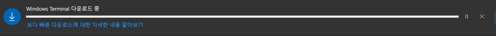
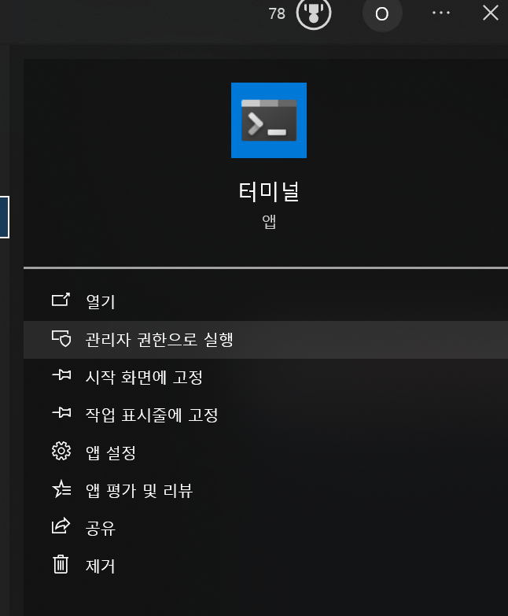
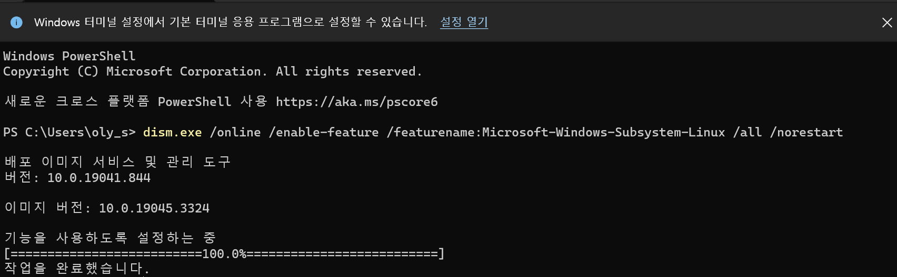
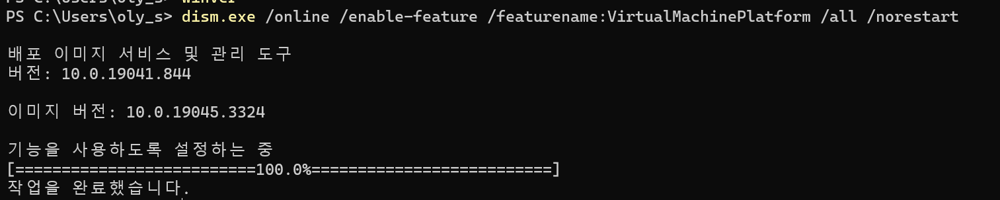
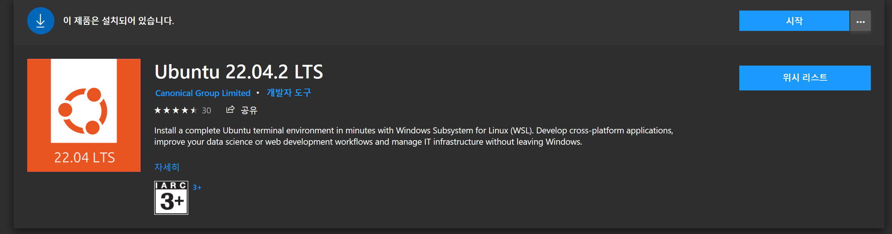
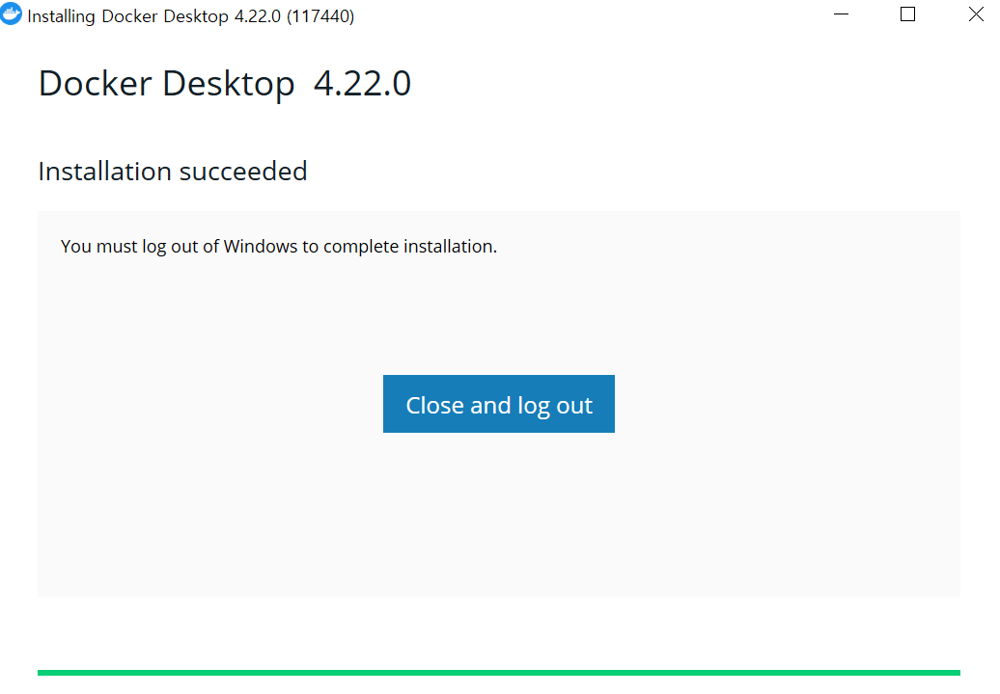
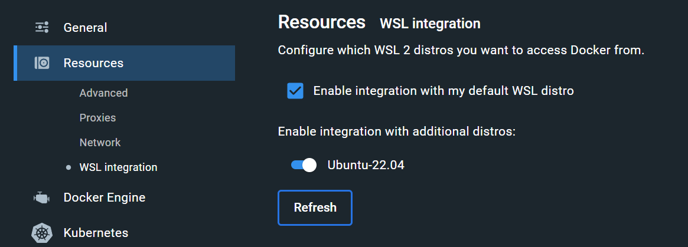
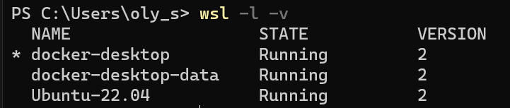

Pytorch와 Tensorflow GPU를 사용하기 위해 어떤 조건이 필요한지 살펴보았는데 window에서 사용하기에는 Tensorflow는 업데이트가 더 되지 않아 낮은 버전에서 사용해야 했고 Pytorch는 그보다 높은 버전에서 보통 사용하여서 cudatoolkit의 버전 관리를 위해서는 가상환경보다는 docker를 사용하는 것이 좋기 때문에 docker 설치를 따라해 보려고 한다

1. Windows Terminal 설치
2. WSL2 설치
3. WSL2 업그레이드
4. GEN/Linux 앱 설치
5. 도커 설치
6. 도커 WSL 설정 확인
7. 설치 확인


---

## Windows Terminal 설치

Windows Store에서 Windows Terminal 검색하여 설치




---

## WSL2 설치



- 터미널에 관리자 권한으로 실행
- Windows PowerShell 프롬프트 열기



```powershell
dism.exe /online /enable-feature /featurename:Microsoft-Windows-Subsystem-Linux /all /norestart
```





- WSL2요구사항 확인
- x64 시스템의 경우: 버전 1903 이상, 빌드 18362 이상 



```powershell
winver
```



명령어로 확인해보면 


으로 버전이 충족되어있었다 버전이 낮다면 윈도우 업데이트를 해야 한다


- #### Virtual Machine 기능 사용



```powershell
dism.exe /online /enable-feature /featurename:VirtualMachinePlatform /all /norestart
```






## WSL2 업그레이드

1. #### Linux커널 업데이트 패키지 다운로드

   - https://wslstorestorage.blob.core.windows.net/wslblob/wsl_update_x64.msi
   - 다운로드 한 패키지를 관리자 권한으로 실행

2. #### WSL2를 기본 버전으로 설정



```
wsl --set-version Ubuntu-22.04 2
```




---

## 4. GNU/Linux 앱 설치

- 'Microsoft Store'에서 다운 받을 Linux 배포판 검색
- 최신 버전인 22.04 버전으로 설치




---

## 5. 도커 설치

- Google에 Docker 검색

- 윈도우용 'Docker Desktop' 설치



- 누르면 재시작이 된다.


---

## 6. 도커 WSL 설정 확인하기

1) Docker 실행
2) [Settings]-[General] 선택 후 설정 확인
   - 아래의 항목에 체크
     - Use the WSL 2 based engine
3) [Settings]-[Resources]-[WSL INTEGRATION] 선택 후 설정 확인
   - 아래의 항목에 체크
     - Enable Integration with my default WSL distro
     - Enable Integration with additional distros: "설치한 리눅스 배포판"



---

## 7. 오류 관련

1. Hyper-V 가 켜져 있지 않으면 오류가 발생하는데 windows HOME 버전에서는 지원해주지 않는다.
   - 대학생이라면 https://onthehub.com/ 에서 학교 이메일을 사용해서 edu 버전을 설치할 수 있다.
   - 이후 windows에서 windows기능 켜기/끄기 설정에서 **Hyper-V** 설정을 활성화 후 재부팅하면 해당 오류가 발생하지 않는다.


---

## 8.설치 확인 

- powershell에서 설치 확인



```powershell
wsl -l -v
```





- bash 에서 설치 확인



```bash
docker run -d -p 80:80 docker/getting-started
docker ps
docker images
```




## 10 docker image docker hub에서 가져오기

[테디노트](https://www.youtube.com/watch?v=Tw7dU-9AkmU&ab_channel=%ED%85%8C%EB%94%94%EB%85%B8%ED%8A%B8TeddyNote)님이 만들어 놓은 docker hub에서 클론해와서 image를 클론해와서




```bash
docker pull teddylee777/deepko
```




nvdia toolkit 설치



```bash
distribution=$(. /etc/os-release;echo $ID$VERSION_ID)
curl -s -L https://nvidia.github.io/nvidia-docker/gpgkey | sudo apt-key add -
curl -s -L https://nvidia.github.io/nvidia-docker/$distribution/nvidia-docker.list | sudo tee /etc/apt/sources.list.d/nvidia-docker.list

sudo apt-get update && sudo apt-get install -y nvidia-container-toolkit
sudo systemctl restart docker
```





```wsl
docker run -it --gpus all --name deeplearning teddylee777/deepko /bin/bash
```



- teddylee777/deepko 이미지를 실행시켜서 deeplearning이름의 컨테이너가 만들어짐
- docker cp를 사용하여 파일 복사해서 이동



```wsl
torch.cuda.is_available()
```



- GPU사용되는지 확인

ctrl + D

## 11 vscode와 연결


- vscode에서 위의 extenstion을 설치한다 




```wsl
docker cp C:\GitHub deeplearning:/root/data
```




gpu가 작동하는지 확인

/image-20230827132502887.png)


익스텐션과 파일을 옮긴 후 commit 



```wsl
docker commit 1e0b jh/dl01
```



/image-20230827132420221.png)

---

## reference

https://velog.io/@hanjuli94/%EC%9C%88%EB%8F%84%EC%9A%B0%EC%97%90%EC%84%9C-%EB%8F%84%EC%BB%A4-%EC%8B%A4%EC%8A%B5%ED%95%98%EA%B8%B0

https://shuka.tistory.com/18

https://greeksharifa.github.io/references/2021/06/21/Docker/

https://www.youtube.com/watch?v=Tw7dU-9AkmU&ab_channel=%ED%85%8C%EB%94%94%EB%85%B8%ED%8A%B8TeddyNote

http://daddynkidsmakers.blogspot.com/2023/02/nvidia-gpu-cuda.html
